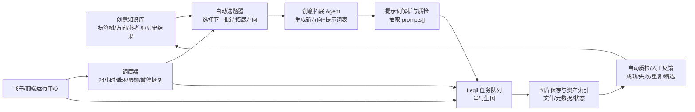
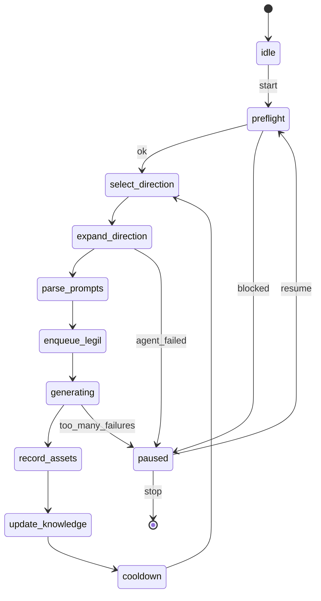

# 24小时创意拓展与 Legil 自动生图方案

## 1. 研究结论

本次对比的目标项目是：

```text
E:\AI\项目相关\Mcc Imagic Q1 Ver.p2 0514
```

当前项目是：

```text
C:\Users\dd\Desktop\项目
```

核心结论：

1. `Mcc Imagic Q1 Ver.p2 0514` 的核心设计不是“自动把 prompt 发给生图平台”，而是“知识库驱动的创意生产系统”。
2. 它把创意资产拆成三层：长期知识库、候选方向拓展层、网页生图执行层。
3. 你的当前项目已经具备 Legil 浏览器自动化、创意 Agent、Excel 提示词解析、创意批量生图、任务暂停恢复、飞书通知等关键能力。
4. 当前项目缺的不是 Legil 执行能力，而是目标项目那种“可持续知识库 + 自动选题调度 + 结果回流”的闭环。
5. 最稳妥的改造路线是：不要硬搬目标项目，因为目标项目源码包不完整；应把它的设计思想迁移到当前项目，用现有 Legil 能力承接自动产图。

一句话方案：

```text
本地创意知识库 -> 自动选择待拓展方向 -> 调用现有 creative-expansion-agent 生成新方向和提示词 -> 调用现有 /api/legil/creative-batch 自动产图 -> 保存结果和反馈 -> 回写知识库 -> 继续下一轮
```

最终要做成一个 24 小时运行的循环：

```text
选题 -> 拓展方向 -> 生成提示词 -> Legil 产图 -> 保存资产 -> 质检/记录 -> 更新知识库 -> 继续选题
```

---

## 2. 目标项目怎么设计知识库和创意拓展

### 2.1 总体业务链路

目标项目的设计链路可以概括为：

```text
飞书标签/方向数据
  -> 本地知识库
  -> 创意方向拓展
  -> Prompt 转译
  -> Lovart 网页自动生图
  -> 任务记录/复盘沉淀
  -> 反哺知识库
```

它真正解决的是广告创意生产中的几个问题：

- 方向太多，人工管理容易混乱。
- 单个方向如果直接写成 prompt，会失去长期复用价值。
- 抽象方向如果直接交给生图工具，画面不稳定。
- 网页生图平台不能并发乱点，需要任务队列和浏览器锁。
- 创意生产不是一次性的，历史成功/失败要沉淀回来。

### 2.2 知识库的核心对象

从目标项目的 `docs/项目设计解析.md`、`panel/server.js`、`panel/public/memory.html` 以及 `tasks/` 数据可以看出，它的知识库大致由这些对象组成：

| 对象 | 作用 |
| --- | --- |
| `Tag` / 标签 | 创意分类节点，比如题材、探索发现、物品展示、急救药品 |
| `Direction` / 方向 | 某个标签路径下的具体创意方向 |
| `DirectionDefinition` / 方向定义 | 说明这个方向是什么、边界是什么、如何继续发散 |
| `HierarchyContext` / 层级语义 | 给 L1/L2/L3/L4 标签补充语义，帮助模型理解父子关系 |
| `ReferenceImage` / 参考图 | 给方向提供视觉锚点，不是最终 prompt |
| `VisualDNA` / 视觉 DNA | 从参考图中沉淀构图、材质、氛围、色彩、主体关系等视觉规律 |
| `ExpansionProfile` / 拓展画像 | 一个方向适合怎样继续拓展、哪些变量空间还没覆盖 |
| `CandidateDirection` / 候选方向 | Agent 生成的新方向，等待人工筛选或自动投产 |
| `Feedback` / 反馈 | 哪些方向好、哪些重复、哪些图可作为新参考 |
| `Task` / 生产任务 | 已经进入网页生图平台执行的任务 |
| `Asset` / 产出资产 | 生成的图片、文件名、尺寸、来源 prompt、状态 |

这个拆法非常关键。它没有把所有东西都塞进 prompt，而是把“长期可复用经验”和“一次性执行文本”分开。

### 2.3 知识库接口设计

目标项目 `panel/server.js` 中能看到大量知识库接口。比较重要的包括：

```text
GET  /api/memory
GET  /api/memory/tag-universe
GET  /api/memory/tag-universe/visual-dna
GET  /api/memory/tag-universe/history-candidates
GET  /api/memory/tag-universe/tombstones
GET  /api/memory/tag-universe/changes
POST /api/memory/tag-universe/import-history
POST /api/memory/tag-universe/reject-history
POST /api/memory/tag-universe/agent-complete
POST /api/memory/tag-universe/agent-complete-dimensions
GET  /api/memory/tag-universe/expansion-profile
POST /api/memory/tag-universe/expansion-profile/analyze
POST /api/memory/tag-universe/direction
PUT  /api/memory/tag-universe/direction
DELETE /api/memory/tag-universe/direction
GET  /api/memory/tag-universe/hierarchy-context
PUT  /api/memory/tag-universe/hierarchy-context
GET  /api/memory/tag-universe/ref-image
POST /api/memory/tag-universe/ref-image
DELETE /api/memory/tag-universe/ref-image
POST /api/memory/tag-universe/ref-image/ai-generate
POST /api/memory/tag-universe/sync
POST /api/memory/digest
GET  /api/memory/stats
POST /api/memory/compress
POST /api/memory/discover
GET  /api/memory/feedback-history
```

这说明它的知识库不是一个简单 JSON，而是一整套本地资产管理系统。

可以把它理解成四个层：

```text
基础层：标签树、方向、参考图
修订层：人工编辑、用户新增方向、删除/拒绝记录
智能层：层级语义补全、视觉 DNA、拓展画像、建议卡片
反馈层：历史拓展、生成结果、正负样本、复盘规则
```

### 2.4 创意拓展设计

目标项目的拓展入口是：

```text
POST /api/expand
GET  /api/expand-status/:id
GET  /api/expand-active
GET  /api/expand-results
GET  /api/expand-history
GET  /api/expand-result/:id
GET  /api/expand-suggestions
POST /api/expand-preview/:id
POST /api/expand-update-direction/:expandId/:index
POST /api/expand-rewrite/:expandId/:index
POST /api/expand-confirm
```

典型流程：

1. 用户在标签树里选择一个节点。
2. 后端加载方向树。
3. 后端加载知识库规则。
4. 后端把待审核方向也加入排除池，防止重复生成。
5. 调用 `creative-expand` 生成候选方向。
6. 候选方向保存到拓展结果 JSON。
7. 用户可编辑、重写、预览、确认。
8. 确认后的方向进入生产任务或知识库成长层。

目标项目有一个很好的设计点：

```text
候选方向不是直接进入量产，而是先成为“可审阅中间态”。
```

这让系统既能自动发散，又不会把错误方向直接放大成大量图片。

### 2.5 Prompt 转译层

目标项目的 `panel/prompt-gen.js` 是最值得迁移的思想之一。

它做的事不是“生成创意”，而是把已经存在的方向转成 Lovart 能执行的 prompt。

输入大概包括：

```text
directionFullPath
subDirection
directionDefinition
agentDescription
humanDescription
mood
perspective
time
narrative
scale
originalDescription
refImages
refDiversityPlan
userIntent
artStyle
```

输出格式被强约束为：

```text
图片名称:
主题:
画风:
情绪氛围:
画面内容:
整体基调:
画面文字规则:

分辨率要求:
```

它还做了质量检查：

- 图片块数量是否足够。
- 是否有分辨率要求。
- 画面内容是否仍像抽象方向定义。
- 是否夹带 Markdown 代码块。
- 不合格就重试。

这个模块背后的理念是：

```text
方向定义是长期资产，生图 prompt 是一次性执行文本；两者必须分离。
```

### 2.6 网页生图任务队列

目标项目的 Lovart 是网页自动化，不是 API。它设计了全局队列和锁：

```text
runtimeTasks
createRuntimeTask
updateRuntimeTask
enqueueLovartTask
drainLovartQueue
acquireLovartLock
```

为什么要这样做：

- 一个浏览器页面同一时间只能稳定执行一个任务。
- 预览图、知识库参考图、正式量产都会抢同一个网页工具。
- 如果并发点击，容易污染输入框、错存图片、任务串线。
- 失败时必须知道是哪个任务失败，才能恢复。

这个设计对你的 Legil 平台也完全适用。

虽然平台不同，但本质相同：

```text
Legil 浏览器页面 = 共享关键资源
```

因此 24 小时自动化时必须显式串行化 Legil 操作。

### 2.7 任务文件设计

目标项目使用 JSON 任务文件作为中间状态。示例目录：

```text
tasks/current_batch/
  batch_state.json
  batch_summary.json
  题材_探索发现_物品展示_急救药品_....json
```

任务文件中包含：

```json
{
  "project": "无尽2603-自动化",
  "directionPrefix": "题材_探索发现_物品展示_急救药品",
  "subDirection": "打开医院药房的一个抽屉...",
  "directionFullPath": "题材/探索发现/物品展示/急救药品/...",
  "contents": ["方向说明", "画面要求"],
  "refImages": ["参考图 token"],
  "images": [
    { "theme": "第1张主题", "sections": "第1张" }
  ],
  "generatedPrompt": "最终 Lovart Prompt",
  "shortTheme": "短主题"
}
```

`batch_state.json` 记录了每个任务的状态、开始结束时间、图片结果、校验结果。

这给 24 小时自动化提供了两个能力：

- 程序崩了可以恢复。
- 人可以复盘每张图从哪里来。

---

## 3. 你的当前项目已有能力

你的当前项目已经比早期说明强很多。当前代码里已经有以下能力。

### 3.1 Legil 自动化已经比较完整

现有文件：

```text
legil-automation.js
src/services/legil/
src/routes/legil.routes.js
```

当前能力：

- 单条 prompt 生图：`POST /api/legil/generate`
- 普通批量生图：`POST /api/legil/batch-generate`
- 创意拓展批量生图：`POST /api/legil/creative-batch`
- 创意任务进度：`GET /api/legil/creative-progress`
- 创意任务恢复：`GET /api/legil/creative-resume`
- 清除恢复状态：`POST /api/legil/creative-resume/clear`
- 停止任务：`POST /api/legil/stop`
- 生成参数支持：模型、宽高比、分辨率、输出数量。
- 支持 headed/headless。
- 支持无参考图时跳过上传。
- 支持连续失败暂停。
- 支持输出命名携带 runId、方向名、prompt 序号。

这部分可以直接作为 24 小时系统的“产图执行层”。

### 3.2 已有创意拓展 Agent

现有目录：

```text
agents/creative-expansion-agent/
```

它已经包含：

```text
agent.yaml
instructions.md
skills/reference-analysis-table/SKILL.md
skills/batch-iteration-strategy-table/SKILL.md
skills/new-direction-expansion-table/SKILL.md
skills/strict-table-direction-iteration/SKILL.md
skills/batch-creative-expansion-accelerator/SKILL.md
integration/creativeExpansionAgent.ts
```

这个 Agent 的默认流程是：

```text
参考分析表
  -> 100组素材迭代策略总表
  -> 逐方向详细迭代策略表
  -> 新方向拓展表
```

第四部分“新方向拓展表”已经固定列：

```text
参考方向
新方向名称
方向描述
来源于哪条详细迭代策略
提示词1
提示词2
提示词3
提示词4
提示词5
```

这正好能对接 Legil 的创意批量生图。

### 3.3 Agent 服务已经能生成 Excel 并提取提示词

现有文件：

```text
creative-agent-service.js
creative-agent-worker.js
creative-table-parser.js
creative-agent-quality.js
src/routes/creative-agent.routes.js
```

当前能力：

- `/api/creative-agent/run` 启动创意 Agent。
- `/api/creative-agent/task-status/:runId` 查询状态。
- `/api/creative-agent/result/:runId` 获取结果。
- `/api/creative-agent/cancel/:runId` 取消任务。
- `/api/creative-agent/download/:fileName` 下载生成表格。
- `/api/creative/parse-table` 解析外部 Excel/CSV 表格。
- 支持把 Markdown 表格转成 `.xlsx`。
- 支持从生成表格中提取提示词。
- 支持质量检查。
- 表格行数较多时，进入结构化表格批处理模式。
- 结构化模式下每个原始行生成 5 个新方向，每个新方向 5 条 prompt。

也就是说，你现在已经有：

```text
方向/表格/附件 -> Agent -> Excel -> prompts[] -> Legil creative-batch
```

这条链路已经存在。

### 3.4 已有完整工作流

现有文件：

```text
workflow-controller.js
src/routes/workflow.routes.js
prompt-generation-service.js
```

当前完整工作流是：

```text
输入文件夹参考图
  -> 调用豆包或 Lumos Winky 生成提示词
  -> 每组提示词送到 Legil
  -> 保存图片
```

这条链路偏“参考图生 prompt”，不是“知识库自动拓展方向”，但它的恢复、状态、停止、失败处理都可复用。

### 3.5 已有飞书通知和看门狗

现有文件：

```text
feishu-notification-service.js
feishu-watchdog.js
health-monitor.js
feishu-control-service.js
```

当前能力：

- 服务启动通知。
- 任务完成通知。
- 卡住/长时间无进展通知。
- 飞书远程控制任务。
- 看门狗自动恢复。

这对 24 小时无人值守很重要，可以直接复用。

---

## 4. 当前项目和目标项目的能力差距

### 4.1 能力对比表

| 能力 | 目标项目 | 当前项目 | 差距 |
| --- | --- | --- | --- |
| Legil/Lovart 网页生图 | Lovart 队列执行 | Legil 执行较完整 | 当前项目更贴近你的平台，可复用 |
| 创意 Agent | 有 creative-expand 但源码缺失 | 已有 creative-expansion-agent | 当前项目已有可用 Agent |
| 表格提示词解析 | 有任务表和结果表 | 已有 Excel/CSV 解析和质检 | 当前项目可复用 |
| 本地知识库 | tag-universe、memory、visual-dna、hierarchy-context | 暂无完整知识库 | 需要新增 |
| 自动选题 | expand-suggestions、coverage、maintenance | 暂无自动调度选题 | 需要新增 |
| 结果回流 | 预览图可挂回知识库，反馈可消化 | 主要是保存图片和进度 | 需要新增资产索引/反馈 |
| 24 小时循环 | 目标项目有任务设计思路，但不完整 | 暂无循环调度器 | 需要新增 scheduler |
| 运行中心 | runtimeTasks + 队列可视化 | 有日志、进度、飞书通知 | 可增强为统一 runtime |
| 浏览器锁 | Lovart 全局锁 | 当前靠 `automationState.legilTaskRunning` 控制 | 建议升级为显式队列 |
| 人工审核中间态 | 拓展页支持编辑/预览/确认 | Agent 结果可人工提取后发 Legil | 可增加自动/半自动模式 |

### 4.2 最大差距

当前项目最大差距不是“不会生成图”，而是：

```text
没有一个长期可增长的创意知识库。
```

没有知识库时，24 小时自动化会变成：

```text
每次都重新发散 -> prompt 可能重复 -> 方向不可控 -> 图越跑越乱 -> 无法知道哪些方向已经做过
```

有知识库后，系统可以做到：

```text
知道哪些方向已覆盖
知道哪些方向缺 prompt
知道哪些方向缺参考图
知道哪些方向上次失败
知道哪些方向效果好
知道下一轮应该优先拓展什么
```

### 4.3 当前项目最适合的迁移方式

不要试图直接复制目标项目的 `panel/server.js`。原因：

- 目标项目缺少 `worker/`、`lib/`、`scripts/`、`data/` 等核心源码。
- 目标项目面向 Lovart，而你要接 Legil。
- 你的当前项目已经有更完整的 Legil 执行层。

推荐迁移：

```text
学习目标项目的数据模型和流程设计
  -> 在当前项目新增 creative-knowledge 和 creative-scheduler
  -> 复用当前 creative-agent-service
  -> 复用当前 /api/legil/creative-batch
```

---

## 5. 24小时自动化目标架构

### 5.1 总体架构



### 5.2 最小闭环

最小可用版本不需要一下子做完整知识库 UI。

第一版只要做到：

```text
data/creative-knowledge/directions.json
data/creative-knowledge/assets.json
data/creative-knowledge/runs/
data/creative-knowledge/scheduler-state.json
```

然后让调度器自动：

1. 从 `directions.json` 选择一个方向。
2. 拼出 Agent 请求。
3. 调用现有 `runCreativeAgent`。
4. 提取 prompts。
5. 调用现有 `/api/legil/creative-batch` 或内部函数。
6. 记录生成结果。
7. 更新方向状态。
8. 进入下一轮。

### 5.3 分层模块设计

建议在当前项目新增这些模块：

```text
src/services/creative-knowledge/
  index.js
  store.js
  schemas.js
  selector.js
  feedback.js
  asset-index.js

src/services/creative-scheduler/
  index.js
  state-machine.js
  preflight.js
  run-log.js
  quotas.js

src/routes/creative-knowledge.routes.js
src/routes/creative-scheduler.routes.js

data/creative-knowledge/
  tag-universe.json
  directions.json
  reference-images.json
  assets.json
  feedback.json
  scheduler-state.json
  runs/
```

如果后续量变大，再从 JSON 升级到 SQLite。第一版继续用 JSON 更符合当前项目风格，也方便排查。

---

## 6. 数据结构建议

### 6.1 标签树 `tag-universe.json`

```json
{
  "version": 1,
  "updatedAt": "2026-05-26T00:00:00.000Z",
  "tree": [
    {
      "id": "tag_topic",
      "label": "题材",
      "path": "题材",
      "level": 1,
      "children": []
    }
  ],
  "items": [
    {
      "id": "dir_medical_supplies",
      "label": "急救药品",
      "path": "题材/探索发现/物品展示/急救药品",
      "level": 4,
      "parentPath": "题材/探索发现/物品展示",
      "brief": "围绕末世医疗资源被发现、争夺、保存和使用的广告方向。",
      "description": "强调稀缺药品、伤病救助、幸存者希望感和冰封废墟探索。",
      "mood": "紧张、稀缺、希望",
      "perspective": "近景、中景、俯拍",
      "narrative": "发现、争夺、救援、分配",
      "scale": "单人到小队",
      "reviewed": true,
      "sourceType": "manual",
      "createdAt": "2026-05-26T00:00:00.000Z",
      "updatedAt": "2026-05-26T00:00:00.000Z"
    }
  ]
}
```

### 6.2 层级语义 `hierarchy-context.json`

```json
{
  "题材": "冰封末世生存世界观，所有画面应体现极寒环境、资源稀缺和废墟生存。",
  "题材/探索发现": "重点表现角色在未知废墟、旧文明遗迹或危险环境中发现资源或线索。",
  "题材/探索发现/物品展示": "重点让关键物资成为画面视觉中心，强调可识别、可获得、可引发点击动机。",
  "题材/探索发现/物品展示/急救药品": "核心是医疗资源稀缺与救命价值，画面应突出药品标签、保存状态和角色反应。"
}
```

### 6.3 方向记录 `directions.json`

```json
{
  "version": 1,
  "items": [
    {
      "id": "direction_20260526_001",
      "path": "题材/探索发现/物品展示/急救药品",
      "name": "冰封医院药房抽屉",
      "description": "幸存者在废弃医院药房中发现保存完好的止痛药、抗生素和绷带。",
      "source": "manual_seed",
      "status": "active",
      "priority": 80,
      "coverage": {
        "expandedCount": 0,
        "promptCount": 0,
        "imageCount": 0,
        "lastExpandedAt": null,
        "lastGeneratedAt": null
      },
      "avoid": [
        "不要重复同一抽屉近景构图",
        "不要出现真实药品品牌"
      ],
      "keep": [
        "简体中文药品标签",
        "冰封废弃医院环境",
        "稀缺医疗资源"
      ],
      "createdAt": "2026-05-26T00:00:00.000Z",
      "updatedAt": "2026-05-26T00:00:00.000Z"
    }
  ]
}
```

### 6.4 参考图记录 `reference-images.json`

```json
{
  "version": 1,
  "items": [
    {
      "id": "ref_001",
      "path": "D:\\工作\\自动化工作流1\\创意知识库\\参考图\\medical_drawer.png",
      "directionPath": "题材/探索发现/物品展示/急救药品",
      "label": "药房抽屉参考",
      "visualNotes": "俯拍抽屉，药瓶整齐排列，冷色环境光，标签清晰。",
      "useFor": ["style", "composition", "object"],
      "status": "active",
      "createdAt": "2026-05-26T00:00:00.000Z"
    }
  ]
}
```

### 6.5 资产索引 `assets.json`

```json
{
  "version": 1,
  "items": [
    {
      "id": "asset_20260526_001",
      "runId": "creative_auto_20260526_010000",
      "directionId": "direction_20260526_001",
      "directionPath": "题材/探索发现/物品展示/急救药品",
      "newDirectionName": "暴风雪中的急救药转运",
      "promptTitle": "雪夜药箱护送",
      "prompt": "主题：...",
      "filePath": "D:\\工作\\自动化工作流1\\创意拓展\\输出\\xxx.png",
      "width": 1024,
      "height": 1024,
      "size": 1832086,
      "status": "generated",
      "quality": {
        "basicCheck": "ok",
        "blank": false,
        "duplicate": false,
        "manualRating": null
      },
      "createdAt": "2026-05-26T01:05:00.000Z"
    }
  ]
}
```

### 6.6 调度状态 `scheduler-state.json`

```json
{
  "enabled": false,
  "phase": "idle",
  "currentRunId": "",
  "lastHeartbeatAt": "",
  "lastError": "",
  "consecutiveFailures": 0,
  "quota": {
    "maxPromptsPerRun": 25,
    "maxImagesPerRun": 25,
    "maxRunsPerDay": 20,
    "cooldownSeconds": 60
  },
  "cursor": {
    "lastDirectionId": "",
    "lastRunAt": ""
  }
}
```

---

## 7. 自动选题器怎么设计

### 7.1 选题目标

24 小时自动拓展不能每次随机选方向。它应该基于知识库自动判断：

- 哪些方向还没拓展。
- 哪些方向产图少。
- 哪些方向最近很久没跑。
- 哪些方向历史效果好，值得继续扩量。
- 哪些方向失败太多，暂时降权。
- 哪些方向缺参考图，适合先补图或降低产图优先级。
- 哪些方向与待审核候选重复，避免反复生成。

### 7.2 推荐评分公式

可以先用简单可解释的打分：

```text
score =
  priority
  + coverageGap
  + staleBoost
  + feedbackBoost
  + noveltyBoost
  - recentPenalty
  - failurePenalty
  - duplicatePenalty
  - missingContextPenalty
```

字段解释：

| 字段 | 含义 |
| --- | --- |
| `priority` | 人工给的方向优先级 |
| `coverageGap` | 产出越少，分越高 |
| `staleBoost` | 越久没跑，分越高 |
| `feedbackBoost` | 历史好图越多，分越高 |
| `noveltyBoost` | 变量空间未覆盖，分越高 |
| `recentPenalty` | 刚跑过，降权 |
| `failurePenalty` | 最近失败多，降权 |
| `duplicatePenalty` | 与待审核/已产出重复，降权 |
| `missingContextPenalty` | 缺方向描述、缺参考图、缺层级语义，降权 |

第一版可以不做向量相似度，先用文本哈希和关键词去重。

### 7.3 自动建议卡片

目标项目的 `/api/expand-suggestions` 很值得借鉴。

当前项目可以新增：

```text
GET /api/creative-scheduler/suggestions
```

返回：

```json
{
  "success": true,
  "suggestions": [
    {
      "type": "coverage_gap",
      "directionId": "direction_20260526_001",
      "path": "题材/探索发现/物品展示/急救药品",
      "reason": "该方向已有参考图但还没有自动拓展产图",
      "score": 92,
      "recommendedAction": "expand_and_generate"
    }
  ]
}
```

前端或飞书可以展示这些建议，24 小时模式则直接取最高分执行。

---

## 8. 创意拓展 Agent 如何接入自动循环

### 8.1 当前可直接复用的路径

当前项目已有 `runCreativeAgent(payload)`。

自动调度器可以内部调用它，不必走 HTTP。

输入 payload：

```json
{
  "apiUrl": "https://...",
  "apiKey": "...",
  "model": "...",
  "provider": "...",
  "instruction": "请基于以下方向继续拓展...",
  "targetCount": 5,
  "attachments": []
}
```

输出中已经有：

```json
{
  "success": true,
  "fileName": "creative_agent_....xlsx",
  "prompts": [
    {
      "index": 1,
      "sourceRow": 2,
      "direction": "xxx",
      "promptTitle": "提示词1",
      "prompt": "完整提示词"
    }
  ],
  "qualityReport": {}
}
```

这可以直接进入 Legil。

### 8.2 自动模式下的 Agent 指令模板

调度器应根据选中的方向拼出完整上下文：

```text
# 自动创意拓展任务

请基于当前知识库方向继续拓展，不要重复已产出的方向和画面结构。

## 当前方向
路径：题材/探索发现/物品展示/急救药品
方向名：冰封医院药房抽屉
方向描述：幸存者在废弃医院药房中发现保存完好的止痛药、抗生素和绷带。

## 必须保留
- 简体中文药品标签
- 冰封废弃医院环境
- 医疗资源稀缺与救命价值

## 必须避开
- 不要重复同一抽屉近景构图
- 不要出现真实药品品牌
- 不要变成现代干净医院广告

## 历史已生成方向
- 近景抽屉药品
- 俯拍满屉药品

## 本次目标
生成 5 个高差异新方向，每个方向 5 条完整中文生图提示词。
要求可直接发送到 Legil。
```

### 8.3 是否还需要目标项目的 `prompt-gen.js`

第一版不一定需要完整复刻 `prompt-gen.js`。

原因：

- 当前 creative-expansion-agent 已经能输出“可直接用于出图”的中文长提示词。
- 当前 `/api/legil/creative-batch` 能直接消费这些 prompt。

但建议新增一个轻量的 `LegilPromptCompiler`，不是为了重新生成 prompt，而是做规范化：

```text
输入：Agent 提示词 + 知识库上下文 + Legil 参数
输出：Legil prompt item
```

它做这些事：

- 清理空 prompt。
- 限制长度。
- 补齐固定尾句。
- 移除 Markdown 表格残留。
- 加上项目统一禁用项。
- 补齐 `direction`、`promptTitle`、`sourceRow`。
- 记录来源方向和策略。

推荐文件：

```text
src/services/creative-scheduler/legil-prompt-compiler.js
```

---

## 9. Legil 生图平台如何结合

### 9.1 使用现有接口

当前已有最适合自动化的接口：

```text
POST /api/legil/creative-batch
```

它接收：

```json
{
  "prompts": [
    {
      "direction": "暴风雪中的急救药转运",
      "promptTitle": "雪夜药箱护送",
      "sourceRow": 2,
      "prompt": "主题：..."
    }
  ],
  "outputFolder": "D:\\工作\\自动化工作流1\\创意拓展\\输出",
  "referenceFolder": "",
  "tableFileName": "auto-run.xlsx",
  "browserMode": "headed",
  "generationSettings": {
    "imageModel": "nano-banana-2",
    "aspectRatio": "1:1",
    "resolution": "1K",
    "outputQuantity": 1
  }
}
```

自动调度器可以内部复用同样逻辑，也可以发本地 HTTP 请求到该接口。

第一版建议直接发本地 HTTP 请求，改动最小：

```text
creative-scheduler
  -> POST http://127.0.0.1:3066/api/legil/creative-batch
```

后续再抽成内部服务调用，减少 HTTP 自调。

### 9.2 Legil 队列要求

24 小时自动化必须遵守：

```text
同一时间只能有一个 Legil 生图任务。
```

当前项目已有：

```text
automationState.legilTaskRunning
automationState.legilTaskType
automationState.legilStopRequested
```

第一版可以继续用它阻止并发。

第二版建议抽象出通用队列：

```text
src/services/task-queue/browser-task-queue.js
```

队列能力：

- `enqueue(taskType, payload, runner)`
- `status()`
- `cancel(taskId)`
- `pause()`
- `resume()`
- `currentTask`
- `pendingTasks`
- `history`

这样未来 Legil、即梦、参考图补图、尺寸修改都可以共享一个浏览器任务调度。

### 9.3 参考图如何给 Legil

你的当前 `/api/legil/creative-batch` 支持 `referenceFolder`。

知识库接入后有两种方式：

#### 方式 A：不上传参考图

让 Agent 的文字 prompt 足够详细，调用 Legil 时：

```text
referenceFolder = ""
skipReferenceUpload = true
```

优点：

- 最稳。
- 不需要为每个方向临时复制参考图。
- 适合第一版 24 小时自动化。

缺点：

- 风格稳定性略差。

#### 方式 B：按方向生成临时参考图文件夹

调度器为每个 run 创建：

```text
runtime/creative-runs/<runId>/references/
```

把该方向的 1-3 张参考图复制进去，然后传给 `creative-batch`。

优点：

- 更接近目标项目的“知识库参考图”设计。
- 方向视觉一致性更强。

缺点：

- 需要管理临时文件。
- 参考图过多可能拖慢 Legil。
- 如果 Legil 页面上传逻辑不稳定，会增加失败率。

建议：

```text
第一版先不传参考图。
第二版对高优先级方向传 1-2 张参考图。
```

---

## 10. 24小时调度器设计

### 10.1 状态机



### 10.2 每轮执行步骤

每一轮自动化建议这样执行：

1. `preflight`
   - 检查 Legil 是否已有任务。
   - 检查 API Key。
   - 检查输出目录。
   - 检查浏览器登录状态。
   - 检查今日额度。
   - 检查磁盘空间。

2. `select_direction`
   - 从知识库选择一个或多个方向。
   - 如果没有方向，暂停并通知。

3. `expand_direction`
   - 调用 creative Agent。
   - 生成 Excel 和 prompts。
   - 写入 `runs/<runId>/agent-result.json`。

4. `parse_prompts`
   - 抽取 prompts。
   - 质量检查。
   - 去重。
   - 限制本轮数量。

5. `enqueue_legil`
   - 调用 `/api/legil/creative-batch`。
   - 保存启动参数。

6. `generating`
   - 轮询 `/api/legil/creative-progress`。
   - 如果长时间无进展，触发飞书提醒或暂停。

7. `record_assets`
   - 扫描输出目录中新生成图片。
   - 写入 `assets.json`。
   - 记录 prompt -> 文件映射。

8. `update_knowledge`
   - 更新方向的 `lastExpandedAt`、`lastGeneratedAt`、`imageCount`。
   - 记录失败和重复。
   - 将新方向作为候选方向或已产出方向沉淀。

9. `cooldown`
   - 等待一段时间，避免平台风控。
   - 进入下一轮。

### 10.3 调度配置

建议新增：

```json
{
  "creativeAuto": {
    "enabled": false,
    "mode": "auto",
    "browserMode": "headed",
    "outputFolder": "D:\\工作\\自动化工作流1\\创意拓展\\输出",
    "referenceMode": "none",
    "maxDirectionsPerRun": 1,
    "targetCountPerDirection": 5,
    "maxPromptsPerRun": 25,
    "maxImagesPerRun": 25,
    "maxRunsPerDay": 20,
    "cooldownSeconds": 60,
    "pauseOnConsecutiveFailures": true,
    "consecutiveFailureThreshold": 3,
    "qualityGate": "warn",
    "notifyOnPause": true,
    "notifyEveryRun": false
  }
}
```

### 10.4 为什么不要一开始就全速 24 小时

真正无人值守前，建议按三档逐步放开：

| 阶段 | 运行方式 | 目的 |
| --- | --- | --- |
| 观察模式 | 只自动生成方向和 prompt，不发 Legil | 验证方向质量和重复率 |
| 半自动模式 | 自动生成 prompt，人工点一次开始生图 | 验证 Legil 稳定性 |
| 全自动模式 | 自动选题、自动 prompt、自动 Legil | 进入 24 小时运行 |

原因：

- 创意方向如果错了，产图越多浪费越大。
- Legil 网页可能有登录过期、人机验证、按钮变化。
- 需要先知道单轮平均耗时、失败率、图片质量。

---

## 11. 结果回流和知识库成长

### 11.1 最低限度必须回流什么

每张图片至少回流：

```text
runId
directionId
directionPath
newDirectionName
promptTitle
prompt
filePath
createdAt
generationSettings
success/failure
errorMessage
```

每个方向至少更新：

```text
expandedCount
promptCount
imageCount
lastExpandedAt
lastGeneratedAt
lastError
consecutiveFailures
```

### 11.2 自动质检

第一版可以做基础质检：

- 文件是否存在。
- 文件大小是否大于最小阈值。
- 图片宽高是否能读取。
- 是否重复文件名。
- 是否生成数量达到预期。

第二版可以加入：

- 感知哈希去重。
- 空白图检测。
- OCR 检查画面是否有大面积英文。
- 缩略图审核面板。
- 人工评分。

### 11.3 人工反馈字段

建议给每张图加：

```json
{
  "manualRating": null,
  "manualTags": [],
  "selectedAsReference": false,
  "rejectReason": "",
  "notes": ""
}
```

前端或飞书卡片后续可以做：

- 精选
- 删除
- 标记重复
- 加入参考图池
- 标记风格好
- 标记方向跑偏

### 11.4 如何让系统越跑越好

每隔一段时间可以做一次“知识消化”：

```text
读取 assets + feedback
  -> 汇总高评分方向
  -> 汇总失败原因
  -> 汇总重复模式
  -> 更新方向 keep/avoid/priority
  -> 更新选题分数
```

这对应目标项目中的：

```text
POST /api/memory/digest
POST /api/memory/compress
POST /api/memory/discover
```

当前项目第一版可以先用脚本做：

```text
node scripts/digest-creative-knowledge.js
```

后续再做成接口。

---

## 12. 需要准备的东西

### 12.1 业务资料

必须准备：

1. 创意标签树
   - 至少 L1/L2/L3。
   - 最好到 L4 方向。

2. 每个方向的说明
   - 这个方向是什么。
   - 适合画什么。
   - 不适合画什么。
   - 与相邻方向的区别。

3. 参考图
   - 每个重点方向至少 1-3 张。
   - 文件名要能关联方向。
   - 最好补充人工描述。

4. 禁用项和风格约束
   - 不要真实品牌。
   - 不要真实 IP。
   - 不要过强科幻/赛博，除非方向允许。
   - 画面文字以简体中文为主。
   - 默认冰封末世、3D 商业广告图质感。

5. 已有产出
   - 以前跑过的图片。
   - 对应 prompt。
   - 哪些效果好，哪些效果差。

### 12.2 技术配置

必须准备：

1. Lumos Winky 或其他 LLM 配置
   - API Key
   - API URL
   - 模型 ID
   - provider 可选

2. Legil 登录态
   - `browser_data` 或持久浏览器 profile。
   - 需要确认 24 小时内是否会登录过期。

3. 输出目录
   - 建议独立目录：

```text
D:\工作\自动化工作流1\创意拓展\输出
D:\工作\自动化工作流1\创意拓展\运行记录
D:\工作\自动化工作流1\创意知识库
```

4. 机器环境
   - Windows 机器保持不断电。
   - 网络稳定。
   - 磁盘空间足够。
   - Chrome/Playwright 浏览器可正常运行。

5. 通知通道
   - 飞书机器人建议开启。
   - 连续失败、长时间无进展、登录失效时必须通知。

### 12.3 运营策略

要提前定好：

- 每天最多生成多少张。
- 每个方向最多连续扩多少轮。
- 失败几次暂停。
- 多久冷却一次。
- 哪些方向优先。
- 哪些方向只生成 prompt，不自动产图。
- 什么时候需要人工审核。

---

## 13. 需要了解的知识

### 13.1 创意体系知识

你需要能区分：

- 标签不是 prompt。
- 方向不是 prompt。
- 方向描述不是画面描述。
- 参考图不是必须复刻的模板。
- 好的拓展不是换几个名词，而是换主体关系、场景机制、叙事焦点和视觉中心。

重点理解这些迭代轴：

```text
主体：谁在画面中
关系：谁和谁发生关系
动作：正在发生什么
场景机制：发现、争夺、修复、撤离、交易、潜入、救援
镜头：近景、俯拍、低机位、广角、中景
情绪：惊喜、压迫、危机、希望、紧张
卖点：资源、奖励、危险、反差、救命价值
材质：冰雪、金属、布料、木头、雾气、火光
信息：中文标签、警示牌、地图、物资编号
```

### 13.2 LLM 生产化知识

需要了解：

- system prompt 和 user prompt 的职责分离。
- 输出格式必须可解析。
- JSON 或表格输出必须有检查器。
- LLM 输出不可靠，必须有 retry。
- prompt 需要带历史已产出方向，防止重复。
- 不能把所有规则都塞在一句话里，要分层组织。

核心原则：

```text
LLM 负责生成，程序负责验收。
```

### 13.3 Playwright 和网页自动化知识

需要了解：

- 持久登录态。
- 页面选择器。
- 超时处理。
- 等待生成完成。
- 下载/截图保存。
- 浏览器崩溃恢复。
- headless 和 headed 差异。
- 同一网页资源必须串行操作。

核心原则：

```text
共享浏览器页面必须有队列和锁。
```

### 13.4 自动化运维知识

24 小时运行需要关注：

- 进程是否还活着。
- 当前任务是否卡住。
- 是否长时间没有新文件。
- API 是否限流。
- 登录是否过期。
- 磁盘是否满。
- 失败是否可恢复。
- 状态是否落盘。

核心原则：

```text
无人值守系统最重要的是暂停、恢复、通知和可追溯。
```

---

## 14. 实施路线

### 阶段 0：准备数据

目标：先让系统有可读的创意知识库种子。

要做：

1. 整理一份 `directions.xlsx` 或 `directions.json`。
2. 每行至少有：
   - 路径
   - 方向名
   - 方向描述
   - 必须保留
   - 必须避开
   - 优先级
3. 整理参考图目录。
4. 统一输出目录。

验收：

```text
程序能读取 20 个以上方向，并列出下一批建议拓展方向。
```

### 阶段 1：最小知识库

目标：新增 `data/creative-knowledge`，不用 UI 也能跑。

新增：

```text
data/creative-knowledge/directions.json
data/creative-knowledge/assets.json
data/creative-knowledge/scheduler-state.json
src/services/creative-knowledge/store.js
src/services/creative-knowledge/selector.js
```

验收：

```text
GET /api/creative-knowledge/status
GET /api/creative-scheduler/suggestions
```

能返回方向数量、资产数量和建议方向。

### 阶段 2：自动调用 Agent

目标：系统能自动选一个方向并生成 prompt 表。

新增：

```text
src/services/creative-scheduler/agent-runner.js
```

复用：

```text
creative-agent-service.js
```

验收：

```text
POST /api/creative-scheduler/run-once?dryRun=agent
```

能生成：

```text
runtime/creative-runs/<runId>/agent-result.json
runtime/creative-runs/<runId>/prompts.json
```

### 阶段 3：接入 Legil 自动生图

目标：Agent 生成的 prompts 自动进入 Legil。

复用：

```text
POST /api/legil/creative-batch
GET  /api/legil/creative-progress
```

新增：

```text
src/services/creative-scheduler/legil-runner.js
```

验收：

```text
POST /api/creative-scheduler/run-once
```

能自动完成：

```text
选方向 -> Agent -> prompts -> Legil -> 输出图片 -> 写 assets.json
```

### 阶段 4：24 小时循环

目标：从单次运行变成持续运行。

新增：

```text
src/services/creative-scheduler/index.js
src/services/creative-scheduler/state-machine.js
src/routes/creative-scheduler.routes.js
```

接口：

```text
POST /api/creative-scheduler/start
POST /api/creative-scheduler/stop
POST /api/creative-scheduler/pause
POST /api/creative-scheduler/resume
GET  /api/creative-scheduler/status
POST /api/creative-scheduler/run-once
```

验收：

```text
启动后可连续执行多轮。
停止后状态落盘。
重启服务后能知道上次运行状态。
连续失败达到阈值会暂停。
```

### 阶段 5：反馈和复盘

目标：系统不只是跑图，还能越跑越有方向。

新增：

```text
src/services/creative-knowledge/feedback.js
src/services/creative-knowledge/digest.js
```

接口：

```text
POST /api/creative-knowledge/assets/:id/rate
POST /api/creative-knowledge/assets/:id/select-reference
POST /api/creative-knowledge/digest
```

验收：

```text
人工精选图片后，该图片能成为某个方向的新参考图。
低评分方向会自动降权。
重复方向会进入 avoid 列表。
```

### 阶段 6：前端和飞书控制

目标：让 24 小时系统可操作、可观察。

前端增加：

- 自动创意状态面板。
- 当前方向。
- 当前 run。
- 今日产量。
- 最近失败。
- 暂停/恢复/运行一次。
- 方向建议列表。
- 产出缩略图。

飞书增加命令：

```text
自动创意状态
启动自动创意
暂停自动创意
继续自动创意
停止自动创意
今天产了多少图
最近失败原因
```

---

## 15. MVP 版本建议

如果希望最快跑起来，建议第一版只做这些：

### 15.1 文件

新增：

```text
data/creative-knowledge/directions.json
data/creative-knowledge/assets.json
data/creative-knowledge/scheduler-state.json
src/services/creative-auto-runner.js
src/routes/creative-auto.routes.js
```

### 15.2 接口

新增：

```text
GET  /api/creative-auto/status
POST /api/creative-auto/run-once
POST /api/creative-auto/start
POST /api/creative-auto/stop
```

### 15.3 `run-once` 流程

```text
1. 读取 directions.json
2. 选一个 imageCount 最少且 priority 最高的方向
3. 拼 Agent instruction
4. 调用 runCreativeAgent
5. 拿 result.prompts
6. 最多取 25 条
7. POST /api/legil/creative-batch
8. 轮询 creative-progress
9. 扫描输出目录
10. 更新 assets.json 和 directions.json
```

### 15.4 第一版先不做

这些可以延后：

- 完整知识库 UI。
- 视觉 DNA。
- 参考图自动补图。
- 感知哈希去重。
- 自动 OCR。
- 多账号调度。
- 复杂队列。
- SQLite。

原因：

```text
先把“方向 -> Agent -> prompts -> Legil -> 图片 -> 记录”跑通，才知道后续优化该往哪里用力。
```

---

## 16. 风险和防护

### 16.1 Legil 登录过期

风险：

```text
无人值守时登录过期，任务会连续失败。
```

防护：

- 每轮前检查页面是否可用。
- 失败截图。
- 连续失败暂停。
- 飞书通知。
- headed 模式保留人工接管。

### 16.2 平台风控或限流

风险：

```text
24 小时高频操作可能触发平台限制。
```

防护：

- 每轮冷却。
- 每日上限。
- 夜间降速。
- 连续失败暂停。
- 不并发操作同一个账号。

### 16.3 prompt 质量漂移

风险：

```text
自动拓展越跑越偏。
```

防护：

- 知识库记录 keep/avoid。
- 每轮传入历史已生成方向。
- Agent 输出质检。
- 每天人工抽检。
- 低评分方向降权。

### 16.4 产出重复

风险：

```text
方向名变了，但画面结构重复。
```

防护：

- prompt 文本去重。
- 方向名去重。
- 主体/动作/场景机制关键词去重。
- 后续加图片感知哈希。

### 16.5 状态丢失

风险：

```text
程序重启后不知道跑到哪里。
```

防护：

- 每个 run 写 `state.json`。
- 每个阶段更新 `scheduler-state.json`。
- Legil creative resume 继续复用。
- 输出资产写 `assets.json`。

---

## 17. 建议的开发顺序

推荐按这个顺序做：

1. `creative-knowledge` 最小 JSON 存储。
2. 方向选择器 `selector.js`。
3. 单次自动运行 `run-once`。
4. 调用 Agent，保存 prompts。
5. 调用 Legil creative-batch。
6. 扫描并记录输出图片。
7. 加状态接口。
8. 加 start/stop 循环。
9. 加飞书通知。
10. 加前端状态面板。
11. 加反馈和精选。
12. 加参考图池和视觉 DNA。

每一步都有明确验收，不建议一口气做完整大系统。

---

## 18. 可以直接复用的当前代码

| 当前文件 | 复用方式 |
| --- | --- |
| `creative-agent-service.js` | 自动创意拓展核心 |
| `creative-agent-worker.js` | 长任务 worker，避免阻塞主线程 |
| `creative-table-parser.js` | 解析 Agent 输出 Excel 或外部表格 |
| `creative-agent-quality.js` | 提示词质量检查 |
| `src/routes/creative-agent.routes.js` | 现有 Agent API |
| `src/routes/legil.routes.js` | Legil 创意批量生图 |
| `legil-automation.js` | 浏览器执行 |
| `src/services/legil/*` | Legil 输入、等待、保存、输出检测 |
| `workflow-controller.js` | 恢复、停止、进度状态设计可参考 |
| `logger.js` | SSE 日志 |
| `feishu-notification-service.js` | 24 小时通知 |
| `health-monitor.js` | 卡住检测 |
| `config-store.js` | 自动化配置落盘 |
| `secrets-store.js` | 密钥读取 |

---

## 19. 不建议直接复用的目标项目内容

目标项目这些内容不建议直接搬：

| 内容 | 原因 |
| --- | --- |
| `panel/server.js` 整体 | 依赖缺失的 `worker/`、`lib/`、`scripts/`，且面向 Lovart |
| `dist/` | Mac Apple Silicon 打包产物，对当前 Windows 项目无用 |
| `.lovart-cft-cdp-profile` | Lovart 登录态，与 Legil 平台无关 |
| `prompt-gen.js` 原样 | 输出格式和平台是 Lovart，需要改成 Legil 语义 |
| 目标项目任务路径 | 含 Mac 绝对路径，不适合当前环境 |

建议只迁移思想：

- 知识库分层。
- 方向和 prompt 分离。
- prompt 输出验收。
- 浏览器任务队列。
- 任务 JSON 可恢复。
- 结果回流。

---

## 20. 最终推荐方案

最终目标形态：

```text
当前项目继续作为 Legil 自动化主系统。

新增 creative-knowledge：
  存标签、方向、参考图、历史产出、反馈。

新增 creative-scheduler：
  24 小时自动选题、调用 Agent、触发 Legil、回写结果。

复用 creative-expansion-agent：
  负责方向拓展和提示词生成。

复用 /api/legil/creative-batch：
  负责稳定串行产图。

复用飞书通知：
  负责无人值守时的状态提醒和人工接管。
```

推荐第一版目标：

```text
一天内能自动跑 3-5 轮。
每轮选 1 个方向。
每轮生成 5 个新方向 x 5 条提示词 = 25 组 prompt。
每组 prompt 在 Legil 生成 1 张图。
每天最多 75-125 张图。
出现连续 3 次失败自动暂停并通知。
所有结果写入 assets.json。
```

当第一版稳定后，再逐步放开到真正 24 小时。

---

## 21. 下一步落地清单

### 你需要先准备

- 一份创意方向种子表。
- 重点方向的参考图目录。
- Lumos Winky 或其他 LLM 的稳定模型配置。
- Legil 浏览器登录态。
- 自动产图输出目录。
- 每日最大产图量。
- 失败暂停阈值。

### 我建议优先开发

1. `data/creative-knowledge/directions.json` 示例和导入脚本。
2. `creative-knowledge/store.js`。
3. `creative-knowledge/selector.js`。
4. `creative-auto-runner.js` 的 `runOnce()`。
5. `/api/creative-auto/run-once`。
6. 自动调用 `runCreativeAgent()`。
7. 自动调用 `/api/legil/creative-batch`。
8. 结果写入 `assets.json`。

做到这里，你就拥有了第一版：

```text
根据现有创意体系，自动拓展方向、自动拓展提示词、自动生成图片。
```

之后再做：

```text
24 小时循环、飞书控制、知识库 UI、反馈回流、视觉 DNA。
```

