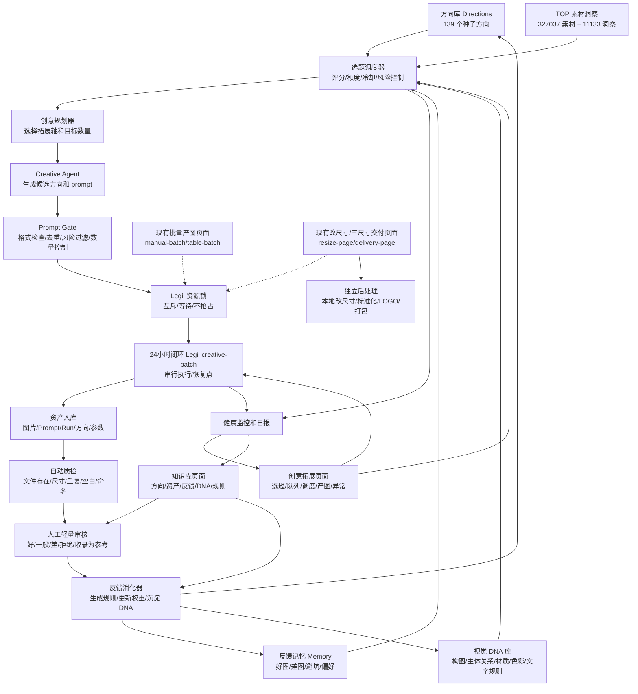

# 24小时创意闭环进化系统新版方案

> 日期：2026-06-06  
> 最近更新：2026-06-10  
> 基于文档：`docs/24小时创意拓展与Legil自动生图方案.md`  
> 当前项目：`C:\Users\dd\Desktop\项目`  
> 目标：让系统根据现有方向库和知识库，24 小时自动拓展新方向、生成新图片、记录结果、吸收反馈，并逐步形成可复用的视觉 DNA 和创意进化能力。

---

## 0. 2026-06-10 当前项目更新摘要

本轮更新基于当前代码、`data/creative-knowledge`、`data/delivery-postprocess`、前端入口和 S11 阶段验收文档重新校准。结论是：项目已经从 2026-06-06 的“L1 到 L2 之间”进一步推进到“L2 已成型，局部能力进入 L3 预备态”。自动创意、目标队列、Prompt Gate、Legil creative-batch、知识库回流、飞书控制、运行中心诊断、三尺寸交付后处理都已经有真实落盘数据或验收脚本支撑；真正缺口集中在 24 小时持续调度、策略自治、自动评审、周报决策和可回滚治理。

### 0.1 本轮确认已落地的新能力

| 能力 | 当前结论 | 证据位置 |
| --- | --- | --- |
| P0 运行中心诊断 | 已落地 | `/api/creative-auto/diagnostics`、`public/js/autonomy-diagnostics.js`、`public/js/status-poller.js` |
| 统一 API Client 雏形 | 已落地 | `public/js/api-client.js`，已提供超时、pending、JSON 错误处理 |
| 自动创意 run 落盘 | 已落地并大量运行 | `data/creative-knowledge/runs/` 当前 379 个 run 文件 |
| 自动创意目标队列 | 已落地并扩容 | `creative-target-queues.json` 当前约 19 组队列、2115 个目标 |
| Prompt Gate 与方向计划修复 | 已落地 | `src/services/creative-auto/prompt-gate.js`、`direction-plan-gate.js`、相关测试脚本 |
| 素材分析到创意拓展 | 已落地 | `material-analysis` 页面可把素材/方向 brief 送入创意拓展目标队列 |
| 任务方向池到创意拓展 | 已落地 | `task-workbook` 页面可导入任务表并多选送入创意拓展 |
| 表格 Prompt 导入 | 已有入口 | `/api/table-prompts/import`、`public/js/table-prompt-batch.js` |
| 视觉分类重命名 | 已有入口 | `/api/vision-taxonomy-rename/*`、`public/js/vision-taxonomy-rename.js` |
| S10 三尺寸交付 | 已落地 | `/api/delivery/*`、`data/delivery-postprocess` |
| S11 源比例复用与逐 job 闭环交付 | 已完成验收 | `docs/S11-阶段6测试和验收记录-20260610.md` |
| 交付后处理最终包 | 已真实跑通 | 当前 3 个 delivery run、450 个 job、1350 个 target 均 finalized |

### 0.2 更新后的本地数据规模

| 数据 | 2026-06-06 记录 | 2026-06-10 当前值 | 说明 |
| --- | ---: | ---: | --- |
| 方向库方向 | 139 | 139 | 当前全部为 `seed` 状态，方向治理尚未分层 |
| TOP 素材 | 327037 | 327037 | 数据源保持不变 |
| TOP 素材洞察 | 11133 | 11133 | 数据源保持不变 |
| 参考图 | 425 | 425 | 当前 status 字段多为空，后续仍需 active/archived 治理 |
| 资产记录 | 4204 | 8976 | 已明显增长，主要来自自动创意和 Legil creative-batch |
| 自动创意 run 文件 | 231 | 379 | `completed` 338、`paused` 32、`failed` 9 |
| completed run | 195 | 338 | 其中 `legil_completed` 300、`agent_completed` 38 |
| Legil 保存计数 | 3271 | 约 7783 | 按 run 中 `savedCount`/progress 统计 |
| 队列数量 | 13 | 约 19 | 队列文件已扩容 |
| 队列目标数 | 98 | 约 2115 | 素材分析/任务方向池已能批量形成目标队列 |
| 反馈记录 | 9 | 9 | 反馈仍明显不足 |
| 方向草稿 | 5 | 5 | 当前仍为 `draft` |
| preferred pattern | 1 | 1 | 字段为 `preferred_patterns` |
| avoid pattern | 7 | 7 | 字段为 `avoid_patterns` |
| active memory rules | 8 | 统计口径不一 | `creative-memory.stats.activeRules=8`，实际 rules 对象中 active/enabled 为 2，需要统一口径 |
| learning reports | 1 | 1 | 学习自动化仍处于早期 |
| delivery run | - | 3 | 全部 finalized |
| delivery job | - | 450 | 全部 finalized |
| delivery target | - | 1350 | 全部 finalized |

### 0.3 当前自动创意运行状态

当前 `scheduler-state.json` 显示服务为 `idle`，最近 run 为 `creative_run_20260603_213405_3bcdc6`，最近 Legil phase 为 `completed`。同时，状态文件中 `daily.date` 仍停留在 `2026-06-08`，`imageCount=1336` 且超过 `imageLimit=1000`，这说明“今日额度/日维度统计”仍不是稳定可信源，不能直接作为 24 小时持续调度的正式依据。

当前目标队列快照：

| 项 | 状态 |
| --- | --- |
| 队列 ID | `creative_queue_20260603_133432_7547a8` |
| 队列状态 | `paused` |
| 队列目标 | 98 |
| 已完成目标 | 42 |
| 剩余目标 | 56 |
| 当前/最近 run | `creative_run_20260603_213405_3bcdc6` |
| 最近 run 状态 | `completed` / `legil_completed` |
| 下一步动作 | `advance_next_target` |
| lastError | 服务器重启或任务被意外打断，可选择继续剩余创意拓展任务 |

这说明系统已经具备“批量目标队列 + 单目标顺序运行 + 可恢复提示”的雏形，但还不是正式 24 小时 scheduler。

### 0.4 对原方案判断的修正

原方案中的大方向仍然成立，但以下判断需要更新：

```text
Delivery Candidate / 三尺寸交付出口不再是纯新增建议，S10/S11 已经形成可用的独立交付后处理基础。
下一步重点不是“先做交付出口”，而是把自动创意精选图以候选方式接入已有交付页，并通过周报或人工确认启动交付。
P0 基线能力已部分落地，运行中心已有诊断摘要和全局状态轮询。
创意自动化已经积累了 8976 条资产和 379 个 run，当前更紧迫的问题是反馈、评审、自治策略和数据治理，而不是继续无约束扩量。
creative-memory.json 的字段命名和统计口径需要纳入 P1/P7 整理，否则后续规则学习会出现“页面显示 8 条 active，但实际 rules 对象只识别 2 条”的歧义。
```

### 0.5 当前最重要缺口更新

截至 2026-06-10，最主要缺口更新为：

1. **24 小时持续调度器仍未完成**  
   当前有 run-once、目标队列、pause/resume、diagnostics，但还没有正式的循环调度、时间窗口、限流、冷却、补跑、日/周预算重置和日报机制。

2. **状态可信源仍需 P1 收口**  
   `scheduler-state.json`、目标队列、run 文件、Legil resume、delivery task、运行中心展示之间还没有一个统一的状态模型。尤其日额度日期滞后、memory 统计口径不一致，需要优先处理。

3. **资产审核和反馈学习远落后于产出规模**  
   资产已经接近 9000 条，但反馈仍只有 9 条，学习报告只有 1 次。系统已经能生产，尚未真正形成“生产 -> 评审 -> 学习 -> 调度优化”的闭环。

4. **自动评审 Auto Curator 尚未落地**  
   如果继续扩量，没有自动评审就会迅速形成审核债。P3 的 Shadow Auto Curator 应前置，而不是等到 24 小时调度完成后再补。

5. **Visual DNA 仍未成为正式对象**  
   方向、参考图、素材洞察、命名规则、记忆规则都有数据，但缺少稳定的 DNA schema、证据链和灰度发布机制。

6. **交付出口已有基础，但尚未接入创意闭环候选**  
   S11 已经完成逐张闭环三尺寸交付，但它仍是独立页面能力。后续要做的是 `auto_good/weekly_selected -> delivery_candidate -> 用户批准 -> delivery run`，而不是重写交付页。

## 1. 核心判断

当前项目已经不是“Doubao 生成 prompt，再发给 Legil”的早期自动化工具，而是已经具备创意知识库、素材分析、自动创意 run-once、Legil 批量产图、资产入库、飞书通知、反馈学习雏形的生产系统。

所以新版方案不建议重做一个大系统，而是把现有系统升级成：

```text
方向库驱动的 24 小时创意进化引擎
```

它的核心循环是：

```text
方向库选题
  -> 提取方向语义和视觉 DNA
  -> Agent 拓展新方向
  -> Prompt Gate 质检和去重
  -> Legil 串行产图
  -> 资产入库和自动质检
  -> 人工轻量反馈
  -> 反馈消化成规则和方向权重
  -> 下一轮自动选题
```

这个系统的重点不是“无限生成图片”，而是“用最少人工介入持续找到更值得生成的图”。

---

## 2. 当前项目状态

> 2026-06-10 说明：本章保留 2026-06-06 方案形成时的结构化判断，最新数量、运行状态和 S11 交付进展以“## 0. 2026-06-10 当前项目更新摘要”为准。后续开发时不要再按本章旧数字估算资产审核、run 数量和交付后处理能力。

### 2.1 已经具备的能力

当前项目已经具备这些基础能力，可以直接复用：

| 能力 | 当前状态 | 说明 |
| --- | --- | --- |
| Legil 浏览器生图 | 已落地 | 支持单条、批量、creative-batch、暂停、恢复、停止、保存图片 |
| 现有批量产图页面 | 已落地且必须保持不变 | 当前用户可独立输入 prompt/表格任务并批量送 Legil，不应被 24 小时闭环改入口、改参数或改操作路径 |
| 改尺寸/三尺寸交付页面 | 已落地且必须保持不变 | 包含 Legil 改尺寸、即梦改尺寸、本地标准化、加 LOGO、打包等链路，是独立交付工具，不属于 24 小时创意闭环主流程 |
| 创意 Agent | 已落地 | `creative-agent-service.js`、`creative-expansion-agent` 可生成新方向和 prompt |
| Prompt Gate | 已落地 | 已能筛选、拒绝、保留 prompt，并进入 Legil |
| 创意知识库 | 已落地 | `data/creative-knowledge` 已有方向、参考图、资产、反馈、学习规则 |
| 方向库导入 | 已落地 | 已从方向种子表和飞书方向表导入方向 |
| TOP 素材分析 | 已落地 | 已有 TOP 素材、视觉洞察、素材 brief、方向 brief |
| 自动创意 run-once | 已落地 | `/api/creative-auto/run-once` 可启动单轮自动创意 |
| 队列式目标处理 | 已部分落地 | 已有 `creative-target-queues.json`，支持多目标队列和恢复 |
| 资产回流 | 已落地 | 生成图可写入 `assets.json` 并关联 run、方向、prompt |
| 人工审核面板 | 已落地 | 前端已有资产审核、收录方向、反馈记忆相关入口 |
| 飞书通知和控制 | 已落地 | 飞书 bridge、通知、测试发送已通过 |
| Lumos Winky | 已接入 | 新旧 LLM 路径基本已按 Winky 网关收口 |

### 2.2 当前数据规模

根据当前本地数据和服务状态，系统已有较多真实产物：

| 数据 | 当前数量 |
| --- | ---: |
| 方向库方向 | 139 |
| TOP 素材 | 327037 |
| TOP 素材洞察 | 11133 |
| 参考图 | 425 |
| 资产记录 | 4204 |
| run 文件 | 231 |
| completed run | 195 |
| run 中记录的 Legil 保存图 | 3271 |
| 队列数量 | 13 |
| 反馈记录 | 9 |
| 方向草稿 | 5 |
| preferred pattern | 1 |
| avoid pattern | 7 |
| active memory rules | 8 |
| learning reports | 1 |

### 2.3 当前自动队列状态

当前 `creative-auto` 服务状态是 `idle`，预检通过。最近的目标队列状态是：

| 项 | 状态 |
| --- | --- |
| 队列总目标 | 98 |
| 已完成目标 | 42 |
| 剩余目标 | 56 |
| 队列状态 | paused |
| 最近 run | `creative_run_20260603_213405_3bcdc6` |
| 最近 Legil 结果 | completed |

这说明系统已经跑过较大规模的自动链路，不是纸面方案。但它现在仍更像“可恢复的批处理系统”，还没有成为真正稳定的 24 小时进化系统。

### 2.4 最主要缺口

当前最大的缺口不是产图能力，而是下面四件事：

1. **24 小时调度器还不完整**  
   当前有 run-once、队列恢复和前端轮询，但没有真正的持续调度、时间窗口、冷却、限流、自动恢复和日报机制。

2. **反馈太少，资产审核积压严重**  
   资产已有 4204 条，其中绝大多数仍是 `unreviewed`。反馈只有 9 条，学习报告只有 1 次。系统已经能产出，但还没有充分吸收“哪些好、哪些差、为什么”。

3. **视觉 DNA 还没有形成正式对象**  
   项目里已有 referenceImages、visualInsight、material learnings，但还缺一个稳定的数据结构，把构图、主体关系、材质、色彩、叙事机制、文字规则沉淀成可复用的方向 DNA。

4. **调度状态需要统一可信源**  
   `scheduler-state.json` 里还有旧日期的 daily 计数和当前服务状态之间的差异。24 小时运行前，要统一“今日额度、当前队列、当前 run、恢复点、失败次数”的状态源。

### 2.5 现有独立工具保护边界

根据当前项目结构，必须把系统分成两类能力：

| 类型 | 包含能力 | 与 24 小时闭环的关系 |
| --- | --- | --- |
| 24 小时创意闭环 | 方向选题、Agent 拓展、Prompt Gate、creative-batch、资产入库、反馈学习、Visual DNA、周报 | 新增自治流程，是本方案建设重点 |
| 现有独立工具 | 批量产图页面、改尺寸页面、三尺寸交付、本地标准化、加 LOGO、打包 | 保持现有页面、接口、配置、操作路径不变，只允许被旁路读取结果或在明确授权时被调用 |

开发原则：

```text
不能为了 24 小时闭环重写现有批量产图页面。
不能把改尺寸页面强行并入 24 小时闭环主流程。
不能改变现有批量产图和改尺寸的默认参数、文件夹、按钮含义和续跑逻辑。
不能让 24 小时调度器自动停止用户手动启动的批量产图或改尺寸任务。
可以新增共享锁、只读状态、资产登记和交付候选引用，但必须保持向后兼容。
```

推荐产品边界：

```text
批量产图 = 手动/半自动生产工具
改尺寸 = 独立交付后处理工具
24 小时闭环 = 自治创意进化系统
```

三者可以共享 Legil 浏览器资源、图片资产和输出目录索引，但页面入口、任务语义和用户心智必须分开。

### 2.6 页面改造范围：知识库 + 创意拓展为主，运行中心可调整

这版方案不是把整个项目大改，也不是新做一套独立后台。更准确的产品范围是：

```text
把当前平台中的“知识库”和“创意拓展”两个页面，升级成 24 小时创意闭环进化系统的主工作区。
运行中心可以做必要调整，用来展示全局状态、资源占用、当前任务和快捷启停。
周报决策、Visual DNA、方向健康度、闭环日志等能力优先做成知识库/创意拓展内部标签页，不默认新增顶级页面。
```

页面处理原则：

| 类型 | 页面 | 处理方式 |
| --- | --- | --- |
| 核心改造页 | 知识库、创意拓展 | 可以增加模块、调整布局、重组信息层级，是 24 小时闭环主阵地 |
| 可调整页 | 运行中心 | 可以调整为全局状态摘要、资源占用、当前 run、异常提醒、快捷入口 |
| 内部标签页 | 周报决策、Visual DNA、方向健康度、闭环日志等 | 优先作为知识库/创意拓展里的二级标签页，不进入顶级导航 |
| 暂不改动页 | 批量产图、改尺寸、素材分析、任务方向池、配置 | 保持现有功能、入口、接口和操作路径，最多提供跳转或只读引用 |

核心页面职责建议调整为：

| 页面 | 当前基础 | 升级后的定位 |
| --- | --- | --- |
| 知识库 | 方向、资产、反馈记忆、运行记录 | 闭环系统的大脑：方向库治理、参考图池、资产审核、反馈学习、Visual DNA、规则和健康度 |
| 创意拓展 | 自动创意工作台、目标队列、执行配置、Prompt Gate、Legil creative-batch | 闭环系统的执行台：选题、自动拓展、队列、调度、产图、异常恢复、周报决策 |
| 运行中心 | 当前 run、phase、Agent、进度、Legil 队列 | 闭环系统的状态仪表盘：全局健康、资源占用、当前任务、异常提醒、快捷启停 |

其他页面保持原有定位：

| 页面 | 处理方式 |
| --- | --- |
| 批量产图 | 保持独立工具，不并入闭环，不改变当前功能 |
| 改尺寸 | 保持独立交付工具，不并入闭环，不改变当前功能 |
| 素材分析 | 继续作为输入来源，可以把结果送入创意拓展，但不是闭环主页面 |
| 任务方向池 | 继续作为人工任务导入来源，可以送入创意拓展 |
| 配置 | 暂不做页面改造；确有必要时只补闭环开关、额度、阈值等配置项 |

开发边界：

```text
优先改造 public/index.html 里的 creativePage 和 knowledgePage。
允许调整 runCenterPage，用于状态摘要、资源占用、快捷启停和异常提醒。
优先复用 public/js/creative-auto.js、creative-knowledge.js、creative-prompts.js。
不重做整站布局，不迁移批量产图/改尺寸页面，不改素材分析、任务方向池、配置页面的主流程。
新增能力优先以模块卡片、抽屉、筛选、状态面板、决策列表的方式嵌入知识库/创意拓展/运行中心。
周报决策、Visual DNA、方向健康度、闭环日志优先做成知识库/创意拓展内部标签页。
只有内容复杂到内部标签页承载不了时，才新增独立详情页；新增详情页也不能反向改造其它既有工具页面。
```

这样做的好处是：既能让 24 小时闭环真正落在你每天会用的核心页面里，又能避免把已经稳定的批量产图、改尺寸、素材分析、任务方向池等工具全部卷进大改。

---

## 3. 新版目标

新版目标不是简单让机器一直跑，而是让系统做到：

```text
自动选最值得拓展的方向
自动生成有差异的新方向
自动生成可执行的 Legil prompt
自动串行产图并保存资产
自动初筛失败和重复结果
人工只做少量关键反馈
反馈自动回流成规则、权重和视觉 DNA
系统下一轮按新经验继续跑
```

建议把目标拆成三个层级：

| 层级 | 目标 | 人工介入 |
| --- | --- | --- |
| L1 可控自动化 | 自动跑单轮或队列，失败可恢复 | 人工启动、人工审核 |
| L2 半自动进化 | 自动根据反馈调整选题和 prompt 规则 | 人工抽检、人工确认规则 |
| L3 24 小时进化 | 自动循环、自动限流、自动日报、自动降权和扩量 | 只处理异常和精选 |

当前项目已经在 L1 和 L2 之间，下一步应补齐 L2，再小流量进入 L3。

---

## 4. 新版总体架构



图里的虚线表示“共享 Legil 资源锁和状态观测”，不是把现有批量产图、改尺寸、三尺寸交付并入 24 小时闭环主流程。

前端主改造面落在 `创意拓展` 和 `知识库` 两个现有页面；当前 `运行中心` 可以调整为状态仪表盘和快捷控制区，但不替代知识库/创意拓展的主业务操作，也不接管批量产图、改尺寸等独立工具。

---

## 5. 核心设计原则

### 5.1 方向、Prompt、图片必须分离

不要把方向库直接变成 prompt 库。三者职责不同：

| 对象 | 生命周期 | 作用 |
| --- | --- | --- |
| 方向 Direction | 长期资产 | 定义要探索的创意空间 |
| Prompt | 单次执行文本 | 把方向翻译成 Legil 可执行画面 |
| 图片 Asset | 产出证据 | 验证方向和 prompt 是否有效 |

反馈回流时，也不能只说“这个 prompt 好”，而要反推：

```text
好在哪里 -> 属于哪个方向 -> 命中了什么视觉 DNA -> 下次应该保留什么、避开什么
```

### 5.2 视觉 DNA 不是参考图复制

参考图只是证据，视觉 DNA 是规律。  
同一张好图应被拆成：

```text
主体：谁在画面中心
关系：主体之间发生什么
动作：正在做什么
场景机制：为什么有戏剧性
构图：近景/俯拍/低机位/对角线/中心构图
色彩：冷暖关系、主色、强调色
材质：冰、雪、金属、布料、火光、雾气
文字规则：是否有中文标签、警示牌、物资编号
广告钩子：稀缺、危险、奖励、救命、选择压力
```

系统后续生成新 prompt 时，应该复用 DNA 的结构，而不是复刻参考图的具体物体和摆放。

### 5.3 LLM 负责生成，程序负责验收

所有 LLM 输出都要被程序检查：

- 是否可解析。
- 是否字段完整。
- 是否重复。
- 是否违反禁用规则。
- 是否有中文画面文字规则。
- 是否仍然只是抽象方向，没有转成画面。
- 是否超过本轮数量和风险限制。

不合格就自动修复或拒绝，不应该直接进入 Legil 放大错误。

### 5.4 Legil 是共享关键资源

Legil 网页必须被当成单线程生产线：

```text
同一账号 + 同一浏览器上下文 + 同一 Legil 页面 = 全局锁
```

正式 24 小时运行时，凡是会操作同一个 Legil 浏览器页面的任务，都必须先检查同一个全局资源锁，避免输入串线、保存错图、状态污染。

但这里的“统一”只指 **Legil 浏览器资源锁和任务互斥**，不代表把所有产品流程合并成一个页面或一个业务队列。当前项目里的批量产图页面和改尺寸页面必须继续保持独立：

```text
批量产图页面仍按原来的批量产图逻辑运行。
改尺寸页面仍按原来的改尺寸/交付后处理逻辑运行。
24 小时闭环只在自己获得 Legil 锁时运行 creative-batch。
如果用户正在手动批量产图或改尺寸，24 小时闭环应等待、降速或暂停，而不是抢占。
```

换句话说：

```text
资源层可以统一锁。
状态层可以统一观测。
产品入口不能强行合并。
现有独立功能不能因为闭环系统建设而退化。
```

### 5.5 现有独立工具不并入闭环

24 小时创意闭环只负责“自动拓展方向并产出新图”，不默认负责用户手动发起的批量产图，也不默认负责改尺寸。

| 功能 | 是否属于 24 小时闭环主流程 | 处理原则 |
| --- | --- | --- |
| 手动批量产图 | 否 | 保留原页面、原接口、原参数；闭环只读取可登记的产物 |
| 表格/任务批量产图 | 否 | 可作为资产来源或人工触发任务，但不被调度器自动改写 |
| Legil creative-batch | 是 | 闭环可用的产图执行方式，但需要打上 `source=auto-loop` 或等价来源 |
| Legil 改尺寸 | 否 | 是交付后处理工具；闭环只可把精选图加入“待交付候选”，不能自动吞掉改尺寸页面 |
| 本地标准化改尺寸 | 否 | 继续使用 `/api/resize-images/preview` 和 `/api/resize-images/run`，不进入 24 小时调度 |
| 三尺寸交付 | 半独立 | 闭环可以生成 Delivery Candidate，但真正跑交付链路应由用户确认或周报批准 |

必须新增来源字段，避免数据混淆：

```json
{
  "source": "auto-loop | manual-batch | table-batch | resize-page | delivery-page",
  "flowType": "creative_generation | resize | delivery_postprocess",
  "ownedByAutoLoop": false,
  "linkedAutoRunId": ""
}
```

判断规则：

```text
ownedByAutoLoop=true 的任务，调度器可以自动恢复、降速、暂停和写入反馈循环。
ownedByAutoLoop=false 的任务，只能展示状态、登记资产、提示冲突，不能被 24 小时调度器自动接管。
```

### 5.6 24 小时运行必须可停、可恢复、可解释

每个 run 至少要落盘：

```text
runId
sourceDirectionId
sourceDirectionPath
selectedReason
visualDnaSnapshot
memoryRulesSnapshot
promptGateResult
legilResult
assetIds
failureReason
nextAction
```

服务重启后，系统必须知道：

```text
上次跑到哪一步
是否可以继续
是否应该暂停等待人工
是否应该跳过失败目标
```

---

## 6. 新增和强化的数据对象

### 6.1 Direction 方向

当前已有 `directions.json`，建议补强以下字段：

```json
{
  "id": "direction_295ed28cee",
  "path": "题材/探索发现/建筑/巨大迷宫",
  "name": "巨大迷宫",
  "description": "画面主体为巨型迷宫类建筑...",
  "status": "seed",
  "autoRun": true,
  "priority": 1,
  "stats": {
    "expandedCount": 0,
    "promptCount": 0,
    "imageCount": 0,
    "goodAssetCount": 0,
    "badAssetCount": 0,
    "lastRunAt": null,
    "lastLearnedAt": null,
    "failureCount": 0
  },
  "visualDnaId": "dna_direction_295ed28cee",
  "memoryRuleIds": [],
  "scheduling": {
    "cooldownUntil": null,
    "lastScore": 51,
    "lastScoreReasons": ["未运行过", "匹配 TOP 素材 113 条"]
  }
}
```

### 6.2 DirectionReferenceImages 方向参考图池

你的想法是合理且必要的：方向参考图不应该是一次导入后固定不变的静态资料，而应该是“当前方向口味”的可维护资产。一个方向的定义、审美锚点、产图目标会变化，参考图也应该允许自由上传、替换、删除和排序。

但为了保证自动化稳定，建议把规则设计成：

```text
每个方向最多 3 张 active 参考图。
可以自由上传新图。
可以自由删除/归档旧图。
可以调整顺序和主参考图。
历史 run 和 Visual DNA 证据不被破坏。
```

也就是说，“最多三张”限制的是当前会进入 Prompt/Legil 上下文的 `active` 参考图，不限制历史证据库。旧参考图被替换后，默认进入 `archived`，仍可追溯；只有明确选择“永久删除文件”时才真正删除本地文件。

建议在 `reference-images.json` 中补强以下字段：

```json
{
  "id": "ref_direction_295ed28cee_001",
  "directionId": "direction_295ed28cee",
  "directionPath": "题材/探索发现/建筑/巨大迷宫",
  "filePath": "D:\\工作\\自动化工作流1\\创意拓展\\参考图\\巨大迷宫_入口俯瞰.png",
  "imageUrl": "/api/creative-knowledge/references/ref_direction_295ed28cee_001/file",
  "status": "active",
  "slot": 1,
  "role": "primary",
  "useFor": ["composition", "scale", "mood"],
  "visualNotes": "俯瞰迷宫入口，小人物衬托建筑尺度，冷蓝环境和火光入口形成对比。",
  "source": "manual_upload",
  "replacedBy": "",
  "replacedAt": null,
  "archivedReason": "",
  "createdAt": "2026-06-06T00:00:00.000Z",
  "updatedAt": "2026-06-06T00:00:00.000Z"
}
```

状态建议：

| 状态 | 含义 | 是否进入下一轮 prompt |
| --- | --- | --- |
| active | 当前方向启用参考图，最多 3 张 | 是 |
| archived | 历史参考图，保留证据但不再使用 | 否 |
| rejected | 不适合该方向，作为负样本保留 | 否 |
| missing | 文件丢失，保留元数据等待修复 | 否 |
| deleted | 元数据保留删除记录，文件已删除 | 否 |

三张参考图建议分工：

| slot | 建议用途 | 说明 |
| ---: | --- | --- |
| 1 | 主视觉锚点 | 最能代表方向当前风格和构图 |
| 2 | 差异参考 | 提供另一种角度、主体关系或场景机制 |
| 3 | 细节参考 | 补充材质、文字、物品、氛围等局部规则 |

上传和替换规则：

```text
如果 active 参考图少于 3 张：直接上传为 active。
如果 active 已有 3 张：上传时必须选择替换哪个 slot，或先归档一张。
替换旧图时：旧图默认 archived，新图继承 slot。
如果旧图曾生成 active Visual DNA：DNA 继续保留，但标记 sourceReferenceArchived=true。
如果新图明显改变方向口味：触发该方向 Visual DNA 重新分析。
```

删除规则建议分三级：

| 操作 | 结果 | 适用场景 |
| --- | --- | --- |
| 从当前方向移除 | `active -> archived` | 只是不用这张图了，但保留历史 |
| 标记不适合 | `active -> rejected` | 图会带偏方向，作为负样本 |
| 永久删除文件 | `status=deleted` 并删除文件 | 上传错图、敏感图、重复文件 |

前端方向库页面应提供：

```text
上传参考图
替换 slot 1/2/3
设为主参考
调整顺序
归档
标记不适合
永久删除
查看历史参考图
用这张图重新分析 Visual DNA
```

后端建议新增或强化接口：

```text
GET    /api/creative-knowledge/directions/:directionId/references
POST   /api/creative-knowledge/directions/:directionId/references
POST   /api/creative-knowledge/references/:referenceId/replace
POST   /api/creative-knowledge/references/:referenceId/archive
POST   /api/creative-knowledge/references/:referenceId/reject
DELETE /api/creative-knowledge/references/:referenceId
POST   /api/creative-knowledge/directions/:directionId/references/reorder
POST   /api/creative-knowledge/references/:referenceId/analyze-dna
```

Prompt 生成时只读取：

```text
status=active
按 slot 排序
最多 3 张
```

但反馈学习、Visual DNA、周报复盘可以读取 archived/rejected 作为历史证据。这样既能保持方向当前参考图干净，又不会丢掉系统进化需要的上下文。

### 6.3 VisualDNA 视觉 DNA

建议新增：

```text
data/creative-knowledge/visual-dna.json
```

结构建议：

```json
{
  "version": 1,
  "items": [
    {
      "id": "dna_direction_295ed28cee",
      "scope": "direction",
      "directionId": "direction_295ed28cee",
      "directionPath": "题材/探索发现/建筑/巨大迷宫",
      "sourceAssetIds": [],
      "sourceReferenceImageIds": [],
      "composition": ["俯瞰", "入口作为视觉中心", "人物小比例衬托建筑巨大"],
      "subjectRelations": ["幸存者与未知建筑", "小队与资源入口"],
      "narrativeMechanisms": ["进入", "逃离", "发现宝箱", "被怪物追赶"],
      "materials": ["冰雪覆盖石墙", "锈蚀金属门", "火把暖光"],
      "colorPalette": ["冷蓝灰环境", "橙色火光强调", "红色警示标记"],
      "textRules": ["可出现简体中文警示牌", "避免英文标识"],
      "positivePrompts": [],
      "avoidPrompts": [],
      "confidence": 0.6,
      "updatedAt": "2026-06-06T00:00:00.000Z"
    }
  ]
}
```

视觉 DNA 的来源可以分三类：

| 来源 | 方式 | 可信度 |
| --- | --- | --- |
| 方向种子表 | 从描述和参考图线索抽取 | 中 |
| TOP 素材洞察 | 从高表现素材总结 | 高 |
| 人工精选资产 | 从 good 或 selectedAsReference 图片总结 | 最高 |

### 6.4 Feedback 反馈

当前已有 `feedback.json` 和资产 review 字段，但数量偏少。建议把反馈分成两层：

| 层 | 内容 | 用途 |
| --- | --- | --- |
| asset review | 单张图好坏、标签、备注 | 训练好图和差图判断 |
| learning rule | 消化后的偏好和避坑规则 | 影响下一轮选题和 prompt |

资产审核字段建议固定为：

```json
{
  "reviewStatus": "good",
  "reviewLabels": ["可以量产", "构图强"],
  "reviewNote": "俯瞰迷宫的空间压迫感强，入口和人物比例清楚",
  "selectedAsReference": true,
  "reviewedAt": "2026-06-06T00:00:00.000Z",
  "reviewedBy": "human"
}
```

消化后的规则应进入 `creative-memory.json`：

```json
{
  "id": "memory_rule_xxx",
  "type": "preferred_pattern",
  "scope": "direction",
  "targetDirectionId": "direction_295ed28cee",
  "title": "巨大建筑方向优先使用小人物衬托尺度",
  "rule": "生成巨大迷宫、堡垒、地标类方向时，画面中应保留 1-3 个小比例幸存者，强化建筑巨大感和探索动机。",
  "evidenceAssetIds": [],
  "status": "active"
}
```

### 6.5 SchedulerState 调度状态

当前已有 `scheduler-state.json`，但 24 小时运行前建议统一为一个可信状态源：

```json
{
  "version": 2,
  "status": "idle",
  "mode": "supervised-loop",
  "currentRunId": "",
  "currentQueueId": "",
  "lastRunId": "",
  "consecutiveFailures": 0,
  "daily": {
    "date": "2026-06-06",
    "imageCount": 0,
    "imageLimit": 300,
    "promptCount": 0,
    "runCount": 0
  },
  "limits": {
    "maxRunsPerDay": 30,
    "maxImagesPerDay": 300,
    "maxConsecutiveFailures": 3,
    "cooldownMinutes": 10,
    "nightCooldownMinutes": 30
  },
  "health": {
    "lastHeartbeatAt": "",
    "lastAssetSavedAt": "",
    "lastProgressAt": "",
    "lastError": ""
  },
  "nextAction": "wait"
}
```

---

## 7. 自动选题策略

### 7.1 选题不应只看优先级

当前 suggestion 已经能综合 priority、freshness、TOP 素材、memory risk、coverage、failure 等因素。新版可以继续强化为：

```text
方向得分 =
  业务优先级
  + TOP 素材表现
  + 新鲜度
  + 参考图/DNA 完整度
  + 历史好图率
  + 缺口覆盖收益
  - 重复惩罚
  - 失败惩罚
  - memory 风险惩罚
  - 最近冷却惩罚
```

### 7.2 推荐状态机

每个方向建议有以下状态：

| 状态 | 含义 | 是否自动跑 |
| --- | --- | --- |
| seed | 种子方向，来自方向库 | 是 |
| candidate | Agent 或反馈产生的新方向，待确认 | 否，除非开启自动采纳 |
| accepted | 已确认可继续拓展 | 是 |
| cooling | 最近跑过或失败后冷却 | 否 |
| disabled | 人工关闭 | 否 |
| archived | 历史保留，不再生产 | 否 |

### 7.3 每轮选题建议

24 小时正式前，建议小流量：

```text
每轮选 1 个来源方向
每个来源方向拓展 3-4 个新方向
每个新方向保留 1-2 条 prompt
每条 prompt 出 4 张图
每轮目标 12-32 张图
```

正式稳定后再提升到：

```text
每轮 2-3 个来源方向
每轮 50-100 张图
每日 300-800 张图
```

不建议一开始就跑每日 1000 张以上，因为反馈审核会跟不上，系统会变成“高速堆积未学习资产”。

---

## 8. Prompt 生产和质检

### 8.1 输入上下文

每次调用 Agent 或 prompt translator 时，建议输入：

```text
sourceDirection
directionDescription
hierarchyContext
topMaterialInsight
visualDna
referenceImages
positiveMemoryRules
avoidMemoryRules
historicalUsedDirections
historicalUsedPromptHashes
generationSettings
```

### 8.2 输出结构

建议统一要求 Agent 输出结构化 JSON 或可解析表格：

```json
{
  "newDirections": [
    {
      "name": "雪夜迷宫入口火把集结",
      "newLabelPath": ["题材", "探索发现", "巨大迷宫"],
      "description": "幸存者小队在暴风雪中发现巨型迷宫入口...",
      "sourceStrategy": "巨大建筑尺度 + 小队探索 + 火光引导",
      "visualDnaUsed": ["俯瞰", "小人物衬托", "冷暖对比"],
      "prompts": [
        {
          "title": "雪夜迷宫入口",
          "contentBrief": "雪夜迷宫入口火把集结",
          "outputNameBase": "题材_探索发现_巨大迷宫_雪夜迷宫入口火把集结",
          "prompt": "..."
        }
      ]
    }
  ]
}
```

字段要求：

| 字段 | 是否必须 | 说明 |
| --- | --- | --- |
| `newLabelPath` | 建议必须 | Agent 拓展出的新标签路径，最多 3 级；能匹配方向库时使用标准标签 |
| `contentBrief` | 必须 | 本条 prompt 的细分图片内容简短描述，用于本地保存命名和人工扫图 |
| `outputNameBase` | 必须 | 由 `newLabelPath + contentBrief` 组成，交给当前 Legil 保存逻辑使用 |
| `title` | 必须 | 给用户看的 prompt 标题，可以比 `contentBrief` 略短 |
| `prompt` | 必须 | 最终送 Legil 的完整中文提示词 |

`contentBrief` 不能写成“提示词1”“创意图1”“新方向图”，必须是可识别画面的短语，例如：

```text
雪夜迷宫入口火把集结
冰湖补给箱抢夺
废弃医院红灯药柜
巨型温度屏前撤离
```

### 8.3 Prompt Gate 强制检查

Prompt Gate 必须检查：

- prompt 不为空。
- 标题不重复。
- 新方向名不重复。
- 与历史 prompt hash 不重复。
- 没有真实品牌、真实 IP、英文包装偏多等问题。
- 画面内容具体，不只是抽象方向说明。
- 有明确主体、动作、场景、构图、材质、文字规则。
- 新方向必须有可用的 `contentBrief`。
- 新方向必须能生成 `outputNameBase`，格式为“新标签路径 + 细分图片内容简短描述”。
- 与当前 visual DNA 有关联，但不是机械复刻。
- 数量不超过本轮上限。

被拒绝的 prompt 不应丢弃，要写入 run 记录，作为后续修复和学习数据。

---

## 9. Legil 执行层

### 9.1 继续复用现有能力

24 小时闭环优先复用当前 creative-batch 能力：

```text
POST /api/legil/creative-batch
GET  /api/legil/creative-progress
GET  /api/legil/creative-resume
POST /api/legil/creative-resume/clear
POST /api/legil/stop
```

同时必须保护这些现有独立能力不被破坏：

| 独立能力 | 当前接口/模块 | 保护要求 |
| --- | --- | --- |
| 普通批量产图 | `POST /api/legil/batch-generate`、`GET /api/legil/task-status`、`POST /api/legil/stop` | 继续作为手动批量产图入口，不强制接入 24 小时选题、反馈或 DNA |
| Legil 改尺寸 | `POST /api/legil/resize-batch`、`GET /api/resize/resume`、`POST /api/resize/resume/clear` | 继续由改尺寸页面控制，不被 24 小时调度器自动抢占 |
| 本地批量改尺寸 | `POST /api/resize-images/preview`、`POST /api/resize-images/run` | 属于本地后处理工具，不需要进入 Legil 队列 |
| 三尺寸交付 | `/api/delivery/scan`、`/api/delivery/start`、`/api/delivery/status`、`/api/delivery/runs/:runId/*` | 闭环可以生成候选清单，但执行交付链路默认需要用户确认 |

继续复用底层模块：

```text
src/services/legil/*
legil-automation.js
src/services/creative-auto/assets.js
src/services/image-resizer.js
src/services/delivery-postprocess/*
```

### 9.2 需要增强的点

1. **统一 Legil 锁**  
   creative-batch、resize-batch、普通 batch-generate、delivery-candidates 这些会操作 Legil 页面或浏览器上下文的任务，都应检查同一个全局资源锁。

   锁的产品行为必须是：

   ```text
   用户手动启动的批量产图/改尺寸优先级高于后台 24 小时闭环。
   24 小时闭环发现独立任务占用 Legil 时，只能等待、降速或暂停。
   24 小时闭环不能自动停止 ownedByAutoLoop=false 的任务。
   ```

2. **产图超时分级**  
   区分：
   - 页面没打开。
   - 未登录。
   - 生成按钮不可用。
   - 生成中超时。
   - 图片保存失败。
   - 文件保存成功但资产入库失败。

3. **失败 prompt 留痕**  
   当前已经有失败 prompt 记录测试，建议正式写入资产或 run failure 表。

4. **输出扫描兜底**  
   Legil 返回进度缺字段时，仍可扫描输出目录按 runId、promptHash、时间窗口匹配图片。

5. **来源隔离**  
   所有 Legil 结果必须带上来源，避免把手动批量产图、改尺寸和 24 小时闭环结果混在一起：

   ```text
   auto-loop：24 小时闭环自动生成
   manual-batch：用户手动批量产图
   table-batch：表格/任务批量产图
   resize-page：改尺寸页面
   delivery-page：三尺寸交付页面
   ```

   只有 `auto-loop` 结果默认进入反馈学习和方向健康度计算；其他来源可以被手动收录或作为参考，但不能默认改变调度权重。

### 9.3 图片本地保存命名规则

24 小时闭环生成的图片保存到本地时，必须沿用当前项目已有的 Legil 保存文件名格式，不另起一套新格式，不破坏现有批量产图和改尺寸的保存逻辑。

当前项目已有命名链路：

```text
/api/legil/creative-batch
  -> normalizeCreativeBatchPromptItems()
  -> legilAutomation.generateImage()
  -> saveGeneratedImages() / saveGeneratedImage()
  -> buildOutputFileName()
```

当前底层文件名格式要继续保留：

```text
有 outputNameBase:
{runId}_{sequence}_{outputNameBase}_v{variant}_{timestamp}.png

无 outputNameBase 时回退旧格式:
{runId}_{sequence}_ref{refIndex}_prompt{promptIndex}_v{variant}_{referenceImageName}_{promptTitle}_{timestamp}.png

普通兜底:
{runId}_{sequence}_prompt{promptIndex}_v{variant}_{timestamp}.png
```

24 小时闭环只新增或补齐 `outputNameBase` 的业务命名内容，不改变 `runId`、`sequence`、`variant`、`timestamp`、扩展名、保存顺序和输出目录规则。

新方向的 `outputNameBase` 生成规则：

```text
outputNameBase = 拓展出的新标签路径 + 细分图片内容简短描述
```

其中：

| 字段 | 来源 | 规则 |
| --- | --- | --- |
| 新标签路径 | Agent 拓展出的新方向标签，或方向库标准标签匹配结果 | 最多保留 3 级，沿用当前 `primaryTag/secondaryTag/tertiaryTag` 结构 |
| 细分图片内容简短描述 | 本条 prompt 对应的具体画面内容 | 8-20 个中文字符优先，描述主体、动作、场景或钩子，不写长句 |
| 分隔方式 | 当前命名服务 | 继续使用下划线 `_` |
| 非法字符 | 当前命名服务 | 继续清洗 Windows 非法字符 |
| 长度 | 当前命名服务 | 继续使用当前长度限制，避免文件名过长 |

示例：

```text
题材_探索发现_巨大建筑_雪夜医院信号塔
角色_救援小队_火光前搬运药箱
玩法_资源争夺_冰湖补给箱抢夺
TOP迭代_温度警示_红色低温警报屏
```

也就是：新方向不是随便用“Prompt 1 / 提示词 1”命名，而是要把本次拓展出的新标签和具体画面简述写进 `outputNameBase`。这样保存到本地的图片仍沿用当前格式，同时在资源管理器里也能一眼看出这张图属于什么方向、画面内容是什么。

命名优先级建议：

```text
1. 如果 promptItem 已有 outputNameBase，直接使用。
2. 如果是 24 小时闭环新方向，使用“新标签路径 + 细分图片内容简短描述”生成 outputNameBase。
3. 如果能匹配方向库标准标签，使用标准标签路径 + 本次细分内容。
4. 如果标签无法确认，只使用本次细分内容简短描述，不能把未知内容硬塞进标准标签。
5. 如果仍无法生成，才回退现有旧命名格式。
```

这条规则同时适用于：

```text
auto-loop：24 小时闭环自动生成
creative-auto run-once：单轮自动创意
creative-batch：结构化创意批量产图
```

但不强制改变：

```text
manual-batch：普通手动批量产图
resize-page：改尺寸页面
delivery-page：三尺寸交付页面
```

这些独立入口如果已经传入 `outputNameBase` 可以复用当前命名服务；如果没有传入，则继续沿用当前旧格式，避免破坏用户现有工作流。

---

## 10. 反馈回流机制

### 10.1 人工反馈要尽量轻

人工不应该填写复杂表单。建议只保留几种高频动作：

| 操作 | 作用 |
| --- | --- |
| 好 | 提升方向权重，进入正样本 |
| 一般 | 保留资产，不强化 |
| 差 | 降低方向或 prompt 模式权重 |
| 拒绝 | 明确避坑，进入负样本 |
| 收录为参考 | 进入 Visual DNA 候选 |
| 新增方向 | 从好图沉淀新方向 |
| 并入方向 | 把好图证据挂到已有方向 |

### 10.2 每日反馈消化

建议每天至少跑一次反馈消化：

```text
读取最近 24 小时 assets
  -> 聚合 good / bad / rejected
  -> 对比 prompt、方向、视觉 DNA
  -> 生成 preferred patterns
  -> 生成 avoid patterns
  -> 更新方向权重
  -> 更新 visual-dna.json
  -> 生成日报
```

接口可以复用或扩展：

```text
POST /api/creative-knowledge/memory/learn
GET  /api/creative-knowledge/memory
POST /api/creative-knowledge/assets/:assetId/review
POST /api/creative-knowledge/assets/:assetId/collect-direction
```

### 10.3 反馈如何影响下一轮

反馈不只是展示，它要进入调度：

| 反馈 | 调度变化 |
| --- | --- |
| good 多 | 方向加权，类似 DNA 优先复用 |
| bad 多 | 方向降权或冷却 |
| rejected 多 | 触发 avoid rule |
| 重复多 | 提高去重惩罚 |
| 文字差 | 加强中文文字规则 |
| 构图弱 | 要求使用更明确镜头和主体关系 |
| 参考图未跟随 | 提高 DNA 和参考图权重 |

---

## 11. 视觉 DNA 工作流

### 11.1 第一版不必做复杂算法

第一版 Visual DNA 可以先用 Lumos Winky 视觉模型和规则抽取，不需要向量数据库。

流程：

```text
人工标记 good 或 selectedAsReference
  -> 读取图片和 prompt
  -> Winky 视觉分析
  -> 抽取构图、主体、关系、材质、色彩、文字、广告钩子
  -> 写入 visual-dna.json 草稿
  -> 人工确认或自动低权重启用
```

### 11.2 DNA 使用方式

在下一轮 prompt 生成时，不要直接说“照着这张图画”，而是注入：

```text
本方向已验证有效的视觉 DNA：
1. 使用小比例幸存者衬托巨大建筑尺度。
2. 入口处使用暖光作为视觉焦点。
3. 冷蓝雪地环境和橙色火光形成对比。
4. 画面中文字使用简体中文警示牌，不要英文包装。

请基于以上规律拓展新画面，不要复刻已有图片中的具体布局。
```

### 11.3 DNA 生命周期

| 状态 | 含义 |
| --- | --- |
| draft | 自动抽取，待确认 |
| active | 已确认，可用于生成 |
| weak | 证据少，只低权重使用 |
| rejected | 人工否定，不再使用 |

---

## 12. 24 小时调度器

### 12.1 运行模式

建议分三种模式：

| 模式 | 说明 | 适用阶段 |
| --- | --- | --- |
| manual-run-once | 手动点一次，跑一轮 | 当前已支持 |
| supervised-loop | 自动多轮，但每轮低配额，异常暂停 | 下一阶段 |
| full-auto-24h | 按时间窗口全天运行，自动日报 | 最终阶段 |

### 12.2 调度循环

调度器每轮做：

```text
1. preflight：检查 Winky、Legil、输出目录、登录态、磁盘、当前锁，并识别是否有用户手动批量产图/改尺寸任务正在运行。
2. quota：检查今日图片数、run 数、失败次数、时间窗口。
3. select：选择下一个方向或队列目标。
4. plan：生成本轮拓展计划。
5. agent：调用创意 Agent。
6. gate：Prompt Gate 筛选。
7. legil：进入 Legil 队列。
8. register：资产入库。
9. inspect：基础质检。
10. learn：低频触发反馈消化。
11. notify：发送飞书摘要或异常。
12. sleep：冷却后下一轮。
```

如果 preflight 发现当前 Legil 锁被独立工具占用：

```text
普通批量产图运行中 -> 24 小时闭环等待，不抢占。
Legil 改尺寸运行中 -> 24 小时闭环等待，不抢占。
delivery-candidates 运行中 -> 24 小时闭环等待，除非该任务本身由闭环授权创建。
本地 resize-images/run 运行中 -> 不占用 Legil，可继续闭环，但不能改写其输入输出目录。
```

这条规则的目标是：保证你当前项目里的“批量产图”和“改尺寸”页面功能不变，24 小时闭环只是新增后台自治能力。

### 12.3 暂停条件

以下情况必须暂停并通知：

- 连续失败达到 3 次。
- Legil 登录失效。
- 30 分钟无进度。
- 60 分钟没有新文件保存。
- 输出目录不可写。
- 今日额度用完。
- Prompt Gate 连续多轮全部拒绝。
- 资产入库失败。
- 浏览器崩溃恢复失败。
- 用户手动启动了普通批量产图、Legil 改尺寸或三尺寸交付，且需要占用同一个 Legil 页面。

### 12.4 日报

每天固定时间生成日报：

```text
今日 run 数
今日生成图数
成功率和失败率
好图数、差图数、未审核数
新增方向草稿数
新增/启用/拒绝规则数
表现最好的方向
失败最多的方向
明天建议优先跑的方向
需要人工处理的问题
```

日报可以先写本地 JSON/Markdown，后续发飞书。

---

## 13. 前端页面改造：知识库 + 创意拓展为主，运行中心辅助

### 13.1 改造原则

本方案的前端不做整站大改，主改造面围绕当前已有的两个页面增强，同时允许调整当前运行中心：

```text
知识库页面 = 闭环系统的大脑
创意拓展页面 = 闭环系统的执行台
运行中心页面 = 闭环系统的状态仪表盘
```

周报决策、Visual DNA 详情、方向健康度详情、闭环日志等能力默认不要新增顶级页面，优先作为 `知识库` 或 `创意拓展` 页面里的二级标签页。只有当某个详情内容非常复杂、内部标签页无法承载时，才考虑独立详情页。

建议标签页归属：

| 标签页 | 放置页面 | 原因 |
| --- | --- | --- |
| 方向健康度 | 知识库 | 属于方向治理和长期策略判断 |
| Visual DNA | 知识库 | 属于经验沉淀、证据图和规则治理 |
| 周报决策 | 知识库优先，创意拓展可放入口 | 周报主要批准规则、方向、DNA、参考图和候选策略 |
| 闭环日志 | 创意拓展 | 属于执行链路、run、队列、Prompt Gate、Legil 和异常恢复 |
| 异常恢复 | 创意拓展或运行中心摘要 | 创意拓展负责处理任务，运行中心只显示 P0/P1 摘要 |
| 资源占用 | 运行中心和创意拓展摘要 | 运行中心看全局，创意拓展看是否能启动下一轮 |

这样顶级导航仍保持克制，用户主要在三个入口里完成闭环工作：

```text
运行中心：看状态
创意拓展：跑任务
知识库：看证据、做决策、沉淀规则
```

### 13.2 创意拓展页面：执行台

当前 `创意拓展` 页面已经有自动创意工作台、目标队列、执行配置、进度和结果入口。建议在这个页面增强 24 小时闭环的“跑起来”能力：

| 模块 | 内容 |
| --- | --- |
| 闭环状态条 | 当前模式、是否自动循环、今日额度、当前 Legil 锁、最近异常 |
| 选题队列 | 自动推荐方向、手动加入方向、队列优先级、冷却状态、跳过原因 |
| 自动拓展计划 | 每方向拓展新方向数、每新方向 prompt 数、输出数量、成本预估 |
| Prompt Gate | 通过、拒绝、修复后的 prompt；展示拒绝原因和命中的规则 |
| 执行控制 | 只生成 prompt、小批量、监督式循环、暂停、恢复、停止、继续队列 |
| 当前 run | 阶段、方向、prompt、Legil 进度、保存数量、失败原因 |
| 异常恢复 | 登录失效、无进度、保存失败、Prompt 全拒绝等的处理建议 |
| 周报入口 | 本周建议批准/暂停/归档的方向，跳转知识库查看证据 |

这个页面的核心目标是：让系统可以从“点一次 run-once”升级成“小流量监督循环”，最终再升级成 24 小时自动跑。

### 13.3 知识库页面：大脑

当前 `知识库` 页面已有方向、资产、反馈记忆和 run 记录。建议把闭环进化相关的判断、学习、治理都放在这里：

| 模块 | 内容 |
| --- | --- |
| 方向库治理 | 方向列表、状态、优先级、健康度、冷却、Champion/Challenger |
| 方向参考图池 | 每方向 active 参考图 0-3 张、上传、替换、归档、删除、设主参考 |
| 资产审核 | good/normal/bad/rejected、批量审核、按 run/prompt/方向分组 |
| 反馈学习 | 消化最近反馈、生成 preferred/avoid 规则草稿、启用/拒绝规则 |
| Visual DNA | DNA 草稿、证据图、启用状态、灰度、回滚 |
| 规则和 Guardrail | Prompt Gate 规则、禁区规则、投放风险规则 |
| 延迟投放反馈 | 素材 observing/mature/winner/loser 状态和归因 |
| 周报决策清单 | 每周需要你批准、拒绝、延后、归档的事项 |

这个页面的核心目标是：让系统知道“什么方向值得跑、什么图算好、什么规则要记住、哪些东西应该停掉”。

### 13.4 运行中心页面：状态仪表盘

当前 `运行中心` 页面可以调整，用来承接“看系统有没有正常跑”的全局视角，但不要把知识库和创意拓展的复杂操作都搬进来。

建议运行中心只放这些高频信息：

| 模块 | 内容 |
| --- | --- |
| 全局健康 | 当前自治等级、运行状态、今日产量、今日额度、P0 异常 |
| 当前任务 | 当前 run、阶段、方向、Prompt Gate、Legil 进度、保存数 |
| 资源占用 | Legil 当前占用来源、是否被批量产图/改尺寸占用、预计等待 |
| 快捷控制 | 启动/暂停/恢复/停止 24 小时闭环；如果不是 auto-loop 任务，只显示跳转 |
| 本周摘要 | 待审核资产、待批准规则、待处理方向、周报入口 |
| 异常提示 | P0/P1 问题、系统已做的补救、建议人工动作 |

运行中心不做这些事：

```text
不承载完整方向库管理。
不承载完整资产审核。
不承载 Visual DNA 复杂编辑。
不接管批量产图和改尺寸任务。
不替代创意拓展页面的队列配置和 Prompt Gate。
```

### 13.5 独立工具入口保持不变

当前项目已有的批量产图和改尺寸入口不应被 24 小时闭环替代：

| 页面/入口 | 当前定位 | 调整原则 |
| --- | --- | --- |
| 批量产图 | 用户手动或半自动提交 prompt/任务批量生成图片 | 保留原入口、原按钮、原进度、原停止/续跑能力 |
| 改尺寸 | OK 图改尺寸、Legil/即梦候选、本地标准化、LOGO、打包 | 保留为独立交付页面，不并入 24 小时闭环导航里的强制步骤 |
| 素材分析 | TOP 素材、视觉洞察、brief 和创意输入 | 继续作为输入来源，可以把结果送入创意拓展 |
| 任务方向池 | 人工任务表导入和方向整理 | 继续作为输入来源，可以把选中方向送入创意拓展 |
| 运行中心 | 全局状态摘要和快捷控制 | 可以调整，但只服务于状态查看、资源占用、快捷启停和跳转 |

创意拓展页面或运行中心可以增加一个只读“资源占用”区域：

```text
Legil 当前占用：空闲 / 24小时闭环 / 普通批量产图 / 改尺寸 / 三尺寸交付
占用任务来源：auto-loop / manual-batch / resize-page / delivery-page
当前处理进度：只读展示
可执行动作：如果不是 auto-loop，只显示“查看对应页面”，不显示“强制停止”
```

这样既能让用户知道为什么 24 小时闭环在等待，又不会破坏现有独立页面的操作心智。

### 13.6 飞书命令

建议保留高层命令，不要让飞书变成复杂后台：

```text
自动创意状态
启动自动创意试运行
暂停自动创意
恢复自动创意
停止自动创意
继续当前队列
今天产了多少图
最近失败原因
生成今日日报
消化最近反馈
```

飞书消息中应带快捷按钮：

```text
暂停
恢复
查看当前 run
审核最近图片
生成日报
```

---

## 14. 实施路线

### 阶段 A：状态收口和真实基线

目标：先把已有系统状态统一，不新增复杂能力。

要做：

1. 梳理 `scheduler-state.json`、服务 status、队列 progress 的字段差异。
2. 明确一个可信状态源。
3. 修正 daily 计数跨日期重置逻辑。
4. 输出当前队列恢复报告。
5. 确认 `creative-target-queues.json` 中 13 个队列的状态。
6. 建立“现有独立工具保护清单”，记录批量产图、Legil 改尺寸、本地改尺寸、三尺寸交付的入口、接口、默认配置和回归用例。
7. 增加一个只读诊断接口：

```text
GET /api/creative-auto/diagnostics
```

验收：

```text
前端、接口、本地 JSON 对当前状态的描述一致。
服务重启后能准确提示：可继续哪个队列、是否有未收尾 run、今日额度如何。
普通批量产图和改尺寸页面不变，原按钮、原接口、原默认路径、原续跑/停止能力可用。
```

### 阶段 B：反馈审核提效

目标：让 4204 条资产中的未审核资产快速转化为可学习数据。

要做：

1. 增加“批量审核最近 run”视图。
2. 支持快捷键：好、一般、差、拒绝、收录为参考。
3. 支持按 run、方向、promptHash 分组审核。
4. 每次至少审核一组 prompt 的 4 张图，而不是单张孤立审核。
5. 审核后自动更新方向 stats。

验收：

```text
30 分钟内可审核 100-200 张图。
good/bad/rejected 能进入 memory learn 输入样本。
```

### 阶段 C：反馈学习稳定化

目标：让反馈变成可用规则。

要做：

1. 强化 `/api/creative-knowledge/memory/learn`。
2. 把 good、bad、rejected、review labels、review notes 统一输入学习器。
3. 学习结果先进入 draft rules。
4. 人工确认后进入 active rules。
5. active rules 进入 Prompt Gate 和方向评分。

验收：

```text
至少从 50 张已审核图中生成 5-10 条规则草稿。
启用规则后，下一次 suggestion 和 Prompt Gate 能展示命中的规则。
```

### 阶段 D：方向参考图池维护

目标：让每个方向都能维护当前最合适的 0-3 张参考图，并且支持自由上传、替换、归档和删除。

要做：

1. 在 `reference-images.json` 中补齐 directionId、status、slot、role、useFor、visualNotes、replacedBy 等字段。
2. 后端提供方向参考图列表、上传、替换、归档、删除、排序接口。
3. 前端方向详情中展示 3 个参考图 slot。
4. 上传新图时，如果已有 3 张 active，必须选择替换或先归档。
5. 删除默认做归档，不直接破坏历史证据。
6. Prompt 生成只读取 active 参考图，最多 3 张。
7. 替换参考图后，可选择触发该方向 Visual DNA 重新分析。

验收：

```text
任意方向都能上传、替换、归档参考图。
active 参考图永远不超过 3 张。
旧参考图归档后不再进入 prompt，但历史 run 和 DNA 证据仍可追溯。
```

### 阶段 E：Visual DNA MVP

目标：把好图和参考图沉淀成可复用视觉规律。

要做：

1. 新增 `visual-dna.json`。
2. 对 good 或 selectedAsReference 图片调用 Winky 视觉分析。
3. 提取 composition、subjectRelations、materials、colorPalette、textRules、hooks。
4. 前端显示 DNA 草稿和证据图。
5. Prompt 生成时注入 active DNA。

验收：

```text
每个重点方向至少有 1 条 active 或 weak DNA。
新 prompt 中能看到 DNA 被使用，但不复刻原图。
```

### 阶段 F：监督式循环

目标：从手动 run-once 升级为小流量多轮自动运行。

要做：

1. 新增 `POST /api/creative-auto/start-loop`。
2. 新增 `POST /api/creative-auto/stop-loop`。
3. 支持 cooldown、daily quota、failure threshold。
4. 每轮自动选择方向、跑 Agent、Gate、Legil、入库。
5. 异常自动暂停并飞书通知。
6. 调度器发现 `manual-batch`、`resize-page`、`delivery-page` 占用 Legil 时，只等待或暂停，不接管。
7. 自动闭环任务必须写入 `source=auto-loop` 和 `ownedByAutoLoop=true`，与现有独立任务隔离。

建议配置：

```json
{
  "mode": "supervised-loop",
  "maxRunsPerDay": 10,
  "maxImagesPerDay": 200,
  "maxPromptsPerRun": 8,
  "outputQuantity": 4,
  "cooldownMinutes": 10,
  "maxConsecutiveFailures": 3
}
```

验收：

```text
连续运行 3-5 轮，无需人工点击下一轮。
每轮有 run 记录、资产入库、失败可解释。
暂停后可恢复。
同时手动启动普通批量产图或改尺寸时，24 小时闭环会让路，原独立功能不受影响。
```

### 阶段 G：24 小时试运行

目标：让系统可控地跑 24 小时，而不是无限放量。

要做：

1. 设定白天和夜间不同速率。
2. 每 2-4 小时自动生成阶段摘要。
3. 每天固定时间生成日报。
4. 未审核资产超过阈值时自动降速。
5. 连续高失败方向自动冷却。
6. 好图率低于阈值时暂停扩量。

验收：

```text
连续 24 小时服务未崩溃。
Legil 未发生输入串线。
生成结果全部可追溯到方向、prompt、run。
异常有通知，恢复有记录。
未审核资产没有失控增长。
期间至少回归一次普通批量产图和改尺寸页面，确认功能、参数、进度和输出不变。
```

### 阶段 H：全自动进化

目标：系统能根据反馈持续优化方向库。

要做：

1. 好图自动产生方向草稿。
2. 差图自动产生避坑规则草稿。
3. 重复图自动降低相似方向权重。
4. TOP 素材表现和产图反馈共同影响选题。
5. Visual DNA 按方向稳定积累。
6. 每周生成方向库健康报告。

验收：

```text
系统能说明：为什么今天优先跑这些方向，为什么跳过那些方向，哪些规则来自哪些图。
```

---

## 15. 推荐的第一版落地目标

如果希望最快看到价值，建议下一版只做这 6 件事：

1. **状态收口**  
   把当前队列、run、daily quota、resume 状态统一展示和统一落盘。

2. **审核提效**  
   先把 4204 条资产中的一部分转化为 good/bad/rejected，至少形成 200 张有效反馈样本。

3. **反馈学习闭环**  
   跑一次 memory learn，确认规则能进入下一轮 suggestion 和 Prompt Gate。

4. **方向参考图池维护**  
   支持每个方向 0-3 张 active 参考图，能上传、替换、归档、设为主参考，并保证 Prompt 只读取 active 图。

5. **Visual DNA MVP**  
   从 good 图和参考图中抽取 DNA，先支持 10 个重点方向。

6. **监督式循环**  
   开启小流量自动多轮，不直接无限 24 小时。

第一版建议验收指标：

```text
连续自动跑 5 轮
总生成 100-200 张图
至少人工审核 100 张
生成 5 条以上有效记忆规则
10 个重点方向完成参考图池维护，active 参考图不超过 3 张
生成 10 条以上方向 Visual DNA
失败后能自动暂停和通知
恢复后能继续队列
```

---

## 16. 风险和控制

| 风险 | 表现 | 控制方式 |
| --- | --- | --- |
| Legil 登录过期 | 连续失败、按钮不可用 | 每轮 preflight，失败截图，飞书通知 |
| 平台限流 | 生成慢、失败率升高 | cooldown、每日上限、夜间降速 |
| 反馈跟不上 | 未审核资产越来越多 | 未审核超过阈值自动降速 |
| 创意漂移 | 越跑越偏 | active memory rules、DNA、人工抽检 |
| 重复产出 | 名字不同画面一样 | prompt hash、方向名、DNA 维度去重 |
| 状态不一致 | 前端说 idle，队列说 paused | 阶段 A 统一可信状态源 |
| 文件体积过大 | JSON 读写变慢 | 后续按月份分片或迁 SQLite |
| 错误规则放大 | 一条错误反馈影响多轮 | 规则先 draft，人工确认后 active |

---

## 17. 需要你确认的业务策略

这些问题会影响 24 小时系统的行为，建议在进入阶段 E 前定下来：

1. 每天最大允许生成多少张图？
2. 未审核资产超过多少张时自动降速或暂停？
3. good、normal、bad、rejected 的业务定义是什么？
4. 哪些方向可以全自动跑，哪些方向必须人工确认？
5. 是否允许好图自动成为参考图，还是必须人工确认？
6. Visual DNA 自动抽取后，是默认 weak 启用，还是必须人工确认？
7. 夜间是否允许 Legil 持续运行，还是只跑白天？
8. 飞书是否允许直接启动 24 小时循环，还是只允许暂停、恢复、查看？
9. 每日图片产出优先追求数量，还是优先追求更高好图率？
10. 方向库是否以飞书为主数据源，本地 JSON 只做运行缓存？

---

## 18. 最终形态

最终系统应该像一个持续进化的创意生产团队：

```text
方向库 = 选题负责人
TOP 素材洞察 = 市场反馈
Visual DNA = 美术经验
Prompt Gate = 制片审核
Legil 队列 = 生产线
资产库 = 档案室
反馈记忆 = 复盘系统
调度器 = 值班主管
飞书/前端 = 指挥台
```

它每天自动完成：

```text
选方向
拓展方向
产图
入库
初筛
等待少量人工反馈
消化反馈
更新规则
继续下一轮
```

当它稳定后，人的工作会从“反复复制 prompt、盯着生图页面、整理文件”变成：

```text
看结果
点好坏
选参考
确认规则
调整方向策略
```

这才是 24 小时创意自动化真正应该节省人工的地方。

---

## 19. 终局优化：一周只看一次的自治模式

你的理想目标是：

```text
系统 7x24 小时自己选题、拓展、产图、筛图、沉淀经验、处理异常。
你每周打开网站一次，看周报、看精选结果、批准少量高影响策略。
```

这不是简单加一个定时器，而是要把人工从“流程操作员”升级成“策略审批人”。系统必须自动做掉 95% 以上的日常动作：

| 日常动作 | 现在常见做法 | 自治模式做法 |
| --- | --- | --- |
| 选方向 | 人工看方向表决定 | 调度器按分数自动选 |
| 拓展方向 | 人工发 Agent | 自动调用 Agent |
| 选 prompt | 人工看表格 | Prompt Gate 自动筛选 |
| 生图 | 人工点 Legil | Legil 队列自动跑 |
| 保存图 | 人工整理文件 | 自动命名、入库、索引 |
| 看好坏 | 人工逐张看 | AI 视觉评审先打分 |
| 沉淀经验 | 人工总结 | 反馈学习器自动生成规则 |
| 处理失败 | 人工盯日志 | 看门狗自动恢复，严重才通知 |
| 周期复盘 | 人工翻历史 | 自动周报和精选面板 |

真正需要你参与的只剩：

```text
每周确认：哪些方向继续加码，哪些方向暂停。
每周确认：系统生成的高影响规则是否启用。
每周浏览：精选 Top 图和失败样例。
偶尔处理：登录过期、平台验证码、业务口味大调整。
```

---

## 20. 自治系统的核心新增模块

为了达到“一周一看”，建议在现有架构上新增 8 个自治模块。

### 20.1 Auto Curator 自动策展/筛图器

目标：让系统先自己看图，把 4204 条资产中大部分自动分层。

输入：

```text
图片文件
prompt
方向
Visual DNA
历史好图/差图
业务规则
```

输出：

```json
{
  "assetId": "asset_xxx",
  "autoScore": 86,
  "autoGrade": "A",
  "confidence": 0.82,
  "labels": ["主体清晰", "构图强", "符合冰封末世", "中文文字可接受"],
  "risks": ["与历史迷宫入口构图相似度中等"],
  "decision": "auto_keep",
  "reason": "主体、空间尺度和广告钩子都明确，可进入周精选候选"
}
```

评分维度：

| 维度 | 权重 | 说明 |
| --- | ---: | --- |
| 方向匹配 | 20 | 是否符合 source direction |
| 画面清晰 | 15 | 主体、动作、视觉中心是否明确 |
| 广告钩子 | 15 | 是否有稀缺、危险、奖励、救命、反差等点击动机 |
| Visual DNA 命中 | 15 | 是否继承了有效构图/材质/主体关系 |
| 差异化 | 10 | 是否不同于历史产出 |
| 文本合规 | 10 | 是否避免英文、乱码、真实品牌 |
| 美术质量 | 10 | 画面完整度、光影、材质 |
| 生产可用性 | 5 | 尺寸、文件、命名、可交付性 |

自动决策规则：

| 分数 | 置信度 | 动作 |
| ---: | ---: | --- |
| 85+ | 0.75+ | 自动标记 `good`，进入周精选候选 |
| 70-84 | 0.65+ | 自动标记 `normal`，保留不强化 |
| 50-69 | 任意 | 自动标记 `weak`，不进入学习正样本 |
| < 50 | 0.70+ | 自动标记 `bad` 或 `rejected` |
| 任意 | < 0.55 | 进入 `needs_human_review` |

这样你不需要逐张图审核，只看系统没把握的少量样本。

### 20.2 Auto DNA Extractor 视觉 DNA 自动抽取器

目标：让好图自动变成可复用经验。

触发条件：

```text
autoGrade = A
或人工 good
或被周精选选中
或投放数据表现好
```

自动抽取：

```text
构图结构
主体关系
动作机制
场景机制
色彩冷暖
材质组合
文字规则
广告钩子
与历史 DNA 的差异
```

自动写入：

```text
visual-dna.json
creative-memory.json
direction.stats
```

默认策略：

```text
新 DNA 先以 weak 权重启用。
同类证据达到 3 条后自动升为 active。
如果后续 bad 反馈增多，自动降回 weak 或 disabled。
```

### 20.3 Auto Reviewer 自动复盘器

目标：每天自动复盘，不等你人工整理。

每天凌晨运行：

```text
读取当天 run 和 assets
  -> 聚合每个方向的产出、成功率、好图率
  -> 找出高分方向、低分方向、重复模式
  -> 生成方向级结论
  -> 生成规则草稿
  -> 更新调度权重
```

输出：

```text
data/creative-knowledge/reports/daily-YYYY-MM-DD.md
data/creative-knowledge/reports/daily-YYYY-MM-DD.json
```

### 20.4 Strategy Governor 策略治理器

目标：让系统能自己决定“加码、降速、暂停、探索”。

每个方向自动进入以下策略之一：

| 策略 | 条件 | 动作 |
| --- | --- | --- |
| exploit | 好图率高、失败率低、重复率低 | 加码生产 |
| explore | 新方向、素材表现好但产图少 | 小流量探索 |
| refine | 有潜力但 prompt 不稳 | 降低产量，先改 prompt/DNA |
| cool_down | 最近重复或失败多 | 冷却 24-72 小时 |
| stop | 长期低分或业务不合适 | 自动停跑，周报提醒 |

调度不再只是“找未跑过方向”，而是像投放优化一样，在探索和加码之间自动平衡。

### 20.5 Exception Router 异常路由器

目标：只有真正需要你处理的事才打扰你。

异常分级：

| 等级 | 例子 | 通知方式 |
| --- | --- | --- |
| P0 立即打扰 | 登录失效、验证码、连续无法打开 Legil、磁盘满 | 飞书立即通知 |
| P1 当日摘要 | 某方向连续失败、今日好图率过低、队列恢复过多 | 日报 |
| P2 周报处理 | 规则草稿待确认、DNA 待确认、低分方向建议归档 | 周报 |
| P3 自动处理 | 单条 prompt 失败、少量重复、普通超时 | 只记日志 |

这样系统不会因为小问题频繁找你，也不会把大问题藏到一周后。

### 20.6 Weekly Command Center 周报指挥台

目标：你每周打开网站，只看一个页面。

页面内容：

```text
本周总产图数
本周好图数和好图率
本周自动拒绝数
本周跑过的方向
表现最好的 10 个方向
表现最差的 10 个方向
新增 Visual DNA
新增记忆规则
待你确认的 5-20 个决策
精选图墙
失败样例墙
下周自动计划
```

你只需要做几个动作：

```text
批准下周计划
否决某些方向
批准/拒绝高影响规则
选择少量图作为强参考
调整总产量预算
```

### 20.7 Policy Engine 规则策略引擎

目标：把你的业务偏好写成机器可执行的策略，而不是靠每次人工提醒。

策略示例：

```json
{
  "weeklyImageBudget": 3000,
  "maxUnreviewedAssets": 800,
  "autoGoodMinScore": 85,
  "autoRejectMaxScore": 45,
  "minGoodRateToScale": 0.18,
  "maxDuplicateRate": 0.25,
  "allowAutoAcceptVisualDna": true,
  "allowAutoCreateDirectionDraft": true,
  "allowAutoRunNewDirections": false,
  "immediateNotifyOnly": ["login_expired", "captcha", "disk_full", "legil_unavailable"]
}
```

你每周改策略，系统每天执行策略。

### 20.8 Data Maintenance 数据维护器

目标：系统自己清理和归档，避免跑几周后数据越来越慢。

自动做：

```text
按月归档 run
按月切分 assets
压缩旧日志
清理重复 prompt 文件
检查丢失图片
生成资产索引快照
备份关键 JSON
输出数据库健康报告
```

如果目标是一周只看一次，长期建议把核心元数据从大 JSON 迁到 SQLite：

```text
assets
runs
directions
feedback
visual_dna
memory_rules
scheduler_events
```

图片文件仍保留在输出目录，SQLite 只管索引和查询。

---

## 21. 一周一看模式的自动运行策略

### 21.1 默认周预算

第一阶段建议保守：

```text
每日 200-300 张
每周 1500-2000 张
未审核/未自动评审资产上限 800
连续失败 3 次暂停
Legil 30 分钟无进度自动恢复一次
Legil 60 分钟无新文件保存自动暂停
```

稳定后：

```text
每日 500-800 张
每周 3000-5000 张
未审核/未自动评审资产上限 1500
只在 P0 异常时立即通知
```

### 21.2 每日自动节奏

```text
00:00-00:30 归档、备份、生成前一日摘要
00:30-08:00 夜间低速生产，偏探索
08:00-10:00 自动评审夜间产出，生成当天计划
10:00-20:00 正常生产，偏加码高分方向
20:00-22:00 自动评审、反馈学习、DNA 抽取
22:00-24:00 低速补跑失败队列和低风险探索
```

### 21.3 每周自动节奏

```text
周一-周五：自动生产 + 自动评审 + 自动学习
周六：降低产量，集中做反馈消化、DNA 汇总、方向健康分析
周日：生成周报和下周计划，等待你打开网站确认
```

如果你周日没有打开网站：

```text
默认沿用上周策略
高风险新规则不自动启用
低风险 active DNA 可继续使用
系统保持保守产量
```

---

## 22. 一周只看一次时，人机分工怎么设计

### 22.1 系统自动做

系统可以自动处理：

```text
80%-90% 的资产审核
普通失败恢复
方向调度
Prompt 筛选
重复过滤
低风险规则启用
弱权重 Visual DNA 启用
日报/周报生成
旧数据归档
```

### 22.2 你每周做

你每周只看：

```text
Top 50 精选图
Bottom 20 失败样例
10 条以内高影响规则
10 条以内新方向草稿
下周预算和方向加码建议
P0/P1 异常汇总
```

建议把每周人工操作控制在 15-30 分钟。

### 22.3 系统必须保留人工刹车

即使目标是自治，也必须有一键刹车：

```text
暂停全部生产
只停某个方向
只停某类 prompt 模式
禁用某条 DNA
禁用某条记忆规则
回滚到上周策略
```

---

## 23. 自动评审的“最佳实践”方案

为了尽可能减少人工，自动评审不应该只靠一个 LLM 结论，而要组合三种信号。

### 23.1 规则质检

程序直接判断：

```text
文件是否存在
图片尺寸是否正确
文件大小是否异常
是否重复保存
prompt 是否可追溯
命名是否合规
是否生成足量图片
```

### 23.2 视觉模型评审

Lumos Winky 视觉模型判断：

```text
画面是否符合 prompt
主体是否清晰
是否符合方向
是否有明显乱码/英文/品牌
是否有视觉吸引力
是否有广告点击钩子
是否适合沉淀为参考
```

### 23.3 历史相似度评审

第一版可先用文本和元数据相似度：

```text
方向名相似
prompt 关键词相似
DNA 维度相似
输出命名相似
```

后续再加图片感知哈希或 embedding：

```text
perceptual hash
CLIP/image embedding
同方向近 30 天图像相似度
```

最终评分：

```text
Creative Fitness Score =
  规则质检分
  + 视觉模型分
  + 历史差异化分
  + 方向商业价值分
  + 人工/投放反馈校正
```

只有高置信度结果才自动进入 good 或 rejected，中间态进入周报抽检。

---

## 24. 延迟投放反馈机制

投放素材的真实好坏可能不是当天、当周就能判断出来。你提到“这个月投放的图片，可能得三四个月后才能跑出来，而且不固定”，这个判断非常重要。

所以系统不能把投放效果当作短期调度的唯一依据。更合理的设计是：

```text
短期用 AI 自动评审 + 人工抽检 + 历史 TOP 素材洞察做快速判断。
中期用资产审核、复用次数、人工精选、方向健康度做稳定判断。
长期等真实投放数据成熟后，再回写成最高权重的最终反馈。
```

也就是说，投放反馈应该是“滞后高权重信号”，不是“实时控制信号”。

### 24.1 素材效果生命周期

建议给每张进入投放或准备投放的图增加效果状态：

| 状态 | 含义 | 是否用于学习 |
| --- | --- | --- |
| generated | 已生成，未审核 | 否 |
| auto_reviewed | 已自动评审 | 低权重 |
| human_reviewed | 已人工审核 | 中权重 |
| selected_for_delivery | 被选入交付/投放候选 | 中权重 |
| launched | 已开始投放 | 暂不作为最终好坏 |
| observing | 投放观察中，数据还没成熟 | 只做弱信号 |
| mature | 投放周期成熟，可以判断 | 高权重 |
| winner | 确认有效素材 | 最高正样本 |
| loser | 确认低效素材 | 最高负样本 |
| inconclusive | 数据不足或环境干扰，无法判断 | 不强学习 |

资产字段建议：

```json
{
  "performance": {
    "status": "observing",
    "launchedAt": "2026-06-06T00:00:00.000Z",
    "expectedMatureAfterDays": 120,
    "maturedAt": null,
    "lastSyncedAt": null,
    "metrics": {
      "impressions": null,
      "clicks": null,
      "ctr": null,
      "cvr": null,
      "roi": null,
      "spend": null
    },
    "decision": "",
    "confidence": 0,
    "notes": ""
  }
}
```

### 24.2 多时间尺度反馈

系统应该同时维护三套反馈，不要混在一起：

| 时间尺度 | 反馈来源 | 作用 | 权重 |
| --- | --- | --- | --- |
| T+0 到 T+7 | AI 视觉评审、规则质检、少量人工抽检 | 决定是否继续生产相似图 | 低到中 |
| T+7 到 T+30 | 人工精选、交付候选、素材复用、方向稳定性 | 决定方向是否加码或修正 | 中 |
| T+60 到 T+180 | 真实投放表现 | 校准方向、DNA、规则、Agent 策略 | 最高 |

短期调度不应该等三四个月，否则系统无法持续迭代；但长期投放结果回来后，必须能“翻旧账”，反向影响历史方向和 DNA。

### 24.3 延迟归因

当几个月后的投放结果回来时，系统要能追溯这张素材当初为什么被生成：

```text
asset
  -> run
  -> sourceDirection
  -> prompt
  -> referenceImages
  -> visualDna
  -> memoryRules
  -> agentVersion
  -> generationSettings
```

如果某张图 4 个月后被确认是 winner，系统不只是给这张图打标签，而是要反推：

```text
哪个方向值得加权？
哪个 Visual DNA 有效？
哪张参考图有价值？
哪个 prompt 结构有效？
哪条记忆规则真的带来了好结果？
哪个 Agent 版本产出了更好的候选？
```

如果某张图成熟后被确认是 loser，也要反推：

```text
是否这个方向本身不适合？
是否参考图误导？
是否 prompt 画面好看但缺广告钩子？
是否 AI 自动评审误判？
是否投放环境导致，不应该归因到创意？
```

### 24.4 成熟窗口不能写死

由于投放成熟时间不固定，不能只写死“三个月后判断”。建议每张投放素材有自己的成熟规则：

```json
{
  "maturityRule": {
    "minDays": 60,
    "preferredDays": 120,
    "minImpressions": 50000,
    "minSpend": 300,
    "allowManualMature": true
  }
}
```

判断逻辑：

```text
如果投放天数不足：observing
如果曝光/消耗不足：observing 或 inconclusive
如果数据足够且周期足够：mature
如果人工明确判定：manual mature
如果投放环境异常：inconclusive
```

这样可以适应“有的素材 2 个月够，有的 4 个月才够，有的永远看不出来”的现实情况。

### 24.5 不要让滞后数据误伤当前系统

几个月后的投放结果回来时，市场、版本、受众、投放策略可能已经变了。系统需要避免把旧结果机械套到当前。

建议每条投放反馈都带上下文：

```json
{
  "marketContext": {
    "campaignType": "",
    "geo": "",
    "audience": "",
    "placement": "",
    "gameVersion": "",
    "season": "",
    "creativeFormat": "",
    "notes": ""
  }
}
```

学习时按上下文降权：

```text
同方向、同玩法、同市场、同格式：高权重学习
方向相同但市场/版本差异大：中权重学习
上下文缺失或干扰明显：低权重或 inconclusive
```

### 24.6 对当前方案的调整

因此，“一周只看一次”的自治系统里，投放反馈不负责每日选题，而负责长期校准：

```text
每日自动运行：
  依赖 AI 评审、参考图、Visual DNA、人工少量抽检、历史 TOP 素材洞察。

每周策略复盘：
  看当前产出、精选、失败、方向健康度，不等待投放成熟。

每月/季度效果回流：
  读取已成熟投放素材，校准方向、DNA、参考图、规则和自动评审器。
```

新增一个低频任务：

```text
Performance Maturity Job
```

每周或每月运行：

```text
扫描 launched/observing 素材
  -> 判断哪些已经 mature
  -> 拉取或导入投放指标
  -> 标记 winner/loser/inconclusive
  -> 回写 asset.performance
  -> 生成长期学习报告
  -> 校准方向健康度、Visual DNA、Auto Curator
```

这样系统不会因为投放反馈慢就停滞，也不会因为短期 AI 评审自嗨而长期跑偏。

---

## 25. 方向健康度评分

方向库不能只按“是否跑过”来调度。一个方向是否值得继续跑，应该有独立的健康度评分：

```text
Direction Health Score
```

它回答的问题是：

```text
这个方向现在值不值得继续投产？
它是应该加码、探索、修复、冷却，还是归档？
```

### 25.1 健康度指标

建议每个方向维护：

| 指标 | 含义 |
| --- | --- |
| imageCount | 已产图数量 |
| promptCount | 已使用 prompt 数 |
| goodRate | 自动/人工好图率 |
| badRate | 差图和拒绝率 |
| promptGateRejectRate | Prompt Gate 拒绝率 |
| legilFailureRate | Legil 执行失败率 |
| duplicateRate | 与历史产出重复率 |
| visualDnaCoverage | 是否有 active/weak DNA |
| referenceHealth | active 参考图数量和质量 |
| recentFatigue | 最近是否疲劳 |
| performanceSignal | 已成熟投放反馈信号 |
| lastRunAge | 距离上次运行时间 |

### 25.2 评分结构

建议公式：

```text
Direction Health Score =
  业务优先级
  + TOP 素材表现
  + 好图率
  + Visual DNA 完整度
  + 参考图健康度
  + 投放成熟 winner 加权
  - 重复率
  - 失败率
  - Prompt Gate 拒绝率
  - 素材疲劳
  - 投放成熟 loser 惩罚
```

### 25.3 策略映射

| 分数/状态 | 策略 | 动作 |
| --- | --- | --- |
| 高分且近期好图率高 | exploit | 加码生产 |
| 高潜力但产图少 | explore | 小流量探索 |
| 有好图但不稳定 | refine | 先修 prompt、DNA、参考图 |
| 重复或失败升高 | cool_down | 冷却 24-72 小时 |
| 长期低分 | stop | 停跑并进入周报确认 |

周报里不应该让你看 139 个方向，而应该直接展示：

```text
本周健康上升方向
本周健康下降方向
建议加码方向
建议冷却方向
建议补参考图方向
建议归档方向
```

---

## 26. Champion / Challenger 实验机制

方向进化不应该只是“随机拓展更多方向”。更好的方式是给每个方向维护一个当前最优版本：

```text
Champion = 当前表现最好的创意策略
Challenger = 系统新生成的小流量挑战策略
```

### 26.1 示例

```text
方向：题材/探索发现/建筑/巨大迷宫

Champion：
  俯瞰入口 + 小队火把 + 冷暖对比 + 巨大尺度压迫

Challenger A：
  第一人称推开迷宫铁门 + 宝箱微光

Challenger B：
  逃离视角 + 怪物追逐 + 迷宫出口远处火光

Challenger C：
  俯视路线图 + 资源标记 + 队伍分岔选择
```

### 26.2 实验规则

| 阶段 | 动作 |
| --- | --- |
| 生成 | 每周为高价值方向生成 2-5 个 challenger |
| 小流量 | 每个 challenger 只跑少量 prompt 和图片 |
| 自动评审 | 用 Auto Curator、重复率、方向匹配度初筛 |
| 人工/周报 | 只展示高潜力 challenger |
| 替换 | challenger 连续表现超过 champion 后升级 |
| 归档 | 低分 challenger 自动归档并沉淀 avoid 规则 |

### 26.3 数据结构

```json
{
  "directionId": "direction_295ed28cee",
  "champion": {
    "strategyId": "strategy_champion_001",
    "summary": "俯瞰入口 + 小队火把 + 冷暖对比",
    "visualDnaIds": ["dna_direction_295ed28cee"],
    "score": 86
  },
  "challengers": [
    {
      "strategyId": "strategy_challenger_001",
      "summary": "第一人称推门发现宝箱微光",
      "status": "testing",
      "score": 74,
      "runIds": []
    }
  ]
}
```

这个机制可以避免系统陷入“换几个名词但画面差不多”的伪创新。

---

## 27. 自动补救剧本

要做到一周只看一次，系统不能一失败就停，也不能无限盲目重试。每类失败都要有固定 playbook。

### 27.1 Legil 失败补救

```text
第 1 次：等待并刷新当前页面
第 2 次：重新打开 Legil 页面
第 3 次：重启 Playwright context
第 4 次：切换 headed 模式并截图
第 5 次：暂停生产，P0 通知人工处理
```

### 27.2 Prompt Gate 全拒绝补救

```text
第 1 次：让 Agent 按拒绝原因重写 prompt
第 2 次：减少拓展数量，强制换主体关系/镜头/场景机制
第 3 次：切换到另一个 challenger 或方向
第 4 次：标记该方向 refine，进入周报待处理
```

### 27.3 参考图问题补救

```text
active 参考图为 0：方向降权，但仍可低流量探索
参考图文件 missing：自动标记 missing，周报提示修复
参考图导致跑偏：降权该参考图，建议归档
好图可作为参考：进入周报“推荐加入参考池”
```

### 27.4 数据和文件问题补救

```text
资产入库失败：重扫输出目录并补登记
图片文件丢失：标记 missing，不删除元数据
JSON 写入失败：写备份文件并暂停状态变更
磁盘空间不足：停止新任务，P0 通知
```

补救结果必须写入：

```text
scheduler_events
run.recoveryActions
weekly report
```

---

## 28. 规则和 DNA 灰度发布

自动学习生成的规则不能直接全量影响生产，否则一条错误规则可能放大一周。

建议所有规则和 DNA 都走：

```text
draft -> canary -> active -> disabled
```

### 28.1 状态含义

| 状态 | 含义 |
| --- | --- |
| draft | 自动生成或人工新建，暂不影响生产 |
| canary | 小流量灰度，只影响 10%-20% 任务 |
| active | 验证有效，正常参与调度和 prompt |
| disabled | 禁用，保留历史 |

### 28.2 自动升级和回滚

```text
canary 后好图率提升：自动建议升 active
canary 后重复率下降：自动建议升 active
canary 后 bad/rejected 上升：自动回滚 disabled
canary 证据不足：保持 canary，周报提示
```

### 28.3 使用位置

灰度应覆盖：

```text
Visual DNA
preferred pattern
avoid pattern
Prompt Gate 规则
方向调度加权规则
Auto Curator 评分规则
```

这样系统可以自己试新经验，但不会一次性把错误经验放大。

---

## 29. 素材疲劳检测

一个方向或 DNA 一开始有效，不代表可以一直跑。系统要监控疲劳。

### 29.1 疲劳信号

| 信号 | 含义 |
| --- | --- |
| sameDirectionImageSpike | 同方向短期产图过多 |
| duplicateRateRising | 图像或 prompt 重复率上升 |
| goodRateDropping | 自动/人工好图率下降 |
| promptGateRejectRising | Prompt Gate 拒绝率上升 |
| sameDnaOveruse | 同一 DNA 使用过多 |
| performanceDecay | 已成熟投放数据表现下降 |

### 29.2 自动动作

```text
降低该方向产量
从 exploit 切到 explore
强制换镜头/主体关系/场景机制
禁用最近高频 DNA 的 canary 使用
要求 Agent 避开最近 20 个高频 prompt 结构
把方向放入 cool_down
```

疲劳检测是避免系统“一周内大量生产同质图片”的关键。

---

## 30. Creative Lineage 创意谱系

每张图片都要能追溯它的来源和后续影响。建议正式建立：

```text
Creative Lineage 创意谱系
```

### 30.1 单张图谱系

```text
asset
  -> run
  -> sourceDirection
  -> champion/challenger strategy
  -> prompt
  -> active reference images
  -> visual DNA
  -> memory rules
  -> generation settings
  -> auto review
  -> human review
  -> delivery status
  -> performance status
  -> derived directions / derived DNA
```

### 30.2 用途

| 用途 | 说明 |
| --- | --- |
| 复盘 winner | 找到真正贡献效果的方向、DNA、参考图和规则 |
| 定位失败 | 判断是 prompt、参考图、DNA、Legil 还是方向本身的问题 |
| 防重复 | 识别同源变体过多 |
| 周报解释 | 告诉你为什么建议加码/暂停 |
| 长期学习 | 几个月后投放数据回来时能反向归因 |

这会让系统从“文件管理”升级为“创意知识图谱”。

---

## 31. 周报决策清单

周报不应该只是数据展示，而应该把你需要处理的事情压缩成少量决策。

建议每周只给你 10-20 个决策项：

```text
1. 建议下周加码 5 个方向，是否批准？
2. 建议暂停 3 个低效方向，是否批准？
3. 建议启用 4 条 Visual DNA，是否批准？
4. 建议归档 6 张旧参考图，是否批准？
5. 建议将 8 张好图加入参考池，是否批准？
6. 建议禁用 2 条低效规则，是否批准？
7. 建议升级 3 个 challenger 为 champion，是否批准？
8. 建议把 4 个方向从 exploit 降为 refine，是否批准？
```

每项只给三个动作：

```text
批准
拒绝
延后
```

每项必须附带：

```text
原因
证据图
影响范围
预计下周产量变化
可回滚方式
```

这才符合“一周打开网站一次”的工作方式。

---

## 32. 数据层升级：SQLite 和归档

当前 JSON 已经很大，继续 24 小时跑后，查询资产、方向健康度、周报会越来越慢。短期可以继续 JSON，但中长期建议迁到 SQLite。

### 32.1 建议表

```text
directions
reference_images
visual_dna
assets
runs
prompts
feedback
memory_rules
scheduler_events
direction_health
creative_strategies
performance_metrics
lineage_edges
weekly_reports
```

### 32.2 迁移原则

```text
图片文件仍放目录。
SQLite 只保存索引、状态、指标和关系。
JSON 可以继续作为导入/导出和备份格式。
先迁 assets/runs/reference_images，再迁 top materials。
```

### 32.3 自动维护

```text
按月归档 run
按月切分资产索引
旧日志压缩
孤儿文件检查
missing 文件检查
重复文件检查
每日备份关键数据库
每周生成数据健康报告
```

如果要长期跑到“一周一看”，数据层升级最终会很值得做。

---

## 33. 自治等级 L0-L5

为了避免一开始就把系统放到全自动，建议把自治能力分成 6 个等级。每升一级，都必须有清晰验收标准。

| 等级 | 名称 | 系统能自动做什么 | 人需要做什么 |
| --- | --- | --- | --- |
| L0 | 手动模式 | 只提供工具和数据 | 人选方向、人发任务、人审核 |
| L1 | 辅助模式 | 自动生成 prompt、给出建议 | 人确认 prompt 后发 Legil |
| L2 | 单轮自动 | 自动选方向、生成、入库、基础质检 | 人触发单轮、看结果 |
| L3 | 监督循环 | 自动多轮、自动恢复普通失败、自动日报 | 人每天或隔几天看异常 |
| L4 | 周度自治 | 自动跑一周、自动评审、自动周报、P0 才打扰 | 人每周看一次决策清单 |
| L5 | 长期进化 | 自动实验、学习、归档、灰度、回滚，并用成熟投放反馈校准 | 人做月度/季度策略审查 |

默认推进路线：

```text
先把 L2 跑稳
再进入 L3 小流量监督循环
再进入 L4 一周一看
最后用延迟投放反馈和季度复盘进入 L5
```

每个等级的放权边界要写入 `policy.json`。例如：

```json
{
  "autonomyLevel": "L3",
  "allowAutoGood": true,
  "allowAutoReject": true,
  "allowAutoArchiveReference": false,
  "allowAutoDisableDirection": false,
  "allowAutoPromoteCanaryRule": false,
  "allowAutoStartLoop": true
}
```

---

## 34. 默认阈值表

系统要能自动运行，必须有统一的默认阈值，不能每个模块各写一套判断。

第一版建议：

| 策略项 | 默认值 | 动作 |
| --- | ---: | --- |
| `autoGoodScore` | `>= 85` | 可自动标记 good |
| `autoGoodConfidence` | `>= 0.75` | good 决策最低置信度 |
| `autoBadScore` | `<= 45` | 可自动标记 bad/rejected |
| `autoBadConfidence` | `>= 0.70` | bad 决策最低置信度 |
| `duplicateRateWarning` | `>= 0.25` | 方向降速 |
| `duplicateRateStop` | `>= 0.40` | 方向进入 cool_down |
| `legilFailureRateWarning` | `>= 0.20` | 触发补救剧本 |
| `legilFailureRateStop` | `>= 0.35` | 暂停并通知 |
| `promptGateRejectRateWarning` | `>= 0.50` | 触发 prompt 重写 |
| `promptGateRejectRateStop` | `>= 0.75` | 方向进入 refine |
| `maxUnscoredAssets` | `800` | 自动降速 |
| `maxConsecutiveFailures` | `3` | 暂停并通知 |
| `sameDnaUsage7d` | `>= 30` | 触发疲劳检测 |
| `directionGoodRateExploit` | `>= 0.22` | 可进入 exploit |
| `directionGoodRateCoolDown` | `<= 0.05` 且 `imageCount >= 80` | 建议 cool_down |
| `canaryTrafficRatio` | `10%-20%` | 新规则/DNA 灰度流量 |
| `p0NotifyCooldownMinutes` | `30` | 防止重复轰炸通知 |

这些阈值应集中保存在：

```text
data/creative-knowledge/policy.json
```

周报里可以提示：

```text
本周哪些阈值触发最多？
是否建议调高或调低？
```

---

## 35. Shadow Mode 与黄金样本集

### 35.1 Shadow Mode 影子模式

新自动决策上线前，先跑影子模式：

```text
系统照常记录建议
但不真正执行自动 good/bad、自动停方向、自动启用规则
把系统建议和人工判断对比
准确率达标后再放权
```

适用模块：

```text
Auto Curator
Direction Health Score
Strategy Governor
Visual DNA 自动抽取
规则/DNA canary 升级
素材疲劳检测
```

影子模式验收：

```text
连续 7 天记录建议
AI good 与人工 good 一致率 >= 80%
AI bad/rejected 与人工 bad/rejected 一致率 >= 80%
方向加码/降速建议人工认可率 >= 70%
P0/P1 异常分级准确率 >= 90%
```

### 35.2 Golden Review Set 黄金评审集

自动评审必须有你亲自定性的校准集：

```text
golden-review-set/
  good/
  bad/
  off_direction/
  weak_composition/
  text_problem/
  duplicate/
  strong_hook/
```

建议第一版规模：

| 类型 | 数量 |
| --- | ---: |
| 好图 | 100 |
| 差图 | 100 |
| 跑题图 | 50 |
| 构图弱 | 50 |
| 文字问题 | 50 |
| 重复图 | 50 |
| 强广告钩子 | 50 |

每次改 Auto Curator prompt、模型、评分权重，都必须先跑黄金集。

验收指标：

```text
good 识别准确率 >= 80%
bad 识别准确率 >= 80%
跑题识别率 >= 85%
文字问题识别率 >= 85%
重复判断准确率 >= 75%
强广告钩子识别率 >= 75%
```

不达标时，新评审器只能留在 shadow mode。

---

## 36. 全链路版本管理

所有会影响产出的东西都必须带版本。否则几个月后投放数据回来，系统无法知道当时是哪一套规则生成了 winner 或 loser。

每个 run 建议记录：

```json
{
  "versions": {
    "agentPromptVersion": "agent-prompt-20260606",
    "promptGateVersion": "prompt-gate-20260606",
    "autoCuratorVersion": "auto-curator-20260606",
    "visualDnaVersion": "visual-dna-schema-v1",
    "memoryRuleVersion": "memory-rules-20260606",
    "directionStrategyVersion": "strategy-v1",
    "referenceImageSetVersion": "refset-direction_295ed28cee-v3",
    "generationSettingsVersion": "legil-nano-banana-2-1x1-2k",
    "legilAutomationVersion": "legil-flow-20260606"
  }
}
```

版本管理用途：

| 用途 | 说明 |
| --- | --- |
| 延迟投放归因 | 几个月后知道 winner 来自哪版策略 |
| 回滚 | 新规则跑偏时回到上周版本 |
| 对比 | 判断新 Auto Curator 是否优于旧版 |
| 审计 | 任意图片都能解释生成上下文 |

---

## 37. 成本和产能预算

自治系统不能只追求多产图，还要管理成本和平台风险。

建议新增：

```text
Cost Budget / Capacity Budget
```

字段示例：

```json
{
  "dailyGeneratedImageMax": 300,
  "weeklyGeneratedImageMax": 2000,
  "dailyWinkyVisionMax": 500,
  "dailyAutoReviewMax": 800,
  "weeklyStorageGrowthLimitGb": 20,
  "maxRetryCostPerRun": 3,
  "nightModeProductionRatio": 0.4,
  "maxLegilContinuousHours": 6,
  "cooldownAfterContinuousHoursMinutes": 30
}
```

预算超过时：

```text
普通生产降速
只跑高健康度方向
暂停低置信探索
延后自动视觉评审
周报提示是否扩容预算
```

---

## 38. 合规和业务禁区 Guardrail

自动生成广告素材必须有业务禁区。建议 Guardrail 进入 Prompt Gate、Auto Curator、Visual DNA 抽取和周报风险提示。

第一版禁区：

```text
禁止真实品牌
禁止真实 IP
禁止大面积英文包装或英文 UI
禁止敏感政治/宗教内容
禁止过度血腥
禁止误导性医疗承诺
禁止明显复刻受版权保护素材
禁止过度赌博化表达
禁止与游戏世界观冲突的现代/科幻元素，除非方向明确允许
禁止画面文字乱码、伪中文、不可读关键信息
```

Guardrail 输出：

```json
{
  "riskLevel": "low|medium|high",
  "violations": [],
  "action": "allow|revise|reject|needs_human_review"
}
```

高风险结果不能自动进入 Legil 或交付候选。

---

## 39. 参考图变更影响分析

方向参考图可以自由上传和替换，但每次变更都可能改变方向口味。建议新增：

```text
Reference Change Impact
```

每次 active 参考图变化时，系统自动判断：

```text
这是轻微替换，还是方向视觉锚点变化？
是否需要重新分析 Visual DNA？
是否需要暂停该方向旧 champion？
是否应该生成新的 challenger？
是否要在周报里提示该方向视觉锚点已变更？
```

影响级别：

| 级别 | 含义 | 动作 |
| --- | --- | --- |
| minor | 同风格替换或补图 | 更新 reference set version |
| medium | 构图/主体关系有变化 | 重新分析 weak DNA，下一轮小流量验证 |
| major | 方向视觉口味明显变化 | 暂停旧 champion，生成 challenger，周报提示 |

这能防止旧 DNA 和新参考图互相打架。

---

## 40. 方向合并与拆分

长期运行后方向库会自然变化：

```text
两个方向越来越像，应该合并。
一个方向内部出现两套完全不同的高分策略，应该拆分。
```

建议新增：

```text
Direction Merge / Split Suggestions
```

触发条件：

| 场景 | 触发信号 |
| --- | --- |
| 建议合并 | 两个方向的 prompt、DNA、参考图、产出图高度相似 |
| 建议拆分 | 一个方向下出现两个高分但互斥的 champion |
| 建议归档 | 方向长期低分且无投放 winner |
| 建议改名 | 方向名称和实际产出不匹配 |

这些操作不建议全自动执行，只进入周报决策清单：

```text
建议把 A 和 B 合并
建议把 C 拆成 C1 / C2
建议归档 D
建议重命名 E
```

批准后才更新方向库。

---

## 41. Safe Mode 保守模式

当系统发生关键变化时，不应直接全速运行。建议新增：

```text
Safe Mode / Conservative Mode
```

触发条件：

```text
模型版本变化
Prompt Gate 规则大改
Auto Curator 大改
Legil 页面选择器变化
参考图池批量更新
数据库迁移后首次运行
关键配置被修改
连续异常后恢复运行
```

保守模式动作：

```text
产量减半
只跑低风险方向
所有新规则只 canary
P1 异常也通知
自动评审只 shadow，不直接写 good/bad
连续 3 轮稳定后恢复正常
```

这个机制能让系统在变化后有缓冲，不会把未知风险放大一整周。

---

## 42. Delivery Candidate 交付出口

方案不能只停在“生成图片”，最终还要形成可投放素材包。但这里必须注意：Delivery Candidate 是 **闭环系统的交付候选清单**，不是把当前改尺寸页面并入 24 小时闭环。

也就是说：

```text
24 小时闭环负责：识别好图、生成候选、准备交付建议、记录谱系。
改尺寸页面负责：按用户选择执行 Legil/即梦改尺寸、本地标准化、LOGO、打包。
```

建议新增交付状态：

```text
generated
auto_good
weekly_selected
delivery_candidate
delivered
launched
observing
mature
```

进入 `delivery_candidate` 前要检查：

```text
尺寸是否齐全
是否需要三尺寸改图
命名是否符合投放规范
是否需要加 logo
是否已打包
是否写入素材清单
是否关联方向、prompt、DNA、参考图
是否通过 Guardrail
```

进入 `delivery_candidate` 后的默认动作：

```text
只加入候选清单
只生成建议目标尺寸
只预填改尺寸/三尺寸交付参数
默认不自动启动改尺寸页面
默认不自动占用 Legil 跑交付候选
```

只有在周报或运行中心明确批准后，系统才可以把候选图送入三尺寸交付链路。即使批准，也要继续复用现有独立接口：

```text
/api/delivery/scan
/api/delivery/start
/api/delivery/status
/api/resize-images/preview
/api/resize-images/run
/api/legil/resize-batch
```

交付候选输出：

```text
图片文件
prompt 文本
方向路径
创意谱系
尺寸信息
审核标签
投放命名
素材清单 CSV/XLSX
```

这样系统才真正从“生图”闭环到“可投放素材包”。

---

## 43. 月度和季度复盘

一周复盘适合控制生产，但投放反馈慢，所以还需要更长周期的复盘。

| 周期 | 重点 |
| --- | --- |
| 每日 | 生产健康、异常、自动评审覆盖率 |
| 每周 | 方向调度、精选图、规则批准、参考图维护 |
| 每月 | 方向库健康、Visual DNA、成本、疲劳、数据归档 |
| 每季度 | 成熟投放反馈、winner/loser 归因、系统策略升级 |

季度复盘重点：

```text
本季度真实 winner 来自哪些方向？
哪些 AI good 最后没有跑出来？
哪些 AI normal 反而跑出来？
Auto Curator 需要怎么校准？
哪些 DNA 被真实投放验证？
哪些参考图真的有价值？
哪些方向应该合并、拆分或归档？
```

季度复盘是把延迟投放数据真正转化为系统长期能力的关键。

---

## 44. 文档拆分与开发规格

当前方案已经很完整，但后续进入开发时，建议拆成几份规格文档：

```text
01_总体架构与目标.md
02_数据模型与状态机.md
03_自动评审与反馈学习.md
04_VisualDNA与参考图池.md
05_调度器与异常恢复.md
06_周报指挥台与人机协作.md
07_延迟投放反馈与归因.md
08_交付出口与素材包.md
09_实施路线与验收标准.md
```

主方案保留总览，子文档写接口、字段、状态机、验收脚本。这样真正开发时不会在一份长文档里反复找细节。

---

## 45. 需要你后续确认的信息

目前不需要立刻打断方案推进，但后续真正落地前，建议你确认这些业务参数：

1. 每日/每周可接受的生成上限。
2. 自动好图、差图的业务标准。
3. 哪些内容属于绝对禁区。
4. 是否允许系统自动把好图加入参考池，还是必须周报批准。
5. 是否允许系统自动冷却方向，还是只能建议。
6. 是否允许系统自动升级 challenger 为 champion。
7. 投放成熟通常看哪些指标，CTR、ROI、CVR 还是别的。
8. 投放素材包最终清单格式是什么。本地生成图保存命名已确认沿用当前格式，新方向使用“新标签路径 + 细分图片内容简短描述”补齐 `outputNameBase`。
9. 是否有必须保留的人审节点。
10. 你希望每周看周报的固定时间。

如果这些暂时没有答案，可以先用方案里的默认策略，后续试运行后再调。

---

## 46. 真正减少人工介入的关键门槛

如果想达到“一周打开一次网站”，系统必须满足这些门槛：

| 门槛 | 标准 |
| --- | --- |
| 自治分级 | 系统明确处于 L0-L5 哪一级，不能越权 |
| 默认阈值 | 所有自动决策有统一阈值表 |
| Shadow Mode | 新自动决策先影子运行，达标再放权 |
| 黄金样本校准 | 自动评审更新前必须通过校准集 |
| 自动恢复 | 普通失败无需人工，自动重试或跳过 |
| 自动评审 | 至少 80% 图片可自动分层 |
| 异常降噪 | 只有 P0 立即通知 |
| 反馈学习 | 每天自动消化，周报只给高影响决策 |
| 调度自控 | 低好图率自动降速，高好图率自动加码 |
| 数据可追溯 | 任意精选图能追溯到方向、prompt、DNA、规则和参考图 |
| 周报可决策 | 周报能直接告诉你批准什么、否决什么 |
| 实验可回滚 | challenger、规则、DNA 都可灰度和回滚 |
| 疲劳可识别 | 同方向/同 DNA 过度生产能自动降速 |
| 成本可控 | 产量、视觉评审、存储、重试都有预算 |
| 合规可控 | 高风险内容不能自动进入交付 |
| 一键回滚 | 错误策略可以回滚，不需要手工修 JSON |

达不到这些门槛时，不建议宣称“无人值守”，否则你虽然不用点按钮，但会被错误结果和异常通知重新拖回人工流程。

---

## 47. 最优落地顺序

如果以“一周一看”为最高目标，推荐把后续开发顺序调整为：

1. **状态可信源和异常分级**  
   先保证系统知道自己真实状态，并且不会乱通知。

2. **自治等级和默认阈值表**  
   明确系统当前允许自动做什么，不允许自动做什么。

3. **Shadow Mode + 黄金评审集**  
   先验证自动评审和自动决策是否靠谱，再放权。

4. **自动评审 Auto Curator**  
   这是减少人工的最大杠杆。没有自动评审，产图越多，人工债越多。

5. **方向健康度评分**  
   让系统知道哪些方向该加码、探索、修复、冷却或停止。

6. **自动补救剧本 + Safe Mode**  
   普通失败自动恢复，关键变化后保守运行。

7. **批量周报页面和决策清单**  
   让你不需要进多个页面翻数据。

8. **反馈学习自动化**  
   每天自动消化 good/bad/rejected，生成规则草稿。

9. **Visual DNA 自动抽取 + 参考图变更影响分析**  
   把好图和参考图变成下一轮稳定产出的经验。

10. **规则/DNA 灰度发布**  
   让新经验先小流量验证，再自动升降级。

11. **策略治理器 + 素材疲劳检测**  
   自动加码、降速、冷却、停止方向。

12. **Champion / Challenger 实验机制**  
   让每个重点方向持续产生可比较的挑战版本。

13. **Delivery Candidate 交付出口**  
   把好图变成可投放素材包，而不是只停留在生成目录。

14. **监督式循环扩量**  
   从每日 200 张逐步扩到每日 500+。

15. **Creative Lineage 创意谱系**  
   保证未来投放数据回来时能反向归因。

16. **延迟投放数据回流**  
   把真实效果作为 2-4 个月后的高权重校准信号，而不是短期生产开关。

17. **SQLite/归档/健康报告**  
   为长期周级运行解决性能和可维护性。

18. **月度/季度复盘**  
   用成熟投放数据和系统产出表现校准长期策略。

19. **完整周度自治验收**  
   连续 7 天只允许 P0 打扰，周末一次性看结果。

---

## 48. 一周一看的验收标准

最终验收不要只看“跑了多久”，要看你有没有真的少干活。

建议验收标准：

```text
连续运行 7 天
系统自治等级明确，且没有越权操作
期间没有人工手动启动下一轮
P0 即时通知不超过 2 次
普通失败自动处理率 >= 90%
自动评审覆盖率 >= 80%
自动评审黄金集达标
人工周审资产数 <= 100
人工操作时间 <= 30 分钟
所有精选图可追溯到方向、prompt、DNA、规则、参考图和版本
系统能生成下周计划
系统能解释为什么加码/暂停每个重点方向
系统能一键回滚本周新增规则/DNA/策略
```

当这些标准达成后，才算真正实现：

```text
我一周打开网站看一次就行。
```

---

## 49. 最终补强：一周一看自治保护层

前面的方案已经覆盖了产图、反馈、Visual DNA、方向健康度、延迟投放反馈和周报决策。为了真正做到“平时不用盯，只需要一周打开一次网站”，还需要再补一层自治保护机制。

这一层不是新增一个大页面，也不是重做项目，而是把系统的控制权、解释权、回滚能力和长期学习边界补完整。

### 49.1 闭环总开关与运行模式

24 小时闭环不能只有“开始/停止”，必须有清晰的运行模式，避免系统一上来就全自动越权。

建议模式：

| 模式 | 含义 | 适用场景 |
| --- | --- | --- |
| off | 完全关闭闭环 | 临时维护、业务暂停 |
| analyze_only | 只分析不产图 | 初期接入、历史资产冷启动 |
| prompt_only | 只生成方向和 prompt，不发 Legil | 检查策略是否靠谱 |
| small_batch | 小批量产图，需要人工确认扩量 | 试运行阶段 |
| supervised_loop | 系统自动跑，但关键策略要进周报审批 | 推荐第一版长期模式 |
| full_auto | 达标后自动选题、产图、筛选、调度 | 通过周度自治验收后开启 |
| safe_mode | 保守模式，只跑低风险方向和已验证规则 | 异常、回滚、参考图大改后 |

页面位置：

```text
运行中心：展示当前总模式、资源占用、为什么暂停、最近一次自动动作
创意拓展：配置闭环产量、探索率、保守率、暂停/恢复当前循环
知识库：审批策略、查看证据、回滚规则和 DNA
```

关键原则：

```text
模式变更必须写入闭环日志。
从低自治模式升级到高自治模式必须有验收条件。
系统不能绕过总开关自动恢复 full_auto。
手动运行批量产图或改尺寸时，24 小时闭环只能让路，不能抢占或停止人工任务。
```

### 49.2 为什么没跑、少跑、暂停的解释系统

一周只看一次时，最怕的不是系统暂停，而是不知道为什么暂停。

运行中心需要给出“解释卡片”，不用用户去翻日志：

```text
今天为什么没跑？
今天为什么只跑了 80 张？
哪些方向被自动跳过？
哪些任务因为 Legil 被占用而延后？
哪些 prompt 被 Prompt Gate 拒绝？
哪些策略因为置信度不足没有执行？
哪些反馈因为未成熟只进入观察池？
```

解释卡片建议字段：

```json
{
  "reasonCode": "legil_busy | policy_denied | low_confidence | budget_exhausted | safe_mode | manual_takeover | missing_reference | prompt_gate_rejected",
  "humanReason": "Legil 当前被批量产图占用，闭环任务已自动延后",
  "impact": "少生成 120 张，未影响现有批量产图任务",
  "systemAction": "已加入明日补跑队列",
  "userAction": "无需处理 | 需要补参考图 | 需要审批规则"
}
```

这样系统“少跑”也能被信任，因为它能讲清楚自己为什么保守。

### 49.3 人工接管和归还系统

用户随时可能手动调整方向、换参考图、暂停某个方向、临时跑批量产图。方案里需要明确：人工接管不是异常，而是正常流程。

建议流程：

```text
人工接管某方向
系统冻结该方向自动动作
记录接管原因、接管时间、接管人、影响范围
用户完成修改
系统执行回归检查：参考图数量、标签路径、DNA 兼容、历史素材追溯、Prompt Gate
通过后进入 safe_mode 观察 1-3 轮
表现稳定后归还 supervised_loop 或 full_auto
```

需要支持的按钮：

```text
接管此方向
归还给系统
仅本周冻结
永久冻结
复制为新方向
合并到其他方向
```

接管后的闭环日志要记录：

```text
谁接管
接管了什么
系统停掉了哪些自动动作
归还时做了哪些检查
归还后是否进入 safe_mode
```

### 49.4 本周变更记录和一键回滚

如果系统每周自动学习和调整，就必须能看见“这一周它到底改了什么”。

知识库里建议新增一个标签页：

```text
知识库 / 本周变更
```

展示内容：

```text
新增方向
方向权重变化
方向合并/拆分/改名
参考图新增、删除、归档、替换
Visual DNA 新增、升级、降级、废弃
Prompt Gate 规则新增、调整、灰度、回滚
策略阈值变化
Champion/Challenger 状态变化
自动补救剧本触发记录
```

每条变更都要有：

```json
{
  "changeId": "chg_20260606_001",
  "objectType": "direction | reference_image | visual_dna | rule | policy | scheduler",
  "objectId": "dir_xxx",
  "before": {},
  "after": {},
  "reason": "基于最近 7 天好图率提升",
  "confidence": 0.82,
  "canRollback": true,
  "rollbackScope": "single_change | direction | this_week"
}
```

一键回滚分三档：

```text
回滚单条变更
回滚某方向本周全部自动变更
回滚本周全部策略/DNA/规则变更
```

不能回滚的内容要说明原因，例如图片文件已经删除、人工已确认合并、投放素材已经导出。

### 49.5 标签治理和方向字典

方向库越跑越久，最大隐患之一是标签变脏：同义词、近义方向、层级混乱、旧方向改名后追溯断裂。

建议在知识库增加：

```text
知识库 / 标签治理
```

核心能力：

```text
标签字典
同义词合并
禁用词
标签层级检查
方向改名历史
方向合并历史
方向拆分历史
旧素材追溯映射
新方向命名建议
```

标签对象建议：

```json
{
  "tagId": "tag_emotion_sad",
  "name": "悲伤情绪",
  "aliases": ["伤感", "低落", "emo"],
  "parentTagId": "tag_emotion",
  "status": "active | deprecated | merged",
  "mergedTo": "",
  "blockedInPrompt": false,
  "createdBy": "manual | auto",
  "schemaVersion": 1
}
```

方向改名、合并、拆分时必须保留历史映射：

```text
旧方向 ID 永不删除。
旧素材仍能追溯到原方向。
新报表默认聚合到新方向。
详情页可切换查看改名前/合并前表现。
```

这能避免三四个月后投放反馈回来时，系统已经找不到当初那张图属于哪个方向。

### 49.6 探索率、保守率和重复有效性判断

系统不应该只追求“新”，因为投放里有些重复结构就是有效；但也不能无脑重复导致素材疲劳。

创意拓展的闭环配置里建议增加：

```text
探索率：用于跑新方向、新组合、新 DNA
保守率：用于跑已验证方向和 champion 变体
修复率：用于修复近期表现差但仍有潜力的方向
复刻率：用于对真实 winner 做结构复用
```

默认建议：

```text
初期：探索 50%，保守 30%，修复 15%，复刻 5%
稳定期：探索 30%，保守 45%，修复 15%，复刻 10%
投放反馈成熟后：按方向健康度自动调节
```

重复判断要分成两类：

```text
有效重复：同一成功结构下，主体、场景、角度、情绪、构图有足够变化。
无效重复：画面结构、主体位置、颜色关系、卖点表达高度相似，只是 prompt 换词。
```

无效重复进入疲劳池，有效重复进入 champion 变体池。

### 49.7 文件系统对账和缩略图缓存

当前项目大量依赖本地图片文件，长期自动运行后一定会遇到：

```text
数据库有记录但文件不存在
文件存在但没有入库
缩略图加载慢
移动/改名后路径失效
同一图片重复保存
历史目录过大导致页面卡顿
```

需要把 Data Maintenance 强化为两个能力：

1. 文件系统对账。
2. 缩略图缓存。

对账内容：

```text
扫描输出目录、参考图目录、交付目录
生成 fileHash、size、mtime、path
检查 orphan files
检查 missing files
检查 duplicated files
检查记录路径是否仍可访问
检查命名是否符合当前规则
```

缩略图策略：

```text
生成 240px / 480px 两档缩略图
列表页默认只读缩略图
详情页再加载原图
缩略图失效时自动重建
缩略图不参与投放和训练，只作为 UI 缓存
```

这对“周报一次看很多图”非常关键，否则页面会因为图片太多变慢。

### 49.8 周报待办化、延后和静音

周报不应该只是报表，而应该像一个决策收件箱。

周报每条建议都应该变成可操作待办：

```text
批准
拒绝
延后
静音
查看证据
回滚
接管
归还系统
```

延后机制：

```text
延后到下周
延后到投放反馈成熟后
延后到样本数达到阈值后
延后到方向跑满 N 张后
```

静音机制：

```text
静音某类 P2 异常
静音某方向的低影响提醒
静音已知 Legil 波动
静音某条策略建议 30 天
```

但 P0 不能被永久静音，只能短时间贪睡：

```text
P0 贪睡 30 分钟 / 2 小时 / 今天不再提醒
```

这样能减少打扰，但不会让真正危险的问题被埋掉。

### 49.9 投放反馈导入模板和来源学习权重

由于投放素材可能 3-4 个月甚至更久才看出效果，反馈导入必须非常稳定，不能依赖临时手工备注。

建议标准导入字段：

```text
assetId
fileName
directionId
campaignId
platform
startDate
endDate
spend
impressions
clicks
ctr
cvr
roi
status: observing | mature | winner | loser | inconclusive
notes
```

不同来源素材的学习权重要分开：

| 来源 | 是否影响方向权重 | 默认权重 |
| --- | --- | --- |
| auto_loop | 是 | 中 |
| manual_batch | 默认不影响，人工标记后影响 | 低到中 |
| table_batch | 默认不影响，人工标记后影响 | 低到中 |
| resize_page | 不独立影响，继承原图 | 继承 |
| delivery_page | 不独立影响，作为投放状态记录 | 继承 |
| 投放 mature winner | 强影响长期策略 | 高 |
| 投放 mature loser | 强影响长期修正 | 高 |

关键规则：

```text
短期 AI good 只能影响短期筛选和小幅加码。
真实投放 mature winner 才能大幅提升方向长期权重。
真实投放 mature loser 才能大幅降低方向长期权重。
resize 衍生图不能被当成独立创意方向重复学习。
manual_batch 只有被人工绑定方向和学习权限后，才进入方向健康度。
```

这样能避免系统被短期视觉评分带偏，也能避免独立工具的产物污染 24 小时闭环。

### 49.10 失败类型学习池

失败不能只记日志，还要沉淀成系统能力。

建议建立失败类型学习池：

```text
Prompt 失败：跑题、违规、过长、卖点不清
图片失败：文字错误、主体畸形、构图弱、重复、风格偏离
流程失败：Legil 超时、下载失败、保存失败、资源冲突
数据失败：文件缺失、方向失效、参考图不足、反馈无法归因
策略失败：误加码、误降权、错误合并、DNA 污染
```

每类失败要记录：

```json
{
  "failureType": "prompt_off_direction",
  "stage": "prompt_gate | legil | curator | delivery | feedback",
  "sampleAssetIds": [],
  "rootCause": "方向标签过宽，prompt 未约束主体",
  "autoFix": "增加主体约束规则",
  "requiresHuman": false,
  "learnedRuleId": "rule_xxx"
}
```

作用：

```text
高频失败自动生成规则草稿。
重复失败进入周报待办。
已验证修复方案进入自动补救剧本。
无法修复的失败进入禁区或人工接管。
```

### 49.11 新增后的最重要落地优先级

如果按“减少人工介入”排序，上述补强建议优先级如下：

1. 总开关和运行模式。
2. 为什么没跑/少跑解释系统。
3. 本周变更记录和一键回滚。
4. 文件系统对账和缩略图缓存。
5. 周报待办化、延后、静音。
6. 标签治理和方向字典。
7. 投放反馈导入模板和来源学习权重。
8. 人工接管和归还系统。
9. 探索率、保守率和重复有效性判断。
10. 失败类型学习池。

这 10 个补强点加上前面的 Visual DNA、方向健康度、延迟反馈和周度自治验收，才比较接近真正可长期运行的“24 小时创意闭环进化系统”。
