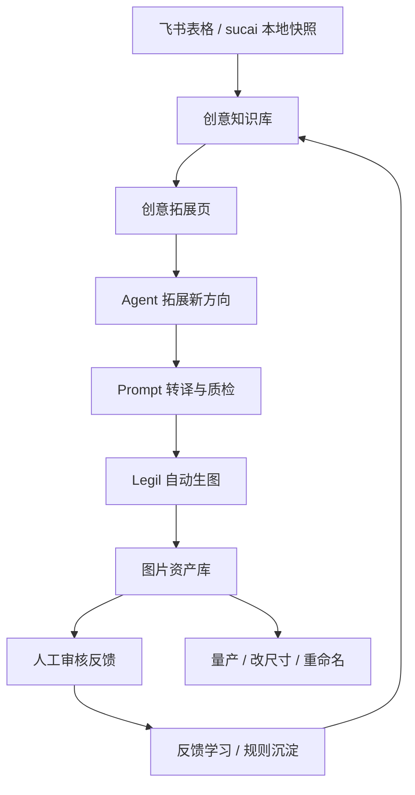

# 创意资产闭环系统项目调整设计方案

> 文档日期：2026-05-26  
> 当前项目目录：`C:\Users\dd\Desktop\项目`  
> 参考来源：`Mcc Imagic Q1 Ver.p2 0514` 项目说明、整体 Agent 系统设计、创意拓展 Agent 设计、旧版创意拓展页与知识库页思路。  
> 当前落地平台：把旧项目中的 `Lovart` 执行层替换为当前项目已经接入的 `Legil`。

---

## 1. 一句话定位

当前项目建议从“AI 生图自动化工具”升级为：

```text
创意资产管理 + 创意拓展 + 自动化生图 + 反馈学习 的本地闭环系统
```

系统的核心闭环是：

```text
飞书表格 / 本地 sucai 快照
  -> 本地创意知识库
  -> Agent 自动拓展方向
  -> Prompt 转译与质检
  -> Playwright 操作 Legil 生图
  -> 图片资产入库
  -> 人工审核好坏
  -> 反馈沉淀成规则
  -> 下一轮拓展更准
```

你的最终目标可以更明确地写成：

```text
让项目 24 小时自动运转，
持续从现有创意体系里找方向，
自动拓展新方向，
自动生成高质量 Legil prompt，
自动生图并入库，
根据人工反馈持续学习，
最终越来越准确地生成你想要的图。
```

因此后续开发不能只追求“自动化跑起来”，还要同时建设四个长期能力：

| 长期能力 | 目标 |
| --- | --- |
| 自动运转 | 系统能按规则持续选题、排队、生图、暂停、恢复、通知 |
| 准确生成 | prompt、参考图、方向定义、禁用规则共同约束 Legil 输出 |
| 可追溯资产 | 每张图都能追溯方向、prompt、模型参数、run、审核结果 |
| 持续进化 | 人工反馈能沉淀成规则，下一轮自动避开坏模式、放大好模式 |

旧项目里的关键思想需要保留：

| 设计思想 | 当前项目中的对应 |
| --- | --- |
| 飞书表格是稳定底图 | 第一阶段继续读取 `sucai` 本地快照，后续接飞书同步 |
| 本地知识库是项目大脑 | `data/creative-knowledge/` 扩展为方向、素材、资产、反馈、规则中心 |
| 方向定义和生图 Prompt 分层 | Agent 先产出新方向，再转译成 Legil prompt |
| AI 负责生成和执行，人负责审核 | 创意拓展页用于执行，知识库页用于沉淀和修正 |
| 生产执行必须串行可追溯 | 复用现有 Legil 批量能力和 run 记录 |
| 反馈必须进入下一轮上下文 | 新增 `feedback.json`、`creative-memory.json` 和规则注入机制 |

---

## 2. 当前项目现状

### 2.1 已有页面

当前前端集中在 `public/index.html`，已有四个主页面：

| 页面 | 当前作用 | 调整策略 |
| --- | --- | --- |
| 量产 | 批量从输入图、提示词或现有流程生成图片 | 保留，后续只接入知识库方向选择和资产回流 |
| 改尺寸 | 批量改尺寸，支持即梦 AI / Legil | 保留，不纳入创意闭环第一阶段改造 |
| 创意拓展 | 表格 prompt 解析、Agent 生成表格、Legil 创意批量生成、运行一次自动创意 | 调整为“创意实验台 / 单轮自动创意工作台” |
| 重命名 | 图片批量重命名、改尺寸、加 LOGO、一键打包 | 保留，后续可以从资产库选图后跳转使用 |

### 2.2 已完成的创意自动化底座

当前“运行一次自动创意第一版”已经完成 P0 到 P7，可作为新系统的执行底座：

| 阶段 | 状态 | 已有能力 |
| --- | --- | --- |
| P0 配置和环境检查 | 已完成 | 输出目录、参考图目录、Legil 参数、每日额度、headed 模式 |
| P1 最小创意知识库导入 | 已完成 | 读取 `sucai` 中方向表、TOP 素材表、参考图目录 |
| P2 自动选题器 | 已完成 | 根据方向覆盖、TOP 素材、历史运行选择方向 |
| P3 Agent 单轮拓展 | 已完成 | 调用 `creative-agent-service.js` 生成新方向和 prompts |
| P4 Prompt Gate | 已完成 | 质检、去重、禁用词、历史避重、额度截断 |
| P5 Legil 单次生图闭环 | 已完成 | 调用 `/api/legil/creative-batch`，headed 模式真实生图 |
| P6 资产索引 | 已完成 | 新图写入 `data/creative-knowledge/assets.json` |
| P7 前端和通知 | 已完成 | 创意拓展页已有运行一次按钮、状态、进度、飞书关键通知 |

当前真实冒烟结果：

```text
Run ID: creative_run_20260526_200045_53b7a7
Prompt count: 1
Images saved: 4
Output folder: D:\工作\自动化工作流1\创意拓展\输出
Assets written: data/creative-knowledge/assets.json
```

S0 基线锁定（2026-05-27）：

| 项目 | 状态 |
| --- | --- |
| 基线文档 | `docs/S0-当前基线锁定.md` |
| 自动验收脚本 | `npm run test:s0-baseline` |
| 覆盖范围 | status、agentOnly、Prompt Gate、小批量 Legil stub、assets.json、四个页面入口 |
| 继续开发前置 | 后续 S1/S2/24 小时循环开发前，先确认 S0 基线仍通过 |

### 2.3 当前代码底座

| 模块 | 路径 | 当前职责 |
| --- | --- | --- |
| 创意知识库路由 | `src/routes/creative-knowledge.routes.js` | 导入、状态、方向列表、TOP 洞察 |
| 自动创意路由 | `src/routes/creative-auto.routes.js` | 状态、选题建议、run-once、run 详情 |
| 创意知识库服务 | `src/services/creative-knowledge/` | 方向表、TOP 素材、参考图索引导入 |
| 自动创意服务 | `src/services/creative-auto/` | 自动选题、Agent 调用、Prompt Gate、Legil 调用、资产入库 |
| Legil 服务 | `src/services/legil/` | 生图参数、页面操作、输出检测、保存 |
| 创意 Agent | `creative-agent-service.js` | 运行 Agent，生成创意拓展表和 prompts |
| Prompt 质量 | `creative-agent-quality.js` | prompt 基础质检 |
| 前端自动创意 | `public/js/creative-auto.js` | run-once 前端交互 |
| 前端创意流程 | `public/js/creative-workflow.js` | 现有创意拓展批量流程 |

---

## 3. 目标系统形态

### 3.1 总体模块



### 3.2 角色分工

| 角色 | 负责什么 | 设计边界 |
| --- | --- | --- |
| 飞书表格 | 保存团队认可的标签、方向、参考图线索 | 短期不强制写回，避免污染底表 |
| 本地知识库 | 保存系统运行、拓展、资产、反馈、规则 | 作为当前系统的大脑和缓存层 |
| 创意拓展页 | 选方向、跑 Agent、生成 prompts、调用 Legil | 偏任务执行和实验 |
| 知识库页 | 看方向、看资产、审核反馈、管理规则 | 偏沉淀、整理和学习 |
| Legil | 生图执行器 | 只接收通过 Prompt Gate 的任务 |
| Playwright | 自动操作员 | 保持 headed，必要时人工接管 |
| assets.json | 图片资产台账 | 每张图必须可追溯 run、方向、prompt、参数 |
| feedback.json / creative-memory.json | 学习层 | 记录人工判断，并转成下一轮 Agent 上下文 |

### 3.3 页面结构调整

建议最终保留五个一级页面：

```text
量产
改尺寸
创意拓展
知识库
重命名
```

其中：

| 页面 | 处理方式 |
| --- | --- |
| 量产 | 保留当前能力。后续增加“从知识库选择方向 / 从资产库复用 prompt”入口 |
| 改尺寸 | 保留当前能力。后续支持从资产库批量送入改尺寸 |
| 创意拓展 | 重新组织为单轮自动创意、手动拓展、结果审核、投产四段 |
| 知识库 | 新增页面，管理方向、标签、参考图、资产、反馈、规则 |
| 重命名 | 保留当前能力。后续支持从资产库筛选后直接进入重命名 |

不建议第一阶段新增独立“运行中心”和“设置页”。当前项目已经有状态面板、配置面板和 SSE 日志，短期可以把运行中心能力折叠在创意拓展页和知识库页里。

---

## 4. 创意拓展页调整方案

### 4.1 页面定位

创意拓展页不再只是“上传表格生成图”的入口，而是变成：

```text
创意实验台：选方向、让 Agent 拓展、质检 prompt、调用 Legil、得到一批可审核的图
```

### 4.2 推荐页面分区

```text
创意拓展页
  1. 数据源状态
  2. 选择目标
  3. 配置与执行
  4. 生成进度
  5. 审核结果
  6. 历史 run
```

### 4.3 数据源状态

目的：让用户知道当前系统有没有足够知识可跑。

展示：

| 字段 | 来源 |
| --- | --- |
| 方向数量 | `data/creative-knowledge/directions.json` |
| TOP 素材数量 | `top-materials.json` |
| TOP 洞察数量 | `top-material-insights.json` |
| 参考图数量 | `reference-images.json` |
| 已生成资产数量 | `assets.json` |
| 今日剩余额度 | `scheduler-state.json` |
| 上次导入时间 | `metadata.json` |

操作：

| 操作 | API |
| --- | --- |
| 刷新知识库状态 | `GET /api/creative-knowledge/status` |
| 从本地 sucai 重新导入 | `POST /api/creative-knowledge/import` |
| 后续从飞书同步 | 新增 `POST /api/creative-knowledge/sync-feishu` |

### 4.4 选择目标

第一版使用自动选题，下一版需要给用户更多控制。

建议支持三种方式：

| 方式 | 说明 | 优先级 |
| --- | --- | --- |
| 自动推荐 | 系统按覆盖度、TOP 素材、失败率、近期运行选择 | 已有基础，继续增强 |
| 手动选择方向 | 从方向树或方向列表里选一个方向 | 新增 |
| 输入灵感 | 用户写一句想法，Agent 判断挂在哪个方向下 | 后续新增 |

方向卡片展示：

```text
方向路径
方向描述
自动评分
TOP 素材信号
参考图数量
历史运行次数
历史通过率
最近失败原因
```

### 4.5 配置与执行

保留当前已确认的默认参数：

| 配置 | 默认值 |
| --- | --- |
| 运行模式 | 运行一次自动创意 |
| 每日上限 | 1000 张 |
| 每 prompt 张数 | 4 张 |
| 单轮 prompt 上限 | 25 条 |
| 冒烟 prompt 数 | 2 到 5 条，当前前端默认 5 条 |
| Legil 模型 | Nano Banana 2 |
| 模型内部值 | `nano-banana-2` |
| 比例 | `1:1` |
| 分辨率 | `2K` |
| 浏览器模式 | `headed` |
| 连续失败暂停 | 5 次 |
| 输出目录 | `D:\工作\自动化工作流1\创意拓展\输出` |
| 参考图目录 | `D:\工作\自动化工作流1\创意拓展\参考图` |
| 飞书通知 | 异常、暂停、完成 |

新增操作按钮：

| 按钮 | 作用 |
| --- | --- |
| 只生成 Prompt | `agentOnly: true`，不调用 Legil |
| 小批量生图 | 默认 2 到 5 条 prompt |
| 完整 25 条 | 用满单轮上限，最多 100 张 |
| 暂停 / 停止 | 停止 Agent 或 Legil 当前任务 |
| 查看 run 详情 | 打开本次原始 Agent 输出、Prompt Gate 报告、Legil 结果 |

### 4.6 生成进度

进度需要按流水线阶段展示，而不是只显示总进度。

阶段建议：

```text
preflight
importing_knowledge
selecting_direction
expanding_prompts
validating_prompts
generating_images
indexing_assets
completed / paused / failed
```

每个阶段展示：

| 内容 | 说明 |
| --- | --- |
| 当前阶段 | 用户知道系统在干什么 |
| 当前方向 | 显示 path 和选择原因 |
| raw prompt 数 | Agent 原始输出数 |
| accepted prompt 数 | 通过 Prompt Gate 的数 |
| rejected prompt 数 | 被拦截的数 |
| expectedImageTotal | 理论生成图片数 |
| savedCount | 实际保存图片数 |
| failedCount | 失败数 |
| runId | 追溯编号 |

### 4.7 审核结果

这是当前创意拓展页下一步最关键的调整。

Legil 生成完成后，页面应直接出现图片审核区：

| 功能 | 说明 |
| --- | --- |
| 图片网格 | 显示本次生成图片 |
| 按 prompt 分组 | 每条 prompt 默认 4 张图，方便比较 |
| 快速标记 | 好图、一般、坏图、废图 |
| 方向判断 | 方向可继续、方向不成立、需要改写 |
| 问题标签 | 跑题、重复、文字差、构图弱、风格不符、参考图没跟上 |
| 反馈备注 | 人工补充说明 |
| 写入知识库 | 把审核结果写入 `feedback.json` |
| 收录方向 | 好方向写入本地成长层，后续可写回飞书 |

审核区不应该让 Agent 自动替用户拍板。Agent 可以给建议，但最终的好坏判断由用户确认。

---

## 5. 新增知识库页面方案

### 5.1 页面定位

知识库页是整个系统的大脑和档案室：

```text
管理方向体系、参考图、生成资产、审核反馈、沉淀规则，让下一轮创意更准
```

### 5.2 推荐 Tab

```text
知识库页
  1. 总览
  2. 标签地图
  3. 方向库
  4. 资产库
  5. 反馈记录
  6. 规则与偏好
  7. 操作记录
```

### 5.3 总览

展示系统健康度和闭环数据。

指标：

| 指标 | 说明 |
| --- | --- |
| 创意方向数 | 方向表导入数量 |
| 可自动运行方向数 | `autoRun !== false` |
| TOP 素材数 | 素材明细数量 |
| 参考图数 | 已索引图片 |
| 已生成图片数 | assets 数量 |
| 已审核图片数 | feedback 中有审核状态的数量 |
| 好图率 | 好图 / 已审核图 |
| Prompt 通过率 | Prompt Gate accepted / raw |
| 今日额度 | 已用 / 1000 |
| 最近一次 run | runId、状态、时间、保存数 |

提醒：

| 提醒 | 触发条件 |
| --- | --- |
| 缺参考图方向 | 某方向没有匹配参考图 |
| 高失败方向 | 连续失败或历史失败率高 |
| 重复高风险方向 | 与历史 prompt / assets 过近 |
| 反馈未消化 | feedback 新增但尚未进入 creative-memory |
| 可写回飞书方向 | 本地采纳但未同步回飞书 |

### 5.4 标签地图

用于查看《无尽冬日》创意方向体系。

功能：

| 功能 | 说明 |
| --- | --- |
| 树状层级 | 一级、二级、三级、细分标签 |
| 搜索方向 | 按 path、名称、描述、关键词搜索 |
| 方向详情 | 描述、参考图、TOP 素材信号、历史 run |
| 覆盖状态 | 已拓展次数、已生图数、好图率 |
| 选择去拓展 | 点击后跳转创意拓展页，并带上 directionId |
| 标记禁跑 | 设置 `autoRun: false` |
| 编辑 mustKeep / mustAvoid | 影响后续 Agent 和 Prompt Gate |

短期可以先做“只读 + 跳转拓展”。编辑和写回放到后续阶段。

### 5.5 方向库

方向库把“飞书原始方向”和“本地成长方向”放在一起看，但来源要分清。

方向类型：

| 类型 | 来源 |
| --- | --- |
| seed | 飞书 / sucai 导入的原始方向 |
| expanded | Agent 拓展并被人工采纳的新方向 |
| draft | Agent 生成但未审核的草案 |
| archived | 用户归档或禁用的方向 |

方向详情建议字段：

```json
{
  "id": "direction_xxx",
  "source": "seed | expanded | draft",
  "path": "题材/探索发现/围墙",
  "name": "围墙",
  "description": "方向定义",
  "mustKeep": [],
  "mustAvoid": [],
  "referenceImageIds": [],
  "topMaterialInsightIds": [],
  "stats": {
    "expandedCount": 0,
    "promptCount": 0,
    "imageCount": 0,
    "acceptedAssetCount": 0,
    "rejectedAssetCount": 0,
    "lastRunAt": null,
    "failureCount": 0
  }
}
```

### 5.6 资产库

资产库是图片管理核心。

资产必须能追溯：

| 字段 | 说明 |
| --- | --- |
| assetId | 图片资产 ID |
| filePath | 本地文件路径 |
| runId | 哪次 run 生成 |
| directionId | 来源方向 |
| sourceDirectionPath | 来源路径 |
| promptHash | prompt hash |
| promptTitle | prompt 标题 |
| prompt | 完整 prompt |
| model | Nano Banana 2 |
| aspectRatio | 1:1 |
| resolution | 2K |
| outputQuantity | 4 |
| width / height | 校验后的图片尺寸 |
| reviewStatus | unreviewed / good / normal / bad / rejected |
| feedbackTags | 人工问题标签 |
| createdAt | 生成时间 |

资产库功能：

| 功能 | 第一阶段 | 后续 |
| --- | --- | --- |
| 查看图片网格 | 必做 | 继续增强 |
| 按 run 筛选 | 必做 | 继续增强 |
| 按方向筛选 | 必做 | 继续增强 |
| 按审核状态筛选 | 必做 | 继续增强 |
| 打开所在文件夹 | 必做 | 继续增强 |
| 标记好坏 | 必做 | 继续增强 |
| 送入重命名 | 可选 | 建议做 |
| 送入改尺寸 | 可选 | 建议做 |
| 生成相似方向 | 后续 | 从好图反推新方向 |

### 5.7 反馈记录

反馈记录把人工判断变成可学习数据。

反馈类型：

| 类型 | 说明 |
| --- | --- |
| asset_review | 对单张图的好坏评价 |
| prompt_review | 对 prompt 的评价 |
| direction_review | 对新方向是否成立的评价 |
| run_review | 对整次 run 的总结 |
| rule_edit | 人工直接新增规则 |

反馈 JSON 示例：

```json
{
  "feedbackId": "feedback_20260526_xxx",
  "type": "asset_review",
  "runId": "creative_run_20260526_200045_53b7a7",
  "assetId": "asset_xxx",
  "directionId": "direction_xxx",
  "promptHash": "abc123",
  "rating": "good",
  "tags": ["构图清晰", "题材准确"],
  "comment": "围墙的防御感明确，可以继续沿这个方向拓展。",
  "createdAt": "2026-05-26T20:30:00.000Z",
  "digested": false
}
```

### 5.8 规则与偏好

这里管理 Agent 下次会参考的规则。

规则分三层：

| 层级 | 说明 |
| --- | --- |
| global | 全局规则，所有方向都适用 |
| dimension | 某类方向或标签下适用 |
| node | 某个具体方向适用 |

规则类别：

| 类别 | 示例 |
| --- | --- |
| preferred_patterns | 偏好“具体角色动作 + 明确物件 + 强广告钩子” |
| avoid_patterns | 避免“抽象科幻、机甲、高科技 UI、大面积英文” |
| prompt_rules | prompt 必须写清主体、动作、环境、光线、画面文字规则 |
| visual_rules | 冰封末世基调、不要偏离无尽冬日世界观 |
| forbidden_terms | 业务禁用词、竞品、敏感元素 |

第一阶段规则可以来自：

```text
内置默认规则
  + 方向表 mustAvoid
  + 接口传入 forbiddenRules
  + 人工在知识库页新增规则
```

后续再让反馈学习 Agent 定期把 feedback 消化为规则草案。

---

## 6. 数据架构调整

### 6.1 数据层分层

```text
data/creative-knowledge/
  metadata.json
  directions.json
  top-materials.json
  top-material-insights.json
  reference-images.json
  assets.json
  feedback.json
  creative-memory.json
  direction-drafts.json
  knowledge-operations.json
  scheduler-state.json
  runs/
```

| 文件 | 作用 | 当前状态 |
| --- | --- | --- |
| `metadata.json` | 记录导入时间、数量、来源和 warnings | 已有 |
| `directions.json` | 原始方向和统计 | 已有 |
| `top-materials.json` | TOP 素材明细 | 已有 |
| `top-material-insights.json` | TOP 素材聚合洞察 | 已有 |
| `reference-images.json` | 参考图索引和方向匹配 | 已有 |
| `assets.json` | 生图资产台账 | 已有 |
| `feedback.json` | 人工审核反馈 | 已有空文件，需要扩展功能 |
| `creative-memory.json` | 反馈消化后的规则和偏好 | 新增 |
| `direction-drafts.json` | Agent 生成但未采纳的新方向草案 | 新增 |
| `knowledge-operations.json` | 知识库操作日志 | 新增 |
| `scheduler-state.json` | 每日额度、连续失败、当前任务 | 已有 |
| `runs/*.json` | 每次自动创意运行记录 | 已有 |

### 6.2 飞书与本地的关系

短期建议：

```text
飞书表格
  -> 手动导出 / 本地 sucai 快照
  -> creative-knowledge import
  -> 本地 JSON 知识库
```

中期增加：

```text
飞书 API 同步
  -> 下载方向表、TOP 素材、参考图线索
  -> 写入同一套本地 JSON schema
```

长期增加：

```text
本地采纳方向
  -> 人工确认
  -> 写回飞书新行或指定表
```

原则：

| 原则 | 说明 |
| --- | --- |
| 飞书是稳定底图 | 不把每次实验都直接写回 |
| 本地是成长层 | 所有实验、草案、反馈先在本地沉淀 |
| 写回必须人工确认 | 避免 Agent 误写污染团队底表 |
| schema 要统一 | 无论来源是 sucai 还是飞书 API，最终都进入同一套 JSON |

### 6.3 run 记录结构建议

当前 run 已经包含 sourceDirection、selection、referenceImages、instruction、agentOutput、prompts、promptQualityReport、legilPayload、legilResult、assets。

后续建议补齐：

```json
{
  "runId": "creative_run_xxx",
  "mode": "legil-run-once",
  "status": "completed",
  "phase": "completed",
  "sourceDirection": {},
  "selection": {},
  "referenceImages": [],
  "agentInput": {
    "direction": {},
    "topMaterialSignals": [],
    "referenceImageHints": [],
    "forbiddenRules": []
  },
  "agentOutput": {
    "rawText": "",
    "rawTableMarkdown": ""
  },
  "promptQualityReport": {},
  "prompts": [],
  "legilPayload": {},
  "legilResult": {},
  "assets": [],
  "reviewSummary": {
    "good": 0,
    "normal": 0,
    "bad": 0,
    "unreviewed": 0
  }
}
```

---

## 7. Agent 架构映射

### 7.1 旧项目 Agent 到当前项目的映射

| 旧项目 Agent | 当前项目落地方式 | 阶段 |
| --- | --- | --- |
| 灵感澄清 Agent | 新增，用户输入一句灵感时归属方向 | 后续 |
| 拓展策略预检 Agent | 当前 preflight + direction-selector 的升级版 | P8/P9 |
| 创意拓展 Agent | 已由 `creative-agent-service.js` + run-once instruction 承担 | 已有，需继续增强 |
| 拓展结果审核 Agent | 新增，审核新方向是否重复、是否可沉淀 | 后续 |
| Prompt 转译 Agent | 当前 Agent 直接产 prompt，后续应拆为独立转译层 | 后续 |
| 拓展预览执行 Agent | 当前 run-once + Legil 批量能力 | 已有基础 |
| 知识库方向定义精修 Agent | 新增，用于补齐方向描述、mustKeep、mustAvoid | 后续 |
| 层级语义补全 Agent | 新增，用于维护标签层级说明 | 后续 |
| 索引标签整理 Agent | 新增，用于补 mood、perspective、time、narrative、scale | 后续 |
| 拓展空间分析 Agent | 新增，用于找空白方向和高潜方向 | 后续 |
| 知识库参考图生成 Agent | 可复用 Legil 生图，为方向补参考图 | 后续 |
| 反馈学习 Agent | 新增，从 feedback 提炼规则到 creative-memory | P10 |
| 量产启动审查 Agent | 当前量产 preflight 可升级 | 后续 |
| Legil 生产执行 Agent | 当前 `src/services/legil/` | 已有 |
| Batch 调度 Agent | 当前 Legil creative-batch / workflow 能力 | 已有 |

### 7.2 第一阶段 Agent 边界

第一阶段不要把 Agent 做得太自由。

Agent 应该做：

```text
读取方向上下文
读取 TOP 素材信号
读取参考图线索
遵守 mustKeep / mustAvoid
生成新方向
生成可给 Legil 的 prompt
输出固定表格或结构化 JSON
```

Agent 不应该做：

```text
直接写知识库
直接写飞书
绕过 Prompt Gate
绕过每日额度
自动判断图片好坏并替用户采纳
在 Legil 登录或验证码问题上绕过人工
```

### 7.3 Prompt 转译层建议

现在 run-once 里 Agent 同时生成新方向和 prompt。后续为了稳定，建议拆成两层：

```text
创意拓展 Agent
  -> 输出方向定义

Prompt 转译 Agent
  -> 把方向定义转成 Legil prompt
```

好处：

| 好处 | 说明 |
| --- | --- |
| 方向更适合沉淀 | 方向定义是开放的，可复用 |
| prompt 更适合执行 | prompt 是单图级、具体、可质检 |
| 知识库更干净 | 不把一次性的 prompt 当成方向本身 |
| 后续可换模型 | 拓展和转译可用不同 LLM |

---

## 8. API 调整建议

### 8.1 保留现有 API

| API | 继续使用 |
| --- | --- |
| `GET /api/creative-knowledge/status` | 知识库状态 |
| `POST /api/creative-knowledge/import` | 本地导入 |
| `GET /api/creative-knowledge/overview` | 知识库只读总览 |
| `GET /api/creative-knowledge/directions` | 方向列表 |
| `GET /api/creative-knowledge/assets` | 资产库只读查询 |
| `GET /api/creative-knowledge/runs` | 自动创意 run 列表 |
| `GET /api/creative-knowledge/top-material-insights` | TOP 洞察 |
| `GET /api/creative-auto/status` | 自动创意状态 |
| `GET /api/creative-auto/suggestion` | 自动选题建议 |
| `POST /api/creative-auto/run-once` | 运行一次自动创意 |
| `GET /api/creative-auto/runs/:runId` | run 详情 |
| `POST /api/legil/creative-batch` | Legil 批量生图 |
| `GET /api/legil/creative-progress` | Legil 进度 |

### 8.2 新增知识库 API

| API | 方法 | 用途 |
| --- | --- | --- |
| `/api/creative-knowledge/overview` | GET | 查询知识库总览 |
| `/api/creative-knowledge/assets` | GET | 查询资产库 |
| `/api/creative-knowledge/assets/:assetId/file` | GET | 读取资产本地图片文件 |
| `/api/creative-knowledge/runs` | GET | 查询自动创意 run 列表 |
| `/api/creative-knowledge/assets/:assetId` | GET | 查看单张资产详情 |
| `/api/creative-knowledge/assets/:assetId/review` | POST | 标记好图、坏图、反馈标签 |
| `/api/creative-knowledge/feedback` | GET | 查询反馈记录 |
| `/api/creative-knowledge/feedback` | POST | 新增人工反馈 |
| `/api/creative-knowledge/memory` | GET | 查看已沉淀规则 |
| `/api/creative-knowledge/memory/digest` | POST | 消化反馈为规则草案 |
| `/api/creative-knowledge/direction-drafts` | GET | 查询 Agent 新方向草案 |
| `/api/creative-knowledge/direction-drafts/:id/accept` | POST | 采纳草案进入本地成长层 |
| `/api/creative-knowledge/direction-drafts/:id/reject` | POST | 拒绝草案并记录原因 |
| `/api/creative-knowledge/operations` | GET | 查看知识库操作记录 |
| `/api/creative-knowledge/sync-feishu` | POST | 后续飞书同步 |

### 8.3 新增创意拓展 API

| API | 方法 | 用途 |
| --- | --- | --- |
| `/api/creative-auto/preflight` | GET | 单独获取运行前检查 |
| `/api/creative-auto/run-once/:runId/review-summary` | GET | 查看某次 run 的审核汇总 |
| `/api/creative-auto/run-once/:runId/retry-failed` | POST | 重试失败 prompt |
| `/api/creative-auto/run-once/:runId/prompts` | GET | 查看本次 accepted / rejected prompts |
| `/api/creative-auto/run-once/:runId/accept-direction` | POST | 把本次好方向收录为 direction draft 或 expanded direction |

---

## 9. 分阶段开发计划

### Phase A：知识库页只读 MVP

目标：

```text
先让用户能看见当前知识库，不急着编辑。
```

任务：

| 任务 | 产出 |
| --- | --- |
| 新增页面 Tab：知识库 | `public/index.html` 新增入口 |
| 新增前端文件 | `public/js/creative-knowledge.js` |
| 新增资产查询 API | `/api/creative-knowledge/assets` |
| 新增 run 列表查询 | `/api/creative-auto/runs` 或知识库侧聚合 |
| 总览卡片 | 方向、素材、参考图、资产、反馈、额度 |
| 标签地图只读列表 | 支持搜索和筛选 |
| 资产库只读网格 | 按 run、方向、时间筛选 |

验收：

```text
打开知识库页能看到方向数量、参考图数量、资产数量。
能看到真实冒烟生成的 4 张图资产记录。
点击资产能看到 runId、方向、prompt 和本地文件路径。
```

当前落地状态（2026-05-27）：

| 项目 | 状态 |
| --- | --- |
| 知识库导航入口 | 已加入 `public/index.html` |
| 总览 / 标签地图 / 方向库 / 资产库 / 运行记录 | 已落地为只读 MVP |
| 资产查询 API | 已落地 `GET /api/creative-knowledge/assets` |
| 资产图片代理 | 已落地 `GET /api/creative-knowledge/assets/:assetId/file` |
| 方向参考图代理 | 已落地 `GET /api/creative-knowledge/references/:referenceId/file` |
| run 列表查询 | 已落地 `GET /api/creative-knowledge/runs` |
| 聚合总览 | 已落地 `GET /api/creative-knowledge/overview` |
| 回归验收 | `npm run test:s0-baseline`、`npm run test:s1-knowledge` 已通过 |

S1 当前只读，不做方向编辑、反馈学习、飞书写回和 24 小时循环。2026-05-27 已从方向种子表抽取 417 张 Excel 嵌入参考图，参考图总数 425；真实 run `creative_run_20260527_113357_d0553e` 已保存 4 张图并写入资产库。

### Phase B：资产审核与反馈入库

目标：

```text
让人工判断沉淀下来，形成反馈数据。
```

任务：

| 任务 | 产出 |
| --- | --- |
| 资产 review API | `/api/creative-knowledge/assets/:assetId/review` |
| feedback 写入 | `feedback.json` |
| 创意拓展页生成完成后展示审核区 | 按 prompt 分组看图 |
| 知识库资产库支持好坏筛选 | good / normal / bad / rejected / unreviewed |
| 方向统计更新 | acceptedAssetCount、rejectedAssetCount |

验收：

```text
用户能把某张图标为好图或坏图。
assets.json 更新 reviewStatus。
feedback.json 新增一条可追溯记录。
知识库总览好图率随审核变化。
```

### Phase C：创意拓展页重组

目标：

```text
把当前创意拓展页从功能堆叠改成清晰流水线。
```

任务：

| 任务 | 产出 |
| --- | --- |
| 数据源状态区 | 展示知识库导入状态 |
| 选择目标区 | 自动推荐 + 手动方向选择 |
| 配置执行区 | agentOnly、小批量、完整 25 条 |
| 进度区 | 按阶段展示 |
| 审核结果区 | 生成后直接审核 |
| 历史 run 区 | 最近运行记录 |

验收：

```text
用户不需要看日志，也能理解这次从哪个方向开始、生成了多少 prompt、丢弃多少、保存多少图、下一步该审核什么。
```

### Phase D：本地成长层与方向草案

目标：

```text
把好方向保存为可复用方向，而不是只保存图片。
```

任务：

| 任务 | 产出 |
| --- | --- |
| direction-drafts.json | 保存 Agent 新方向草案 |
| 收录新方向 | 好方向进入 expanded directions |
| 拒绝新方向 | 记录拒绝原因 |
| 方向合并 / 归档 | 避免方向库变乱 |
| mustKeep / mustAvoid 编辑 | 影响后续 Agent |

验收：

```text
用户能把某次 run 中表现好的新方向收录到知识库。
下次自动选题和 Agent 上下文能看到这个方向，避免重复生成。
```

### Phase E：反馈学习 Agent

目标：

```text
把人工审核从“记录”升级为“可注入下一轮的规则”。
```

任务：

| 任务 | 产出 |
| --- | --- |
| creative-memory.json | 保存 preferred_patterns、avoid_patterns、rules |
| digest API | `/api/creative-knowledge/memory/digest` |
| 规则草案 | Agent 先生成草案，不直接覆盖 |
| 人工确认规则 | 确认后才启用 |
| Prompt 注入 | run-once instruction 读取 creative-memory |

验收：

```text
连续审核几轮后，系统能总结出“哪些元素常被采纳、哪些元素常被拒绝”。
下一轮 Agent prompt 中能看到这些规则。
```

### Phase F：飞书同步

目标：

```text
让飞书成为稳定底图来源，不再只依赖手动放 sucai。
```

任务：

| 任务 | 产出 |
| --- | --- |
| 飞书配置检查 | App ID、Secret、表格 token、权限 |
| 读取方向表 | 同步到 directions.json |
| 读取 TOP 素材表 | 同步到 top-materials.json |
| 下载或索引参考图 | 写入 reference-images.json |
| 同步记录 | knowledge-operations.json |
| 可选写回 | 人工确认后写回新方向 |

验收：

```text
点击同步飞书后，本地知识库刷新。
飞书不可用时保留上次缓存，不阻塞已有本地流程。
```

### Phase G：量产联动

目标：

```text
让创意拓展沉淀出的好方向进入正式量产。
```

任务：

| 任务 | 产出 |
| --- | --- |
| 量产页接入知识库方向 | 可从 expanded directions 选择 |
| 量产启动审查增强 | 检查方向质量、参考图、历史表现 |
| assets 反向引用量产任务 | 图能追溯到量产批次 |
| 好图二次加工 | 好图送入重命名、改尺寸 |

验收：

```text
在知识库里选中的好方向，可以进入量产页继续批量生图。
量产产物也能回流 assets.json。
```

### Phase H：24 小时自动化

目标：

```text
在单轮闭环稳定后，再开启自动调度。
```

前置条件：

```text
run-once 稳定
Prompt Gate 稳定
Legil 登录态稳定
失败暂停可靠
资产审核闭环可用
飞书或本地知识库可持续更新
```

任务：

| 任务 | 产出 |
| --- | --- |
| 调度器 | 定时触发 run-once |
| 每日额度守卫 | 1000 张硬上限 |
| 夜间策略 | 失败暂停，不无限重试 |
| 飞书日报 | 完成、暂停、异常摘要 |
| 人工接管机制 | headed 浏览器保留 |

验收：

```text
系统可以无人值守运行，但遇到登录、验证码、连续失败、额度用完时自动暂停并通知。
```

24 小时自动化不是简单加一个定时器，而是需要达到“可控的无人值守”。正式开启前必须具备：

| 能力 | 要求 |
| --- | --- |
| 自动选题稳定 | 能避开刚跑过、失败多、重复高、无参考依据的方向 |
| Prompt Gate 稳定 | 能拦截重复、禁用元素、模板化和超预算 prompt |
| Legil 执行稳定 | headed 模式可接管，失败能停，不会无限消耗额度 |
| 资产回流稳定 | 每张图自动写入 assets，并能被审核和复用 |
| 反馈学习稳定 | 好图、坏图、方向反馈能进入 creative-memory |
| 通知稳定 | 只在异常、暂停、完成、日报等关键节点打扰你 |
| 恢复策略稳定 | 服务重启后能知道上次跑到哪、今天用了多少额度 |

---

## 10. 保留现有页面的具体边界

### 10.1 量产页

保留：

```text
现有参考图目录
现有输出目录
现有提示词生成流程
现有 Legil 批量能力
现有进度、暂停、继续、日志
```

只新增轻量入口：

```text
从知识库选择方向
从好图资产复用 prompt
量产结果写回 assets.json
```

### 10.2 改尺寸页

保留：

```text
即梦 AI / Legil 改尺寸选择
输入输出目录
批量任务进度
继续任务能力
```

只新增轻量入口：

```text
从资产库选择图片送入改尺寸
改尺寸结果作为派生产物记录到资产关系里
```

### 10.3 重命名页

保留：

```text
当前重命名规则
主标签 / 副标签配置
批量改尺寸
加 LOGO
一键打包
```

只新增轻量入口：

```text
从资产库筛选图片后送入重命名
重命名结果回写资产派生记录
```

---

## 11. 需要你提供什么

原则：能从当前项目、配置、表格、日志和默认规则里推断的，系统自己处理。只有无法自动判断或涉及账号权限、业务偏好时再找你。

### 11.1 系统可以自己处理

| 项目 | 默认处理 |
| --- | --- |
| 本地数据导入 | 自动读取 `C:\Users\dd\Desktop\项目\sucai` |
| 输出目录 | 自动使用 `D:\工作\自动化工作流1\创意拓展\输出` |
| 参考图目录 | 自动使用 `D:\工作\自动化工作流1\创意拓展\参考图` |
| Legil 参数 | Nano Banana 2、1:1、2K、每 prompt 4 张 |
| 单轮规模 | 默认小批量，完整模式最多 25 条 prompt |
| 每日额度 | 1000 张硬上限 |
| 浏览器模式 | headed |
| 失败策略 | 连续 5 次失败暂停 |
| Prompt Gate | 内置禁用词、重复检测、历史避重、额度截断 |
| 飞书通知 | 有配置就发异常、暂停、完成；无配置就写日志 |
| 文档同步 | 调整参数时同步 Agent 设定文件和项目文档 |

### 11.2 真正需要你提供或确认

| 情况 | 需要你做什么 |
| --- | --- |
| Legil 登录过期、验证码、二次验证 | 在 headed 浏览器里登录或接管 |
| LLM API Key / API URL / 模型不可用 | 提供可用配置或确认替换模型 |
| 飞书 API 接入 | 提供 App ID、App Secret、表格 token、权限范围 |
| 飞书通知目标 | 指定发到哪个群或哪个人 |
| 业务专属禁用词 | 提供品牌、竞品、敏感元素、绝对禁跑方向 |
| 方向表字段大改 | 告诉字段含义或提供新样例 |
| 想直接放量 | 确认从冒烟变成大批量，避免消耗过快 |
| 人工审核标准 | 如果希望系统更懂“好图”和“坏图”，需要给几轮示例反馈 |

---

## 12. 风险与控制

| 风险 | 控制策略 |
| --- | --- |
| Legil 页面变化 | 复用现有选择器适配，失败保留 headed 浏览器 |
| Prompt 重复浪费额度 | Prompt Gate 做 hash、相似标题、历史 assets 避重 |
| Agent 方向跑偏 | 注入方向描述、TOP 素材、参考图线索、mustKeep、mustAvoid |
| 知识库变脏 | Agent 只生成草案，写入方向库需要人工确认 |
| 飞书底表被污染 | 第一阶段不自动写回，后续写回也必须人工确认 |
| 24 小时循环失控 | 先稳定 run-once，再做调度器，额度和失败暂停做硬约束 |
| 图片无法追溯 | assets.json 必须记录 runId、directionId、prompt、参数、文件路径 |
| 审核没有沉淀 | 每次标记好坏都写 feedback.json，后续 digest 到 creative-memory |

---

## 13. 推荐下一步

当前最合适的下一步不是直接做 24 小时循环，而是：

```text
P8：新增知识库页只读 MVP
  -> 能看方向、参考图、资产、run 记录

P9：资产审核与反馈入库
  -> 能把好图、坏图、问题标签写入 feedback.json

P10：反馈学习 Agent
  -> 能把人工反馈消化成 creative-memory，并注入下一轮 Agent

P11：创意拓展页重组
  -> 把当前功能按“数据源、选择目标、配置执行、审核结果”重新整理
```

这样推进的原因：

```text
当前 run-once 已经能跑通 Legil 生图。
现在最缺的不是继续加自动化速度，而是让生成结果能被看见、审核、沉淀、复用。
只要知识库页和反馈入库补上，闭环就真正成立。
```

---

## 14. 最终验收标准

最终版本不以“能生成图片”为验收，而以“能稳定生产你想要的图，并且越跑越准”为验收。

### 14.1 自动运转验收

| 项目 | 合格标准 |
| --- | --- |
| 24 小时运行 | 能按设定时间窗口持续运行，不需要每轮手动点击 |
| 每日额度 | 严格遵守每日上限，例如 1000 张 |
| 失败暂停 | 连续失败达到阈值自动暂停，不继续浪费额度 |
| 人工接管 | Legil headed 浏览器保留，登录、验证码、页面异常时可接管 |
| 任务追溯 | 每次自动运行都有 run 记录、阶段、错误、输出 |
| 关键通知 | 异常、暂停、完成、日报能通知，普通进度不刷屏 |

### 14.2 准确生成验收

| 项目 | 合格标准 |
| --- | --- |
| 方向准确 | Agent 拓展不偏离《无尽冬日》广告创意体系 |
| Prompt 准确 | Prompt 能明确主体、动作、环境、镜头、光线、文字规则 |
| 视觉准确 | 生成图符合方向定义、参考图线索和项目风格 |
| 去重有效 | 不反复生成相同构图、相同卖点、相同模板 prompt |
| 禁用有效 | 业务禁用元素、竞品、敏感元素不会进入 Legil |
| 质量可提升 | 好图率能随着反馈逐步提升 |

### 14.3 持续进化验收

| 项目 | 合格标准 |
| --- | --- |
| 反馈沉淀 | 人工标记好图、坏图、方向好坏后写入 feedback |
| 规则生成 | 系统能从反馈中总结 preferred_patterns 和 avoid_patterns |
| 规则确认 | 学到的规则先成为草案，人工确认后启用 |
| 下轮生效 | 下一轮 Agent 能读取 creative-memory，并明显避开旧问题 |
| 方向成长 | 好方向能成为本地成长层，后续继续拓展 |
| 资产复用 | 好图、好 prompt、好方向能进入量产、改尺寸、重命名流程 |

最终成熟状态应该是：

```text
你主要负责定战略、看结果、给反馈；
系统负责持续拓展、筛 prompt、跑 Legil、整理资产、吸收经验；
每一轮产出的好坏都会影响下一轮。
```

---

## 15. 第一版完成后的样子

第一版闭环完成后，你的日常操作会变成：

```text
打开本地平台
  -> 进入创意拓展页
  -> 看系统推荐方向
  -> 运行一次自动创意
  -> 等 Legil headed 生图完成
  -> 在页面里审核好图 / 坏图
  -> 好图和好方向进入知识库
  -> 下一轮 Agent 自动避开坏模式，沿好模式继续拓展
```

对应的数据沉淀：

```text
directions.json
  记录方向体系和本地成长方向

runs/*.json
  记录每次自动创意的完整过程

assets.json
  记录每张图片从哪来

feedback.json
  记录人工审核判断

creative-memory.json
  记录系统学到的偏好和规避规则
```

最终目标不是“多生成几张图”，而是让系统逐渐形成一个可持续增长的创意资产库：

```text
已有创意资产
  -> Agent 拓展
  -> Legil 出图
  -> 人工筛选
  -> 反馈学习
  -> 下次更准
```
