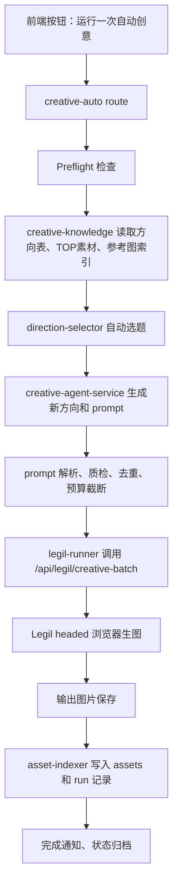

# 运行一次自动创意第一版分阶段开发计划

## 1. 文档定位

这份文档只服务第一版 MVP：先做一个可以手动触发的“运行一次自动创意”，不直接进入 24 小时循环。

第一版的目标不是追求最大产能，而是先把完整闭环跑通：

```text
读取创意体系
  -> 自动选择一个方向
  -> Agent 拓展新方向和 prompt
  -> prompt 质检、去重、限额
  -> 调用 Legil 生成图片
  -> 保存图片和资产记录
  -> 异常/暂停/完成时飞书通知
```

后续 24 小时自动循环只在这个闭环稳定后再加调度器。

---

## 2. 已确认的第一版边界

| 配置项 | 第一版值 |
| --- | --- |
| 运行模式 | 只做“运行一次自动创意”，不直接 24 小时循环 |
| 创意方向表 | `C:\Users\dd\Desktop\项目\sucai\创意方向种子表.xlsx` |
| TOP 素材表 | `C:\Users\dd\Desktop\项目\sucai\分月TOP素材数据表\*.csv` |
| 每日最多生成 | `1000` 张图 |
| 每条 prompt 出图 | `4` 张图 |
| Legil 模型 | `Nano Banana 2` |
| Legil 模型内部值 | `nano-banana-2`，以当前代码映射为准 |
| Legil 比例 | `1:1` |
| Legil 分辨率 | `2K` |
| 浏览器模式 | `headed`，方便人工接管 |
| 连续失败暂停 | `5` 次 |
| 输出目录 | `D:\工作\自动化工作流1\创意拓展\输出` |
| 参考图目录 | `D:\工作\自动化工作流1\创意拓展\参考图` |
| 飞书通知 | 只在异常、暂停、完成时发 |

第一版推荐单次运行默认规模：

| 项目 | 建议值 | 说明 |
| --- | --- | --- |
| 每轮原始方向数 | `1` | 先保证方向选择和回流清晰 |
| 每个原始方向拓展新方向数 | `5` | 让 Agent 有足够发散空间 |
| 每个新方向 prompt 数 | `5` | 单轮最多形成 25 条 prompt |
| 每轮最大 prompt 数 | `25` | 25 条 prompt x 4 张 = 100 张 |
| 冒烟测试 prompt 数 | `2-5` | 第一次试跑先少量，避免一次跑太久 |
| 每日图片预算 | `1000` | 第一版硬上限，超过则自动暂停或截断 |

### 2.1 默认自治原则

后续开发默认按“能自己解决就自己解决”的方式推进，不把可推断、可检测、可回退的问题都抛给你。

| 类型 | 处理原则 | 例子 |
| --- | --- | --- |
| 可从现有代码/配置判断 | 我直接读取并执行 | 目录、端口、已有 Agent 配置、已有 Legil 参数、已有飞书配置 |
| 可用保守默认值处理 | 我直接采用默认值并写入 run 记录 | TOP 指标权重、方向优先级、prompt 截断、禁用高科技/真实品牌等基础规则 |
| 可自动检测失败 | 我先做 Preflight 或冒烟测试 | 目录不可写、知识库未导入、LLM 配置缺失、当前有任务占用 |
| 可降级处理 | 我先保证主流程可跑 | 飞书未配置时只写日志，参考图未匹配时走纯文字拓展 |
| 会卡住真实执行 | 再找你处理或确认 | Legil 登录失效、验证码、LLM Key 缺失、平台页面大改、大批量真实出图前确认 |

第一版默认不要求你额外整理资料。除非遇到我无法从本地项目、配置文件、运行日志或现有数据中推断的问题，否则我会直接推进开发、测试和文档同步。

---

## 3. 当前项目可复用能力

| 能力 | 已有文件/接口 | 第一版用法 |
| --- | --- | --- |
| 创意 Agent | `creative-agent-service.js`、`creative-agent-worker.js` | 根据方向上下文生成新方向和 prompt |
| Agent API | `/api/creative-agent/run` | 后端 run-once 服务内部调用或复用逻辑 |
| prompt 解析 | `creative-table-parser.js`、`/api/creative/parse-table` | 从 Agent 输出表格提取 prompt |
| prompt 质检 | `creative-agent-quality.js` | 检查空 prompt、重复、结构问题 |
| Legil 批量生图 | `/api/legil/creative-batch` | 接收 prompts 后顺序生成图片 |
| Legil 进度 | `/api/legil/creative-progress` | run-once 页面和日志轮询进度 |
| Legil 停止/恢复 | `/api/legil/stop`、`/api/legil/creative-resume` | 失败或人工接管时使用 |
| Legil 参数设置 | `src/services/legil/*` | 复用模型、比例、分辨率、出图数量设置 |
| 实时日志 | `logger.js` | 输出每个阶段进度 |
| 飞书通知 | `feishu-notification-service.js`、`feishu-cli-bridge.js` | 只保留异常、暂停、完成通知 |
| 配置落盘 | `config-store.js` | 保存第一版固定配置和用户改动 |

第一版不重写 Legil 自动化，只在上层新增“创意知识库”和“运行一次编排器”。

---

## 4. 第一版目标架构



第一版新增能力分三层：

| 层级 | 新增能力 | 作用 |
| --- | --- | --- |
| 知识库层 | `creative-knowledge` | 导入方向表、TOP素材、参考图，形成可查询 JSON |
| 决策层 | `creative-auto` | 自动选题、生成 prompt、质检、预算控制 |
| 执行层 | `legil-runner` | 调用现有 Legil 批量生图，并把结果写回资产索引 |

---

## 5. 建议新增文件

### 5.1 数据目录

```text
data/creative-knowledge/
  directions.json
  top-materials.json
  top-material-insights.json
  reference-images.json
  assets.json
  feedback.json
  scheduler-state.json
  runs/
```

| 文件 | 内容 |
| --- | --- |
| `directions.json` | 从创意方向种子表导入的方向知识库 |
| `top-materials.json` | 从分月 TOP 素材 CSV 导入的素材明细 |
| `top-material-insights.json` | 按标签、方向、素材名拆出的效果信号 |
| `reference-images.json` | 参考图目录扫描索引 |
| `assets.json` | 已生成图片资产索引 |
| `feedback.json` | 后续人工好图/坏图反馈 |
| `scheduler-state.json` | 第一版只保存单轮状态和每日额度，不启动循环 |
| `runs/*.json` | 每次 run-once 的完整记录 |

### 5.2 后端服务

```text
src/services/creative-knowledge/
  index.js
  store.js
  direction-importer.js
  top-material-importer.js
  reference-image-indexer.js
  knowledge-status.js

src/services/creative-auto/
  run-once-service.js
  preflight.js
  direction-selector.js
  prompt-expander.js
  prompt-gate.js
  quota-guard.js
  failure-policy.js
  asset-indexer.js
  feishu-events.js
```

| 文件 | 作用 |
| --- | --- |
| `store.js` | 统一 JSON 读写，避免多个模块各写各的 |
| `direction-importer.js` | 解析 `创意方向种子表.xlsx`，忽略 `~$*.xlsx` |
| `top-material-importer.js` | 解析每月 CSV，提取指标和 `HYPERLINK()` 里的图片 URL |
| `reference-image-indexer.js` | 扫描参考图目录，按文件夹名/文件名匹配方向 |
| `run-once-service.js` | 第一版核心编排器 |
| `preflight.js` | 检查目录、配置、登录态、任务占用、预算 |
| `direction-selector.js` | 根据方向覆盖度、TOP素材信号和历史运行选择方向 |
| `prompt-expander.js` | 组织 Agent 输入，生成 prompt |
| `prompt-gate.js` | 解析、质检、去重、截断 prompt |
| `quota-guard.js` | 每日 1000 张和单轮上限控制 |
| `failure-policy.js` | 连续失败 5 次暂停 |
| `asset-indexer.js` | 记录图片、prompt、方向、参数和文件路径 |
| `feishu-events.js` | 只发异常、暂停、完成三类通知 |

### 5.3 后端路由

```text
src/routes/creative-knowledge.routes.js
src/routes/creative-auto.routes.js
```

建议新增接口：

| 接口 | 方法 | 作用 |
| --- | --- | --- |
| `/api/creative-knowledge/import` | `POST` | 手动导入方向表、TOP素材、参考图索引 |
| `/api/creative-knowledge/status` | `GET` | 查看方向数、TOP素材数、参考图数 |
| `/api/creative-knowledge/directions` | `GET` | 查看方向列表和覆盖状态 |
| `/api/creative-auto/run-once` | `POST` | 启动一次自动创意 |
| `/api/creative-auto/status` | `GET` | 查看当前 run-once 状态 |
| `/api/creative-auto/pause` | `POST` | 暂停当前任务 |
| `/api/creative-auto/resume` | `POST` | 后续恢复当前任务，第一版可先预留 |
| `/api/creative-auto/runs/:runId` | `GET` | 查看某次运行详情 |

### 5.4 前端文件

第一版最小改动：

```text
public/index.html
public/js/app-state.js
public/js/config-panels.js
public/js/creative-auto.js
```

前端只需要先提供：

| 功能 | 第一版要求 |
| --- | --- |
| 运行按钮 | “运行一次自动创意” |
| 配置展示 | 输出目录、参考图目录、模型、比例、分辨率、每 prompt 张数 |
| 进度展示 | 当前阶段、方向、prompt 数、成功图片数、失败次数 |
| 暂停按钮 | 调用 `/api/creative-auto/pause` 和现有 `/api/legil/stop` |
| 日志 | 复用 SSE 日志 |

---

## 6. 数据导入设计

### 6.1 方向表导入

当前方向表：

```text
C:\Users\dd\Desktop\项目\sucai\创意方向种子表.xlsx
```

已观察到的工作表：

```text
无尽冬日标签系统
```

已观察到的表头：

```text
一级标签
二级标签
三级标签
细分标签
方向简述
参考图1
参考图2
参考图3
```

导入规则：

| 原始列 | 目标字段 | 说明 |
| --- | --- | --- |
| `一级标签` | `primaryTag` | 如 `题材` |
| `二级标签` | `secondaryTag` | 如 `探索发现` |
| `三级标签` | `tertiaryTag` | 注意不要写成“三极标签” |
| `细分标签` | `subTag` | 值为 `暂无` 时可保留字段，但构造 path 时可省略 |
| `方向简述` | `description` | 作为 Agent 核心上下文 |
| `参考图1-3` | `referenceHints` | 保存原表线索，后续和参考图目录匹配 |

方向 ID 建议：

```text
direction_{hash(path + description)}
```

方向 path 建议：

```text
一级标签/二级标签/三级标签/细分标签
```

当细分标签为 `暂无` 时：

```text
一级标签/二级标签/三级标签
```

方向 JSON 示例：

```json
{
  "id": "direction_8fd91c2a",
  "path": "题材/探索发现/末世文字/末世标语",
  "primaryTag": "题材",
  "secondaryTag": "探索发现",
  "tertiaryTag": "末世文字",
  "subTag": "末世标语",
  "description": "画面核心为简洁醒目的末世标语文字，体现冰封末世的生存信念感或危机感",
  "referenceHints": ["参考图1原值", "参考图2原值"],
  "autoRun": true,
  "priority": 50,
  "stats": {
    "expandedCount": 0,
    "promptCount": 0,
    "imageCount": 0,
    "lastRunAt": null,
    "failureCount": 0
  }
}
```

### 6.2 TOP 素材导入

当前目录：

```text
C:\Users\dd\Desktop\项目\sucai\分月TOP素材数据表
```

已观察到 CSV 文件：

```text
2025年1月.csv
...
2026年4月.csv
```

已观察到表头：

```text
素材名称,花费,CTR,CPI,D0 IAP ROI,D1 IAP ROI,D7 IAP ROI,素材内容
```

导入规则：

| 字段 | 处理 |
| --- | --- |
| `素材名称` | 解析投放渠道、标签路径、方向关键词、尺寸 |
| `花费` | 转成数字，用于判断素材可信度 |
| `CTR` | 转成数字，用于点击吸引力排序 |
| `CPI` | 转成数字，越低越好 |
| `D0/D1/D7 IAP ROI` | 转成数字，用于回收质量参考 |
| `素材内容` | 识别 `=HYPERLINK("https://...")`，提取图片 URL |

第一版不需要复杂建模，只做三个用途：

| 用途 | 说明 |
| --- | --- |
| 给方向加权 | 同路径或同关键词 TOP 素材越多，方向优先级越高 |
| 给 Agent 做参考 | 把高 CTR、高花费、高 ROI 素材的关键词喂给 Agent |
| 建立避重依据 | 避免重复生成已经大量跑过的同质素材 |

TOP 素材洞察示例：

```json
{
  "pathKey": "题材/探索发现/妙思发现温度计",
  "materialCount": 18,
  "avgCtr": 0.043,
  "avgD7Roi": 0.128,
  "topNames": [
    "GOFCNIM18598_BJ_广点通_题材_探索发现_妙思发现温度计_800x800"
  ],
  "keywords": ["探索发现", "温度计", "800x800"]
}
```

### 6.3 参考图索引

当前参考图目录：

```text
D:\工作\自动化工作流1\创意拓展\参考图
```

第一版策略：

| 能力 | 第一版处理 |
| --- | --- |
| 扫描参考图 | 必做 |
| 方向匹配 | 文件夹名、文件名、方向表参考图字段三路匹配 |
| 上传给 Legil | 配置化。匹配到参考图且 Legil 当前流程支持时再启用 |
| 没有参考图 | 不阻塞 run-once，走纯 prompt 生图 |

支持格式：

```text
.png .jpg .jpeg .webp
```

索引示例：

```json
{
  "id": "ref_12a8d0",
  "filePath": "D:\\工作\\自动化工作流1\\创意拓展\\参考图\\题材_探索发现\\001.png",
  "fileName": "001.png",
  "matchedDirectionIds": ["direction_8fd91c2a"],
  "source": "folder-name",
  "createdAt": "2026-05-26T10:00:00.000Z"
}
```

---

## 7. Run-once 编排流程

### 7.1 状态机

```text
idle
  -> preflight
  -> importing_knowledge
  -> selecting_direction
  -> expanding_prompts
  -> validating_prompts
  -> generating_images
  -> indexing_assets
  -> completed
```

失败状态：

```text
failed
paused
cancelled
```

只要连续失败达到 5 次：

```text
进入 paused
停止继续提交新 prompt
保留 headed 浏览器，方便人工接管
发送飞书暂停通知
```

### 7.2 Preflight 检查

每次运行前必须检查：

| 检查项 | 不通过时 |
| --- | --- |
| 方向表存在 | 进入 `failed`，飞书异常通知 |
| TOP 素材目录存在 | 允许继续，但记录警告 |
| 输出目录可写 | 进入 `failed`，飞书异常通知 |
| 参考图目录存在 | 允许继续，但记录警告 |
| Legil 当前没有任务运行 | 进入 `paused`，提示先处理当前任务 |
| LLM 配置可用 | 进入 `failed`，飞书异常通知 |
| 今日剩余额度大于 0 | 进入 `paused`，飞书暂停通知 |
| 浏览器模式为 headed | 自动修正为 `headed` 并记录日志 |

### 7.3 自动选题

第一版选择 1 个原始方向。

排序因素：

| 因素 | 权重建议 | 说明 |
| --- | --- | --- |
| 表内优先级 | 高 | 如果方向表已有优先级，优先使用；没有则默认 `50` |
| 未覆盖程度 | 高 | 没跑过或少跑过的方向优先 |
| TOP 素材匹配 | 中 | 和高 CTR、高 ROI 素材有关联的方向优先 |
| 近期失败 | 负向 | 最近失败次数多的方向降权 |
| 最近运行时间 | 负向 | 避免连续跑同一方向 |

第一版可以先用可解释公式：

```text
score = priority
      + topMaterialScore
      + freshnessScore
      - failurePenalty
      - recentRunPenalty
```

### 7.4 Agent 拓展

输入给 Agent 的上下文建议包含：

| 内容 | 来源 |
| --- | --- |
| 原始方向路径 | `directions.json` |
| 方向简述 | `directions.json` |
| 同路径 TOP 素材关键词 | `top-material-insights.json` |
| 高表现素材名称 | `top-materials.json` |
| 必须保留规则 | 优先读方向表 `mustKeep`，缺失时从方向简述和全局规则生成 |
| 必须避开规则 | 默认禁用规则 + 方向表 `mustAvoid` + 接口传入 `forbiddenRules` |
| 输出格式要求 | 程序固定 |

Agent 输出格式建议固定为表格：

| 字段 | 说明 |
| --- | --- |
| `sourceDirectionPath` | 原始方向路径 |
| `newDirectionName` | 新拓展方向名 |
| `newDirectionDescription` | 新方向说明 |
| `promptTitle` | prompt 标题 |
| `prompt` | 可直接给 Legil 的提示词 |
| `mustKeep` | 必须保留 |
| `mustAvoid` | 必须避开 |

第一版默认生成：

```text
5 个新方向，每个新方向 5 条 prompt，共 25 条 prompt。
```

### 7.5 Prompt 质检和限额

Prompt 进入 Legil 前必须经过：

| 检查 | 处理方式 |
| --- | --- |
| 空 prompt | 丢弃 |
| prompt 太短 | 警告或丢弃 |
| 重复 prompt | 去重 |
| 与历史 prompt 过近 | 第一版可警告，后续可丢弃 |
| 缺少核心方向 | 警告 |
| 命中禁用词 | 丢弃 |
| 超过每日 1000 张 | 截断 prompt 或暂停 |

预算计算：

```text
预计产图数 = 合格 prompt 数 x 4
今日剩余额度 = 1000 - 今日已生成图片数
最终提交 prompt 数 = floor(今日剩余额度 / 4)
```

### 7.6 调用 Legil

调用现有创意批量接口：

```text
POST /api/legil/creative-batch
```

payload 建议：

```json
{
  "prompts": [
    {
      "direction": "暴风雪中的急救药转运",
      "promptTitle": "雪夜药箱护送",
      "sourceDirectionId": "direction_8fd91c2a",
      "sourceDirectionPath": "题材/探索发现/物品展示/急救药品",
      "prompt": "主题：..."
    }
  ],
  "outputFolder": "D:\\工作\\自动化工作流1\\创意拓展\\输出",
  "referenceFolder": "D:\\工作\\自动化工作流1\\创意拓展\\参考图",
  "tableFileName": "creative_auto_20260526_010000.xlsx",
  "browserMode": "headed",
  "generationSettings": {
    "imageModel": "nano-banana-2",
    "imageModelLabel": "Nano Banana 2",
    "aspectRatio": "1:1",
    "resolution": "2K",
    "outputQuantity": 4
  }
}
```

第一版执行策略：

| 项目 | 策略 |
| --- | --- |
| 浏览器 | `headed` |
| 并发 | 不并发，同一时间只允许一个 Legil 任务 |
| 失败重试 | prompt 级失败先记失败，不无限重试 |
| 连续失败 | 达到 5 次暂停 |
| 人工接管 | 暂停时不强制关闭浏览器 |

### 7.7 资产记录

每次 run-once 建议生成一个 run 文件：

```text
data/creative-knowledge/runs/creative_run_20260526_180000.json
```

run 记录字段：

```json
{
  "runId": "creative_run_20260526_180000",
  "status": "completed",
  "startedAt": "2026-05-26T18:00:00.000Z",
  "completedAt": "2026-05-26T19:20:00.000Z",
  "sourceDirectionId": "direction_8fd91c2a",
  "sourceDirectionPath": "题材/探索发现/物品展示/急救药品",
  "promptTotal": 25,
  "submittedPromptTotal": 25,
  "expectedImageTotal": 100,
  "savedImageTotal": 96,
  "failureCount": 1,
  "generationSettings": {
    "imageModel": "nano-banana-2",
    "imageModelLabel": "Nano Banana 2",
    "aspectRatio": "1:1",
    "resolution": "2K",
    "outputQuantity": 4
  }
}
```

资产记录字段：

```json
{
  "assetId": "asset_20260526_180000_001",
  "runId": "creative_run_20260526_180000",
  "directionId": "direction_8fd91c2a",
  "directionPath": "题材/探索发现/物品展示/急救药品",
  "newDirectionName": "暴风雪中的急救药转运",
  "promptTitle": "雪夜药箱护送",
  "promptHash": "sha1...",
  "prompt": "主题：...",
  "filePath": "D:\\工作\\自动化工作流1\\创意拓展\\输出\\legil_generated_20260526_180001_1.png",
  "referenceImageIds": [],
  "topMaterialIds": [],
  "generationSettings": {
    "imageModel": "nano-banana-2",
    "imageModelLabel": "Nano Banana 2",
    "aspectRatio": "1:1",
    "resolution": "2K",
    "outputQuantity": 4
  },
  "status": "generated",
  "createdAt": "2026-05-26T18:20:00.000Z"
}
```

---

## 8. 分阶段开发计划

### P0：配置固化和环境检查

目标：

```text
把你确认的 10 条规则写成系统默认配置，并能在启动前检查。
```

当前实现状态：

```text
已完成。默认配置已按第一版规则对齐，creative-auto status/preflight 能读取运行边界和知识库状态。
```

要做：

| 任务 | 产出 |
| --- | --- |
| 固化默认路径 | 输出目录、参考图目录、sucai 目录 |
| 固化 Legil 参数 | Nano Banana 2、1:1、2K、4 张 |
| 固化运行策略 | run-once、headed、失败 5 次暂停、每日 1000 张 |
| 检查 Feishu 通知配置 | 只保留异常、暂停、完成 |

验收：

```text
GET /api/creative-auto/status 能返回第一版配置。
Preflight 能明确告诉你缺什么。
```

默认由我/系统处理：

| 项目 | 状态 |
| --- | --- |
| 默认路径和 Legil 参数 | 直接从当前确认值和 `automation-config.json` 固化 |
| 输出目录/参考图目录 | 自动创建或检查可写性 |
| LLM 配置 | 自动读取现有 Winky/Agent 配置并做缺失检查 |
| 飞书通知 | 自动读取现有配置；未配置时第一版降级为只写日志 |

只有这些情况需要你处理：

| 情况 | 为什么无法完全自动解决 |
| --- | --- |
| Legil 登录态失效、验证码、二次验证 | 需要人工登录或接管浏览器 |
| LLM API Key/URL/模型缺失或失效 | 我会提示具体缺哪项；需要人工补可用凭据或确认换模型 |
| 飞书必须发但授权失效 | 需要重新授权；如果不强制飞书，可继续只写日志 |

### P1：最小创意知识库导入

目标：

```text
把方向表、TOP素材表、参考图目录变成可查询 JSON。
```

当前实现状态：

```text
已完成。方向表、TOP素材表、TOP素材洞察和参考图索引已经能导入到 data/creative-knowledge。
```

要做：

| 任务 | 产出 |
| --- | --- |
| 读取 `创意方向种子表.xlsx` | `directions.json` |
| 忽略 `~$创意方向种子表.xlsx` | 防止读取 Excel 临时锁文件 |
| 读取 TOP CSV | `top-materials.json` |
| 提取 HYPERLINK URL | 素材图片 URL 字段 |
| 聚合 TOP 洞察 | `top-material-insights.json` |
| 扫描参考图目录 | `reference-images.json` |

验收：

```text
GET /api/creative-knowledge/status
```

返回至少包含：

```json
{
  "directionCount": 10,
  "topMaterialCount": 100,
  "referenceImageCount": 0,
  "lastImportedAt": "2026-05-26T18:00:00.000Z"
}
```

默认由我/系统处理：

| 项目 | 说明 |
| --- | --- |
| 参考图命名规则 | 先按文件夹名、文件名、方向标签、参考图字段自动模糊匹配 |
| 方向表字段适配 | 自动识别已知字段；新增字段时优先做兼容映射 |
| TOP CSV 字段适配 | 自动读取素材名、花费、CTR、CPI、ROI、素材内容等已知字段 |
| 自动运行范围 | 默认所有 `autoRun !== false` 的方向允许进入候选 |

只有这些情况需要你处理：

| 情况 | 为什么无法完全自动解决 |
| --- | --- |
| 某些方向绝对不能自动跑 | 需要你给禁跑清单，或在方向表里标记 `自动运行=否` |
| 参考图必须精准绑定某方向 | 自动模糊匹配不够时，需要你调整文件名/文件夹名或补字段 |
| 表格加密、损坏、字段含义完全变化 | 我会先报出无法解析的文件和字段；需要人工补可读文件或说明新字段含义 |

### P2：自动选题器

目标：

```text
系统能自动选出本次最值得拓展的一个方向。
```

当前实现状态：

```text
已完成。creative-auto/status 和 creative-auto/suggestion 已能基于优先级、新鲜度、TOP素材匹配、覆盖度和失败次数自动给出候选方向。
```

要做：

| 任务 | 产出 |
| --- | --- |
| 方向评分 | 每个方向生成 score |
| 运行历史避重 | 最近跑过的方向降权 |
| 失败降权 | 失败次数高的方向降权 |
| TOP 素材加权 | 高表现素材相关方向加权 |
| 返回可解释原因 | 告诉你为什么选它 |

验收：

```text
GET /api/creative-auto/status
```

能看到：

```json
{
  "nextDirection": {
    "path": "题材/探索发现/末世文字/末世标语",
    "score": 82,
    "reason": ["未覆盖", "TOP素材匹配", "近期未运行"]
  }
}
```

默认由我/系统处理：

| 项目 | 说明 |
| --- | --- |
| 优先级规则 | 默认使用方向表优先级；没有优先级时使用 `50` |
| TOP 指标偏好 | 默认综合素材数、CTR、D7 ROI，兼顾覆盖度和失败降权 |
| 最近运行避重 | 自动读取方向统计和 run 记录降权 |
| 失败降权 | 自动按方向失败次数降权，避免重复撞同一个坑 |

只有这些情况需要你处理：

| 情况 | 为什么无法完全自动解决 |
| --- | --- |
| 某批方向必须优先跑 | 需要你给方向 path 或在表里调高优先级 |
| 业务目标临时变化 | 例如这周只看 ROI、不看 CTR，需要你明确新规则 |

### P3：Agent 单轮拓展

目标：

```text
选中一个方向后，自动生成新方向和 prompt。
```

当前实现状态：

```text
已完成 agentOnly 后端闭环。
POST /api/creative-auto/run-once 在 agentOnly: true 时会自动选题、构造 Agent 输入、调用现有 creative-agent-service、保存 run 文件、解析 prompts、生成质检报告，不调用 Legil。
run 文件已保留 Agent 原始输出：agentOutput.rawText / agentOutput.rawTableMarkdown / agentOutput.markdownPreview。
Agent 输入已包含：方向、TOP素材信号、参考图线索、方向表 mustKeep/mustAvoid、接口传入 constraints/mustAvoid/forbiddenRules。
```

已验证真实运行：

```text
runId: creative_run_20260526_190129_4451d5
方向: 题材/探索发现/末世文字/末世标语
Agent 原始提取: 25 条 prompt
本次 maxPrompts: 5
最终保存: 5 条 prompt
预计图片数: 20
Legil 调用: 否
```

当前 Agent 设定位置：

```text
agents/creative-expansion-agent/PROJECT_SETTINGS.md
agents/creative-expansion-agent/instructions.md
agents/creative-expansion-agent/agent.yaml
agents/creative-expansion-agent/skills/legil-run-once-prompt-contract/SKILL.md
```

后续只要调整 Legil 参数、每日额度、每 prompt 张数、失败暂停、目录、通知策略、禁用元素或方向表字段，需要同步更新以上 Agent 设定文件，避免 Agent 输出和后端运行配置不一致。

要做：

| 任务 | 产出 |
| --- | --- |
| 构造 Agent 输入 | 方向、TOP素材、参考图线索、禁用规则 |
| 调用已有 Agent | 复用 `creative-agent-service.js` |
| 保存原始输出 | run 文件里保留原始文本/表格 |
| 解析 prompt | 得到结构化 prompts |

验收：

```text
POST /api/creative-auto/run-once
```

在 `agentOnly: true` 时只生成 prompt，不调用 Legil。

补充验证：

```text
agentOnly: true  -> HTTP 202，run 完成后有结构化 prompts 和原始 rawText，不调用 Legil
未传 agentOnly 或 agentOnly:false -> 进入 P5 完整闭环，Prompt Gate 后调用 Legil
```

默认由我/系统处理：

| 项目 | 说明 |
| --- | --- |
| 禁用元素 | 默认禁用真实品牌、大面积英文、赛博 UI、机甲、激光、悬浮设备等不符合当前体系的元素 |
| 统一风格要求 | 默认沿用冰封末世、资源稀缺、现实废土、高质量 3D 卡通商业广告海报 |
| prompt 语言偏好 | 默认中文完整长提示词，直接适配 Legil |
| Agent 设定同步 | 调整参数时同步 `PROJECT_SETTINGS.md`、`instructions.md`、`agent.yaml`、相关 skill |

只有这些情况需要你处理：

| 情况 | 为什么无法完全自动解决 |
| --- | --- |
| 新增明确禁用元素或强制风格 | 需要你说明业务偏好，否则使用默认规则 |
| 想把 prompt 改成英文或中英混合 | 需要你确认语言策略变化 |

### P4：Prompt 质检、去重和预算控制

目标：

```text
让进入 Legil 的 prompt 可控，不浪费额度。
```

当前实现状态：

```text
已完成。run-once 的 agentOnly 流程已经接入 prompt gate，会在 Agent 输出后执行质检、禁用词拦截、本轮去重、历史 run/assets 避重和每日额度截断。
run 文件会写入 promptQualityReport，并且 prompts 只保留 accepted prompts。
```

要做：

| 任务 | 产出 |
| --- | --- |
| 复用质检 | 使用 `creative-agent-quality.js` |
| 去重 | prompt hash 和相似标题去重 |
| 禁用词拦截 | 命中禁用元素直接丢弃 |
| 每日额度计算 | 1000 张上限 |
| 单轮截断 | 默认最多 25 条 prompt |

验收：

```text
run 记录里能看到 promptQualityReport。
```

报告包含：

```json
{
  "rawPromptCount": 25,
  "acceptedPromptCount": 23,
  "rejectedPromptCount": 2,
  "expectedImageTotal": 92,
  "dailyRemainingBeforeRun": 1000
}
```

已验证覆盖：

```text
本轮重复 prompt -> rejected: duplicate_current_prompt
命中禁用元素 -> rejected: forbidden_term
命中历史 run/assets prompt -> rejected: duplicate_history_prompt
超过每日/单轮额度 -> rejected: quota_limit
```

默认由我/系统处理：

| 项目 | 说明 |
| --- | --- |
| 禁止词/禁用元素表 | 先内置第一版默认规则，并读取方向表 `mustAvoid` 和接口传入 `forbiddenRules` |
| 是否允许轻微重复 | 默认允许同方向“机制不同”的相近主题，不允许 prompt 文本重复或高度模板化 |
| 历史 prompt 避重 | 自动扫描 `runs/*.json` 和后续 `assets.json` 做 hash/相似度去重 |
| 每日额度控制 | 自动按 `1000` 张/天、每 prompt `4` 张计算并截断 |

只有这些情况需要你处理：

| 情况 | 为什么无法完全自动解决 |
| --- | --- |
| 有业务专属禁用词 | 例如特定品牌、竞品、敏感元素，需要你给清单 |
| 你想更激进或更保守 | 需要你指定“宁可少图也严格去重”或“允许更宽松测试” |

### P5：Legil 单次生图闭环

目标：

```text
一键完成“选题 -> Agent -> prompt 质检 -> Legil 生图”。
```

当前实现状态：

```text
后端编排已完成。/api/creative-auto/run-once 在未传 agentOnly 或 agentOnly:false 时，会在 Agent 和 Prompt Gate 完成后调用 /api/legil/creative-batch，并轮询 /api/legil/creative-progress 回写 run 状态。
已完成 stub 验证：能走到 legil_completed，run 记录包含 legilPayload、legilProgress、legilResult、savedCount 和每日额度回写。
真实 Legil headed 冒烟已通过：2026-05-26 使用 maxPrompts:1 成功生成 1 组、保存 4 张图。
```

要做：

| 任务 | 产出 |
| --- | --- |
| 组装 Legil payload | 使用确认的输出目录和生图参数 |
| 调用 `/api/legil/creative-batch` | 复用现有批量能力 |
| 监听进度 | 写入 run 状态 |
| 失败计数 | 连续失败达到 5 次暂停 |
| headed 保持 | 失败时方便人工接管 |

验收：

```text
点击“运行一次自动创意”后，Legil headed 浏览器启动并保存图片到输出目录。
```

最低合格：

```text
至少 1 条 prompt 成功生成 4 张图，且 run 记录能追溯来源。
```

完整合格：

```text
默认 25 条 prompt 尽量完成，理论最多 100 张图。
```

默认由我/系统处理：

| 项目 | 说明 |
| --- | --- |
| Legil payload | 自动使用输出目录、参考图目录、Nano Banana 2、1:1、2K、每 prompt 4 张 |
| 首轮真实生图规模 | 默认先用 2-5 条 prompt 冒烟，通过后再放到 25 条 |
| 失败处理 | 默认允许自动暂停/停止任务，并保留 headed 浏览器供人工接管 |
| 页面选择器适配 | 页面小变动时优先从现有 Legil 自动化里修选择器 |

只有这些情况需要你处理：

| 情况 | 为什么无法完全自动解决 |
| --- | --- |
| Legil 未登录、登录过期、验证码 | 需要你在 headed 浏览器里登录或接管 |
| Legil 页面大改导致无法识别模型/按钮 | 我会先修选择器；如果需要人工判断页面含义，再找你确认 |
| 要从冒烟测试直接放量到大批量 | 涉及额度和时间，建议你确认一次 |

### P6：资产索引和结果回流

目标：

```text
每张图都能知道从哪个方向、哪个 prompt、哪些参数生成。
```

当前实现状态：

```text
已完成。creative-auto 在 Legil 完成后会登记 assets.json，并把 assets/assetIds 回写到 run 记录。
Legil creative-progress 后续会带 savedFiles/promptResults；旧 run 或进度中没有 savedFiles 时，会按本轮 startedAt 对应的输出文件名前缀和文件修改时间扫描输出目录兜底。
2026-05-26 真实冒烟生成的 4 张图已补写入 data/creative-knowledge/assets.json。
```

要做：

| 任务 | 产出 |
| --- | --- |
| 扫描本次输出图片 | 匹配新文件 |
| 写入 `assets.json` | 图片资产索引 |
| 写入 `runs/*.json` | 单次运行详情 |
| 更新方向统计 | expandedCount、imageCount、lastRunAt |
| 更新每日额度 | 今日已生成张数 |

验收：

```text
任意一张生成图都能追溯 runId、directionId、prompt、模型参数。
```

默认由我/系统处理：

| 项目 | 说明 |
| --- | --- |
| 文件命名 | 默认保留 Legil 当前保存名，并在资产索引里记录 runId/prompt/方向 |
| sidecar JSON | 默认先写入中心化 `assets.json`；如实现成本低，可额外写同名 `.json` |
| 图片匹配 | 默认按运行前后目录快照和文件修改时间识别本次新增图片 |
| 方向统计 | 自动更新 expandedCount、promptCount、imageCount、lastRunAt |

只有这些情况需要你处理：

| 情况 | 为什么无法完全自动解决 |
| --- | --- |
| 你有固定命名规范 | 例如必须包含素材编号/投放组名，需要你给格式 |
| 输出目录里混入大量人工文件 | 自动匹配可能误判，需要你指定更干净目录或命名规则 |

### P7：前端控制和飞书通知

目标：

```text
你能在网页上启动、查看、暂停一次自动创意；飞书只在关键节点通知。
```

当前实现状态：

```text
已完成。创意拓展页新增“运行一次自动创意”面板，可查看知识库状态、今日额度、下一方向、Preflight、Prompt Gate、Legil 进度和资产回流。
按钮默认小批量运行，可手动切换完整 25 条；暂停/停止会优先取消 Agent 或调用 Legil stop。
creative-auto 内部调用 Legil 时会抑制 Legil 批量的重复完成通知，由 run-once 自己在异常、暂停、完成时发送摘要。
```

要做：

| 任务 | 产出 |
| --- | --- |
| 新增运行按钮 | “运行一次自动创意” |
| 新增状态区域 | 当前阶段、方向、prompt、图片数、失败数 |
| 新增暂停按钮 | 调用 pause 和 Legil stop |
| 调整通知策略 | 不发启动和普通进度，只发异常、暂停、完成 |
| 完成通知摘要 | 包含方向、prompt 数、图片数、输出目录 |

飞书通知类型：

| 类型 | 触发 |
| --- | --- |
| 异常 | Preflight 失败、LLM 失败、Legil 报错、输出目录不可写 |
| 暂停 | 连续失败 5 次、今日额度用完、已有 Legil 任务占用 |
| 完成 | 单次 run-once 正常结束 |

验收：

```text
普通运行过程中不刷飞书。
异常/暂停/完成时能收到明确摘要。
```

默认由我/系统处理：

| 项目 | 说明 |
| --- | --- |
| 飞书通知配置 | 自动读取现有配置；未配置时第一版只写日志，不阻塞主流程 |
| 完成通知内容 | 默认只发方向、prompt 数、图片数、输出目录、runId |
| 图片链接 | 第一版默认不上传图片，只给本地输出目录，避免通知过重 |
| 前端按钮和状态 | 默认接入现有 SSE 日志和 creative-auto 状态接口 |

只有这些情况需要你处理：

| 情况 | 为什么无法完全自动解决 |
| --- | --- |
| 飞书必须通知到指定群/人但当前未配置 | 我会先降级写日志；如果必须发飞书，需要人工完成授权配置 |
| 完成通知必须带图片或文件 | 需要确认上传策略、权限和是否会刷屏 |

---

## 9. 第一版不做的事情

| 暂不做 | 原因 |
| --- | --- |
| 24 小时自动循环 | 先验证单次闭环稳定性 |
| 多账号并发 | 当前 Legil 自动化更适合先串行 |
| 数据库 | JSON 足够第一版追溯和调试 |
| 复杂知识库 UI | 先保证导入和状态可查 |
| 自动视觉评分 | 需要样本和评分标准，放到后续 |
| OCR 审核 | 第一版先做 prompt 侧约束 |
| 强制上传参考图 | 先索引和匹配，上传作为配置开关 |
| 自动删除失败图 | 先保留，便于排查 |

---

## 10. 需要你介入的边界

原则：默认不要求你额外提供东西。只有我无法从本地项目、现有配置、运行日志和数据文件中解决时，才找你确认。

### 10.1 我默认自行解决

| 项目 | 默认处理方式 |
| --- | --- |
| 输出目录和参考图目录 | 自动创建、检查可写性、写入 Preflight |
| 方向表和 TOP 素材表 | 读取 `sucai` 目录，自动导入和生成知识库 |
| 参考图匹配 | 按文件名、文件夹、方向标签、参考图字段自动模糊匹配 |
| TOP 指标权重 | 默认综合素材数、CTR、D7 ROI、花费，后续可按数据表现调整 |
| 第一版禁用规则 | 默认禁真实品牌、大面积英文、赛博 UI、机甲、激光、悬浮设备等 |
| prompt 语言策略 | 默认中文完整长提示词，适配 Legil 直接生图 |
| prompt 去重 | 自动按本轮、历史 run、资产索引做 hash/相似度避重 |
| 每日额度 | 自动按 1000 张/天和每 prompt 4 张截断 |
| 飞书通知 | 有配置就发异常/暂停/完成；没配置就只写日志，不阻塞 |
| 文档同步 | 调整 Legil 参数、额度、目录、通知策略、禁用元素或字段时，同步 Agent 设定文件 |
| 验证 | 我自己跑语法检查、服务层冒烟、HTTP 冒烟和必要的 parser/quality 测试 |

### 10.2 真正需要你处理或确认

| 情况 | 为什么需要你 |
| --- | --- |
| Legil 登录失效、验证码、二次验证 | 必须由你在 headed 浏览器中登录或接管 |
| LLM API Key/API URL/模型不可用 | 我会提示具体缺哪项；需要人工补可用凭据或确认替换模型 |
| 飞书必须发到指定群/人但授权缺失 | 需要你完成授权或告诉我目标 |
| 方向表/TOP 表加密、损坏、字段语义完全变化 | 我会先报出无法解析位置；需要人工补可读文件或解释新字段 |
| 某些方向绝对不能自动跑 | 需要你给禁跑清单，或在方向表中标记 `自动运行=否` |
| 新增业务专属禁用元素 | 例如竞品、特定人物、特定题材，需要你明确 |
| 要从冒烟测试直接放量 | 涉及额度、时间和平台稳定性，建议你确认一次 |

### 10.3 可选增强，不阻塞第一版

| 项目 | 后续用途 |
| --- | --- |
| 历史好图 | 提升方向评分和参考图池质量 |
| 历史坏图 | 建立更准确的避坑规则 |
| 历史 prompt | 提升相似度去重和风格模板 |
| 人工评分表 | P10 质量回流 |
| OCR 规则 | 后续检查画面文字 |
| 多账号信息 | 后续提升产能 |

---

## 11. 开发顺序建议

当前状态：

```text
P0 配置固化和环境检查：已完成
P1 最小创意知识库导入：已完成
P2 自动选题器：已完成
P3 Agent 单轮拓展：已完成
P4 Prompt 质检、去重和预算控制：已完成
P5 Legil 单次生图闭环：已完成，真实 Legil headed 冒烟已通过
P6 资产索引和结果回流：已完成，assets.json 已写入真实冒烟图片
P7 前端控制和飞书通知：已完成
```

后续最稳的开发顺序：

```text
第 1 步：再跑一次 2-5 条 prompt 的小批量真实验收。
第 2 步：稳定后把单轮 prompt 数放到 25。
第 3 步：准备后续 24 小时循环前的暂停、恢复、告警和日报策略。
第 4 步：补 run 列表、资产筛选和二次挑图能力。
```

建议第一轮验收拆成三次：

| 轮次 | 目标 | 风险 |
| --- | --- | --- |
| 第一次 | 导入知识库和自动选题 | 低 |
| 第二次 | Agent-only 生成 prompt | 中 |
| 第三次 | Legil 真生图，2-5 条 prompt | 高 |

第一次、第二次、P4 prompt gate、P5 后端编排、P5 真实 Legil 冒烟、P6 资产回流和 P7 前端控制/飞书通知已经完成。下一次验收建议跑 2-5 条 prompt 的小批量真实验收；稳定后再把单轮 prompt 数放到 25。

---

## 12. 验收清单

第一版完成时，需要满足：

| 项目 | 合格标准 |
| --- | --- |
| 知识库导入 | 能读取方向表、TOP素材表、参考图目录 |
| 自动选题 | 能自动选择一个方向，并给出选择原因 |
| Agent 拓展 | 能生成结构化新方向和 prompt |
| prompt 质检 | 能输出通过、警告、丢弃数量 |
| 预算控制 | 每日最多 1000 张，按每 prompt 4 张计算 |
| Legil 生图 | headed 模式，Nano Banana 2，1:1，2K，4 张 |
| 输出保存 | 图片保存到 `D:\工作\自动化工作流1\创意拓展\输出` |
| 资产追溯 | 每张图能查到方向、prompt、参数、runId |
| 失败暂停 | 连续失败 5 次自动暂停 |
| 飞书通知 | 只在异常、暂停、完成时通知 |
| 人工接管 | headed 浏览器保留可见，方便你手动处理 |

---

## 13. 下一步可以直接开工的任务

因为方向表、TOP 素材表、第一版运行规则、自动选题、Agent-only prompt 生成、prompt gate、P5 真实生图、P6 资产回流和 P7 控制面板已经跑通，下一步进入 2-5 条 prompt 的小批量真实验收。

第一批代码任务建议：

```text
1. 在网页“创意拓展”页点击“刷新状态”，确认自动创意面板显示知识库、额度和下一方向。
2. 使用默认 5 条 prompt 运行一次小批量真实验收。
3. 确认 run 记录进入 legil_completed，并能看到 promptQualityReport、legilResult、assets。
4. 确认飞书只在完成或异常/暂停时收到摘要，不发送普通进度。
5. 验收稳定后，再把默认单轮数量逐步放到 25 条 prompt。
```

P6 已完成；后续每次真实生图完成后，系统会自动把新增图片写入 `assets.json`，并更新 run 资产引用、方向统计和每日额度。
